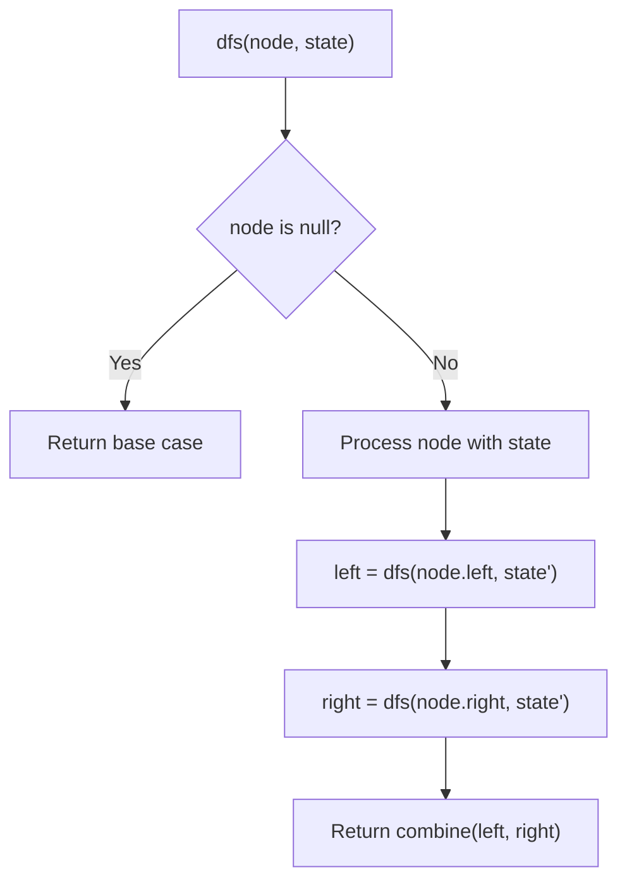
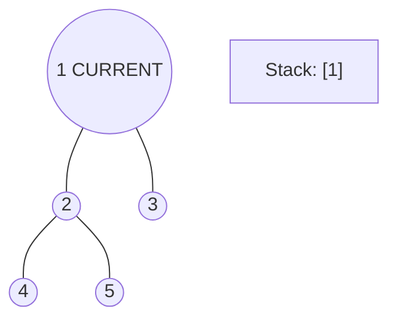
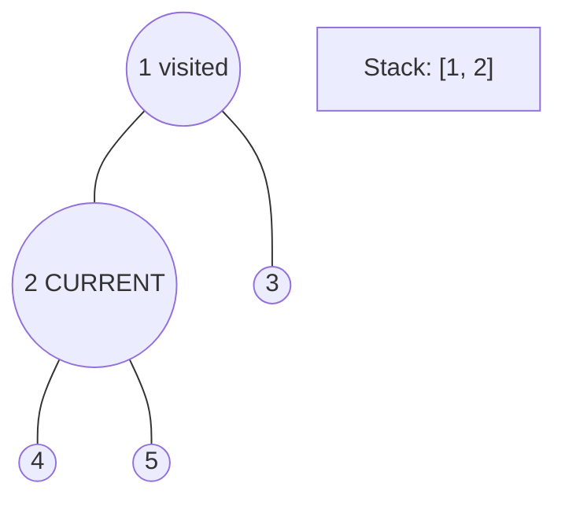
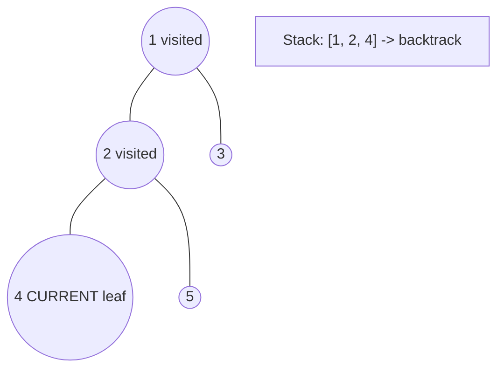
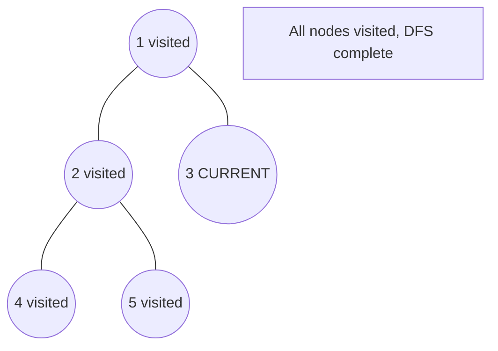

# Problem 124: Binary Tree Maximum Path Sum

**Difficulty:** Hard  
**Tags:** Dynamic Programming, Tree, Depth-First Search, Binary Tree  
**Pattern:** DFS Tree Traversal  
**Link:** [leetcode.com/problems/binary-tree-maximum-path-sum](https://leetcode.com/problems/binary-tree-maximum-path-sum/)

## Description

A **path** in a binary tree is a sequence of nodes where each pair of adjacent nodes in the sequence has an edge connecting them. A node can only appear in the sequence **at most once**. Note that the path does not need to pass through the root.

The **path sum** of a path is the sum of the node's values in the path.

Given the `root` of a binary tree, return *the maximum **path sum** of any **non-empty** path*.

 

Example 1:

```

**Input:** root = [1,2,3]
**Output:** 6
**Explanation:** The optimal path is 2 -> 1 -> 3 with a path sum of 2 + 1 + 3 = 6.

```

Example 2:

```

**Input:** root = [-10,9,20,null,null,15,7]
**Output:** 42
**Explanation:** The optimal path is 15 -> 20 -> 7 with a path sum of 15 + 20 + 7 = 42.

```

 

**Constraints:**

	- The number of nodes in the tree is in the range `[1, 3 * 10^4]`.
	- `-1000 <= Node.val <= 1000`

## Approach: DFS Tree Traversal

Perform depth-first search on the tree. Recurse on left and right subtrees, combining results bottom-up. Track state (path, depth, sum) during traversal.

## Pseudocode

```
1. Define dfs(node, state):
   a. Base case: if null, return default
   b. Process node with current state
   c. left_result = dfs(node.left, updated_state)
   d. right_result = dfs(node.right, updated_state)
   e. Return combine(left_result, right_result)
2. Return dfs(root, initial_state)
```

## Algorithm Flow



## Visual State Transitions

**DFS Tree Traversal Step-by-Step:**

**Frame 1: Start at root**


**Frame 2: Go left - visit node 2**


**Frame 3: Go left - visit node 4 (leaf)**


**Frame 4: Backtrack, visit node 5, then node 3**



## Complexity Analysis

- **Time:** O(n)
- **Space:** O(h)

## Solution (Python3)

```python
class Solution:
    def maxPathSum(self, root: Optional[TreeNode]) -> int:
        # DFS on binary tree - O(n) time, O(h) space
        def dfs(node):
            if not node:
                return 0
            left = dfs(node.left)
            right = dfs(node.right)
            return 1 + max(left, right)
        
        result = dfs(root)
        return result
```

## Solution (C++)

```cpp
#include <algorithm>
#include <functional>
#include <string>
#include <vector>
using namespace std;

class Solution {
public:
    int maxPathSum(TreeNode* root) {
        // DFS on binary tree - O(n) time, O(h) space
        function<int(TreeNode*)> dfs = [&](TreeNode* node) -> int {
            if (!node) return 0;
            int left = dfs(node->left);
            int right = dfs(node->right);
            return 1 + max(left, right);
        };
        return dfs(root);
    }
};
```
