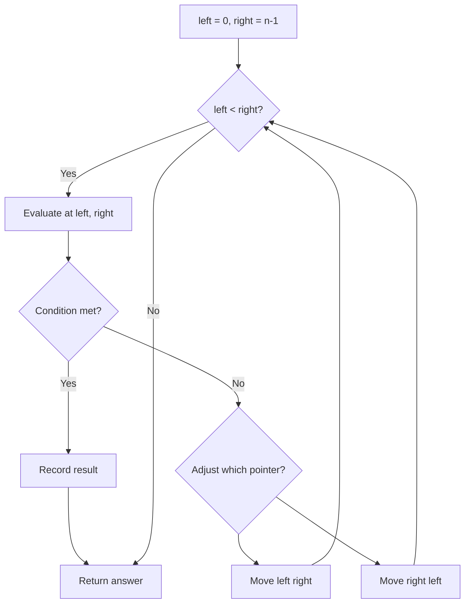
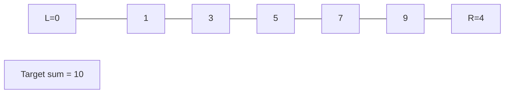
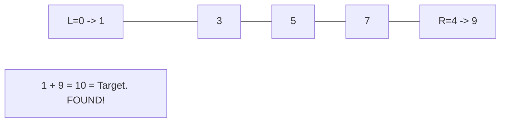

# Problem 125: Valid Palindrome

**Difficulty:** Easy  
**Tags:** Two Pointers, String  
**Pattern:** Two Pointers  
**Link:** [leetcode.com/problems/valid-palindrome](https://leetcode.com/problems/valid-palindrome/)

## Description

A phrase is a **palindrome** if, after converting all uppercase letters into lowercase letters and removing all non-alphanumeric characters, it reads the same forward and backward. Alphanumeric characters include letters and numbers.

Given a string `s`, return `true`* if it is a **palindrome**, or *`false`* otherwise*.

 

Example 1:

```

**Input:** s = "A man, a plan, a canal: Panama"
**Output:** true
**Explanation:** "amanaplanacanalpanama" is a palindrome.

```

Example 2:

```

**Input:** s = "race a car"
**Output:** false
**Explanation:** "raceacar" is not a palindrome.

```

Example 3:

```

**Input:** s = " "
**Output:** true
**Explanation:** s is an empty string "" after removing non-alphanumeric characters.
Since an empty string reads the same forward and backward, it is a palindrome.

```

 

**Constraints:**

	- `1 <= s.length <= 2 * 10^5`
	- `s` consists only of printable ASCII characters.

## Approach: Two Pointers

Use two pointers moving through the data structure. Depending on the problem, pointers may move toward each other (converging), in the same direction (fast/slow), or independently.

## Pseudocode

```
1. Initialize left = 0, right = n-1 (or two independent pointers)
2. While pointers haven't crossed:
   a. Evaluate condition at pointer positions
   b. Move left pointer right or right pointer left
3. Return result
```

## Algorithm Flow



## Visual State Transitions

**Two Pointer Convergence:**

**Frame 1: Initialize pointers**


**Frame 2: Sum = 1+9 = 10, found!**



## Complexity Analysis

- **Time:** O(n)
- **Space:** O(1)

## Solution (Python3)

```python
class Solution:
    def isPalindrome(self, s: str) -> bool:
        # Two pointer approach - O(n) time, O(1) space
        left, right = 0, len(s) - 1
        while left < right:
            curr = s[left] + s[right]
            if curr == s:
                return [left, right]
            elif curr < s:
                left += 1
            else:
                right -= 1
        return False
```

## Solution (C++)

```cpp
#include <string>
#include <vector>
using namespace std;

class Solution {
public:
    bool isPalindrome(string& s) {
        // Two pointer approach - O(n) time, O(1) space
        int left = 0, right = s.size() - 1;
        while (left < right) {
            int curr = s[left] + s[right];
            if (curr == s) {
                return {left, right};
            } else if (curr < s) {
                left++;
            } else {
                right--;
            }
        }
        return false;
    }
};
```
