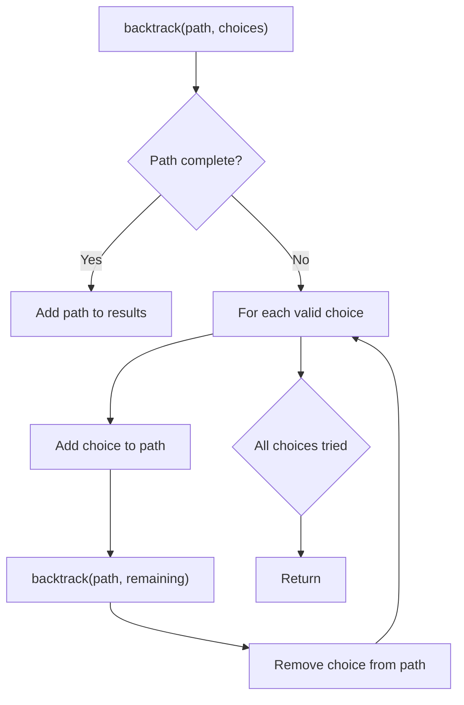
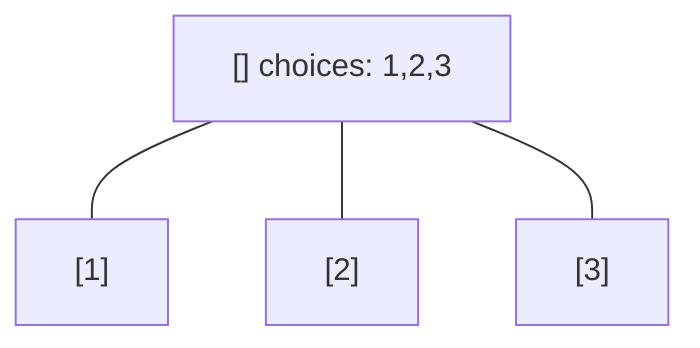
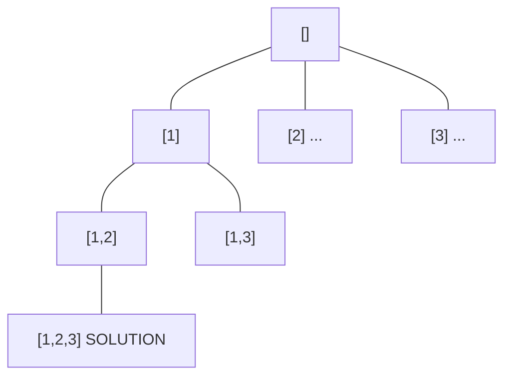
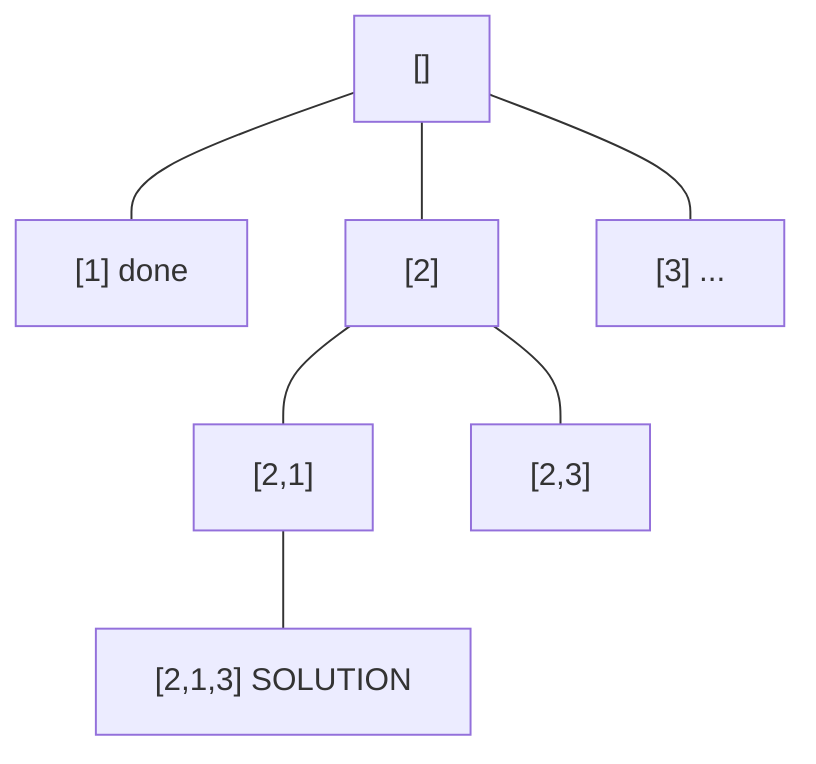
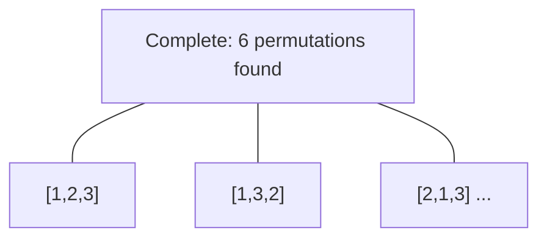

# Problem 126: Word Ladder II

**Difficulty:** Hard  
**Tags:** Hash Table, String, Backtracking, Breadth-First Search  
**Pattern:** Backtracking  
**Link:** [leetcode.com/problems/word-ladder-ii](https://leetcode.com/problems/word-ladder-ii/)

## Description

A **transformation sequence** from word `beginWord` to word `endWord` using a dictionary `wordList` is a sequence of words `beginWord -> s1 -> s2 -> ... -> sk` such that:

	- Every adjacent pair of words differs by a single letter.
	- Every `si` for `1 <= i <= k` is in `wordList`. Note that `beginWord` does not need to be in `wordList`.
	- `sk == endWord`

Given two words, `beginWord` and `endWord`, and a dictionary `wordList`, return *all the **shortest transformation sequences** from* `beginWord` *to* `endWord`*, or an empty list if no such sequence exists. Each sequence should be returned as a list of the words *`[beginWord, s1, s2, ..., sk]`.

 

Example 1:

```

**Input:** beginWord = "hit", endWord = "cog", wordList = ["hot","dot","dog","lot","log","cog"]
**Output:** [["hit","hot","dot","dog","cog"],["hit","hot","lot","log","cog"]]
**Explanation:** There are 2 shortest transformation sequences:
"hit" -> "hot" -> "dot" -> "dog" -> "cog"
"hit" -> "hot" -> "lot" -> "log" -> "cog"

```

Example 2:

```

**Input:** beginWord = "hit", endWord = "cog", wordList = ["hot","dot","dog","lot","log"]
**Output:** []
**Explanation:** The endWord "cog" is not in wordList, therefore there is no valid transformation sequence.

```

 

**Constraints:**

	- `1 <= beginWord.length <= 5`
	- `endWord.length == beginWord.length`
	- `1 <= wordList.length <= 500`
	- `wordList[i].length == beginWord.length`
	- `beginWord`, `endWord`, and `wordList[i]` consist of lowercase English letters.
	- `beginWord != endWord`
	- All the words in `wordList` are **unique**.
	- The **sum** of all shortest transformation sequences does not exceed `10^5`.

## Approach: Backtracking

Explore all possible solutions by building candidates incrementally. At each step, make a choice and recurse. If the choice leads to a dead end, undo the choice (backtrack) and try the next option.

## Pseudocode

```
1. Define backtrack(path, choices):
   a. If path is a complete solution: add to results
   b. For each choice in choices:
      - If choice is valid:
        * Add choice to path
        * backtrack(path, remaining_choices)
        * Remove choice from path (backtrack)
2. Call backtrack([], all_choices)
```

## Algorithm Flow



## Visual State Transitions

**Backtracking Decision Tree:**

**Frame 1: Root - start with empty path**


**Frame 2: Explore branch [1]**


**Frame 3: Backtrack, explore [2]**


**Frame 4: All solutions found**



## Complexity Analysis

- **Time:** O(k^n) or O(n!)
- **Space:** O(n)

## Solution (Python3)

```python
class Solution:
    def findLadders(self, beginWord: str, endWord: str, wordList: List[str]) -> List[List[str]]:
        # Backtracking - O(2^n) or O(n!) time
        result = []
        
        def backtrack(path, start):
            result.append(path[:])
            for i in range(start, len(beginWord)):
                path.append(beginWord[i])
                backtrack(path, i + 1)
                path.pop()
        
        backtrack([], 0)
        return result
```

## Solution (C++)

```cpp
#include <functional>
#include <string>
#include <vector>
using namespace std;

class Solution {
public:
    vector<vector<string>> findLadders(string& beginWord, string& endWord, vector<string>& wordList) {
        // Backtracking - O(2^n) or O(n!) time
        vector<vector<int>> result;
        vector<int> path;
        function<void(int)> backtrack = [&](int start) {
            result.push_back(path);
            for (int i = start; i < (int)beginWord.size(); i++) {
                path.push_back(beginWord[i]);
                backtrack(i + 1);
                path.pop_back();
            }
        };
        backtrack(0);
        return result;
    }
};
```
