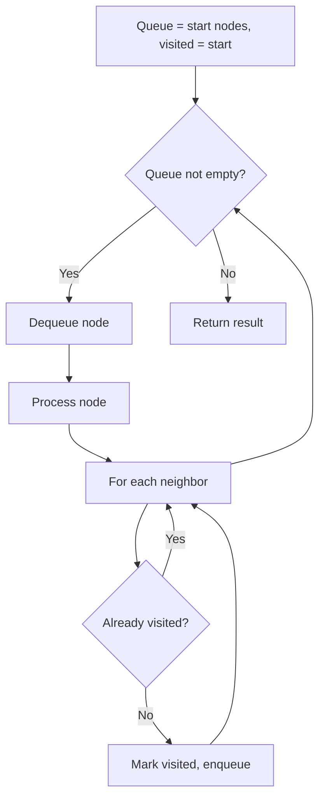
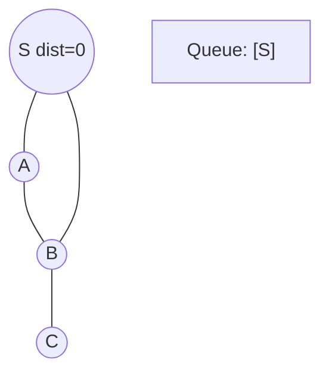
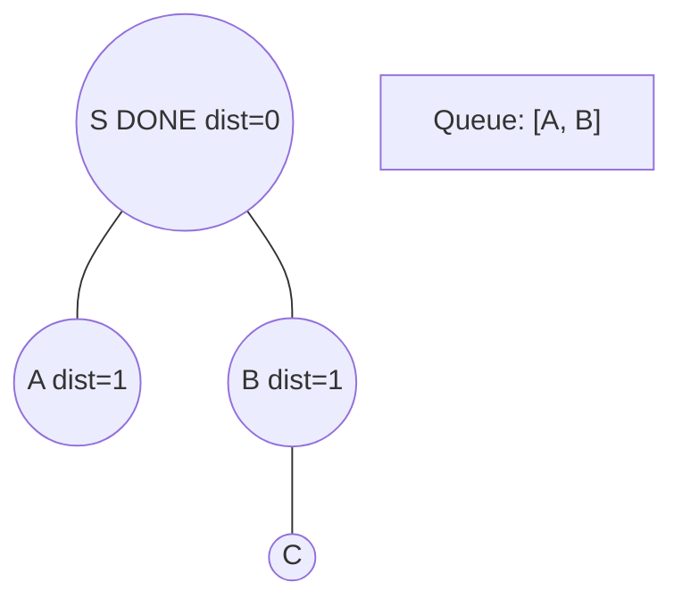
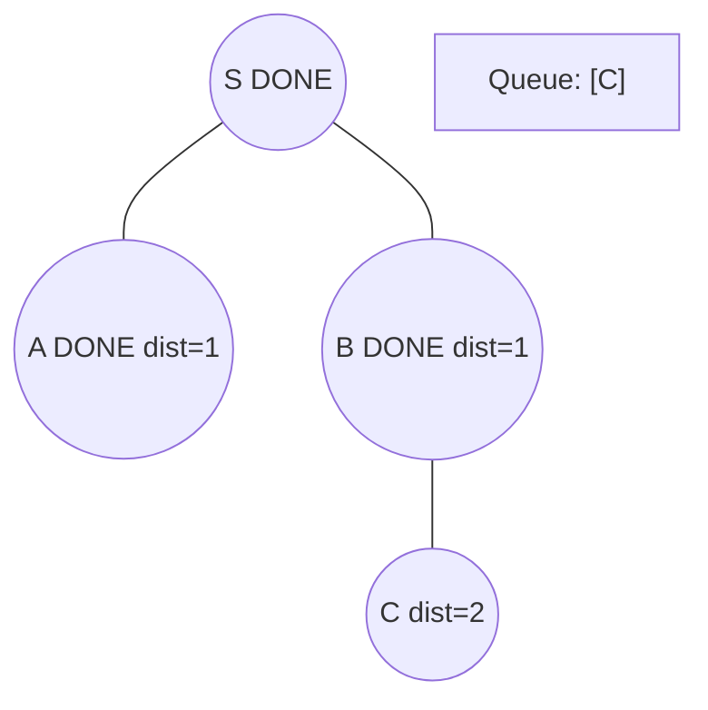
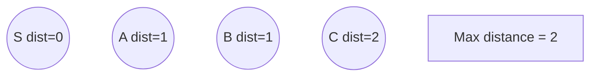

# Problem 127: Word Ladder

**Difficulty:** Hard  
**Tags:** Hash Table, String, Breadth-First Search  
**Pattern:** BFS Graph Traversal  
**Link:** [leetcode.com/problems/word-ladder](https://leetcode.com/problems/word-ladder/)

## Description

A **transformation sequence** from word `beginWord` to word `endWord` using a dictionary `wordList` is a sequence of words `beginWord -> s1 -> s2 -> ... -> sk` such that:

	- Every adjacent pair of words differs by a single letter.
	- Every `si` for `1 <= i <= k` is in `wordList`. Note that `beginWord` does not need to be in `wordList`.
	- `sk == endWord`

Given two words, `beginWord` and `endWord`, and a dictionary `wordList`, return *the **number of words** in the **shortest transformation sequence** from* `beginWord` *to* `endWord`*, or *`0`* if no such sequence exists.*

 

Example 1:

```

**Input:** beginWord = "hit", endWord = "cog", wordList = ["hot","dot","dog","lot","log","cog"]
**Output:** 5
**Explanation:** One shortest transformation sequence is "hit" -> "hot" -> "dot" -> "dog" -> cog", which is 5 words long.

```

Example 2:

```

**Input:** beginWord = "hit", endWord = "cog", wordList = ["hot","dot","dog","lot","log"]
**Output:** 0
**Explanation:** The endWord "cog" is not in wordList, therefore there is no valid transformation sequence.

```

 

**Constraints:**

	- `1 <= beginWord.length <= 10`
	- `endWord.length == beginWord.length`
	- `1 <= wordList.length <= 5000`
	- `wordList[i].length == beginWord.length`
	- `beginWord`, `endWord`, and `wordList[i]` consist of lowercase English letters.
	- `beginWord != endWord`
	- All the words in `wordList` are **unique**.

## Approach: BFS Graph Traversal

Explore the graph breadth-first using a queue. Process nodes level by level; BFS finds shortest paths in unweighted graphs.

## Pseudocode

```
1. Initialize queue with start node(s), visited set
2. While queue not empty:
   a. Dequeue node
   b. Process node
   c. For each unvisited neighbor:
      - Mark visited, enqueue
3. Return result
```

## Algorithm Flow



## Visual State Transitions

**BFS Level-by-Level Traversal:**

**Frame 1: Start BFS from source**


**Frame 2: Process level 0, enqueue neighbors**


**Frame 3: Process level 1**


**Frame 4: All nodes reached**



## Complexity Analysis

- **Time:** O(V + E)
- **Space:** O(V)

## Solution (Python3)

```python
class Solution:
    def ladderLength(self, beginWord: str, endWord: str, wordList: List[str]) -> int:
        # BFS on graph - O(V+E) time
        from collections import deque
        if not beginWord:
            return 0
        visited = set()
        queue = deque([0])
        visited.add(0)
        dist = 0
        while queue:
            for _ in range(len(queue)):
                node = queue.popleft()
                # Process node
            dist += 1
        return dist
```

## Solution (C++)

```cpp
#include <queue>
#include <string>
#include <unordered_set>
#include <vector>
using namespace std;

class Solution {
public:
    int ladderLength(string& beginWord, string& endWord, vector<string>& wordList) {
        // BFS on graph - O(V+E) time
        if (beginWord.empty()) return 0;
        queue<int> q;
        unordered_set<int> visited;
        q.push(0);
        visited.insert(0);
        int dist = 0;
        while (!q.empty()) {
            int sz = q.size();
            for (int i = 0; i < sz; i++) {
                int node = q.front(); q.pop();
                // Process node
            }
            dist++;
        }
        return dist;
    }
};
```
