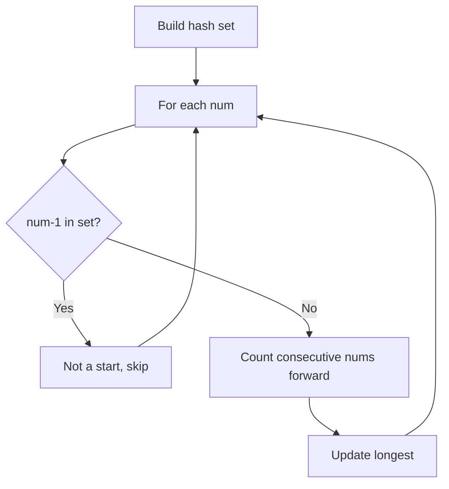
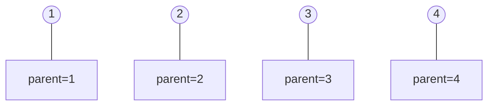
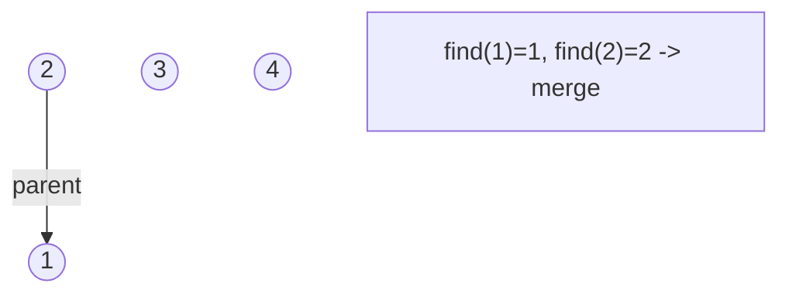
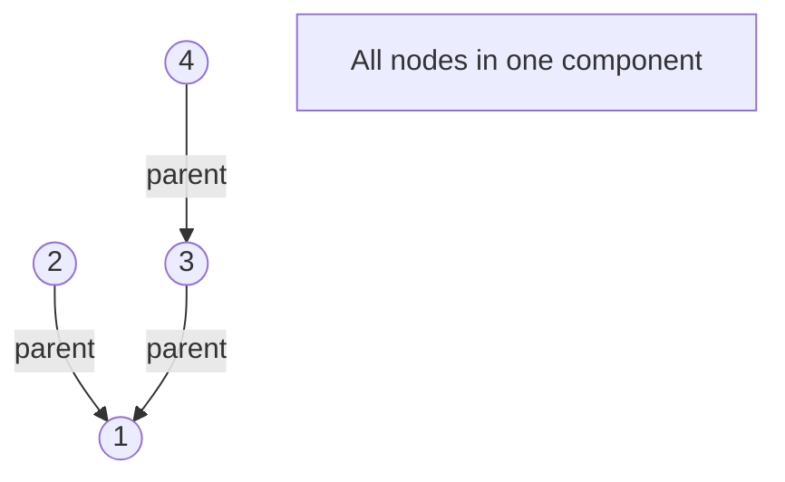
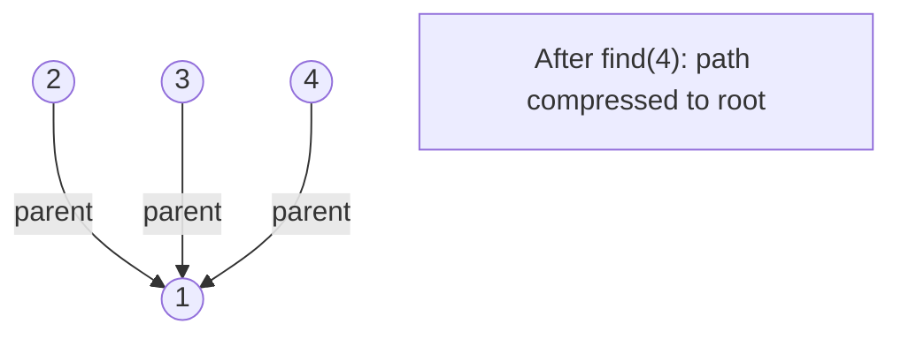

# Problem 128: Longest Consecutive Sequence

**Difficulty:** Medium  
**Tags:** Array, Hash Table, Union-Find  
**Pattern:** Hash Set  
**Link:** [leetcode.com/problems/longest-consecutive-sequence](https://leetcode.com/problems/longest-consecutive-sequence/)

## Description

Given an unsorted array of integers `nums`, return *the length of the longest consecutive elements sequence.*

You must write an algorithm that runs in `O(n)` time.

 

Example 1:

```

**Input:** nums = [100,4,200,1,3,2]
**Output:** 4
**Explanation:** The longest consecutive elements sequence is `[1, 2, 3, 4]`. Therefore its length is 4.

```

Example 2:

```

**Input:** nums = [0,3,7,2,5,8,4,6,0,1]
**Output:** 9

```

Example 3:

```

**Input:** nums = [1,0,1,2]
**Output:** 3

```

 

**Constraints:**

	- `0 <= nums.length <= 10^5`
	- `-10^9 <= nums[i] <= 10^9`

## Approach: Hash Set

**Key Insight:** Only start counting from sequence beginnings (num-1 not in set). Count forward.

## Pseudocode

```
1. num_set = set(nums)
2. For each num: if num-1 not in set: count forward
3. Track longest sequence
```

## Algorithm Flow



## Visual State Transitions

**Union-Find Step-by-Step:**

**Frame 1: Initial - each node is own parent**


**Frame 2: Union(1,2) - merge components**


**Frame 3: Union(3,4) then Union(2,3)**


**Frame 4: Path compression on find(4)**



## Complexity Analysis

- **Time:** O(n)
- **Space:** O(n)

## Solution (Python3)

```python
class Solution:
    def longestConsecutive(self, nums: list[int]) -> int:
        num_set = set(nums)
        longest = 0
        for num in num_set:
            if num - 1 not in num_set:
                length = 1
                while num + length in num_set:
                    length += 1
                longest = max(longest, length)
        return longest
```

## Solution (C++)

```cpp
#include <functional>
#include <numeric>
#include <string>
#include <vector>
using namespace std;

class Solution {
public:
    int longestConsecutive(vector<int>& nums) {
        // Union Find (DSU) - O(n * alpha(n))
        int n = nums.size();
        vector<int> parent(n + 1), rnk(n + 1, 0);
        iota(parent.begin(), parent.end(), 0);
        function<int(int)> find = [&](int x) -> int {
            return parent[x] == x ? x : parent[x] = find(parent[x]);
        };
        auto unite = [&](int x, int y) -> bool {
            int px = find(x), py = find(y);
            if (px == py) return false;
            if (rnk[px] < rnk[py]) swap(px, py);
            parent[py] = px;
            if (rnk[px] == rnk[py]) rnk[px]++;
            return true;
        };
        int components = n;
        return components;
    }
};
```
