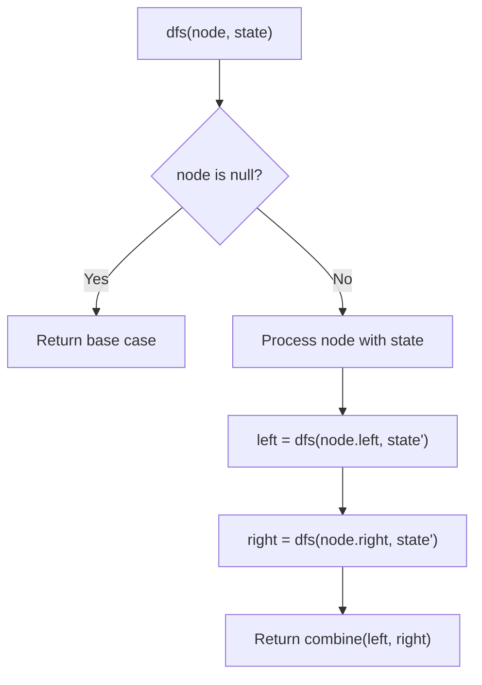
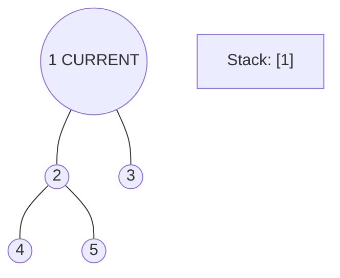
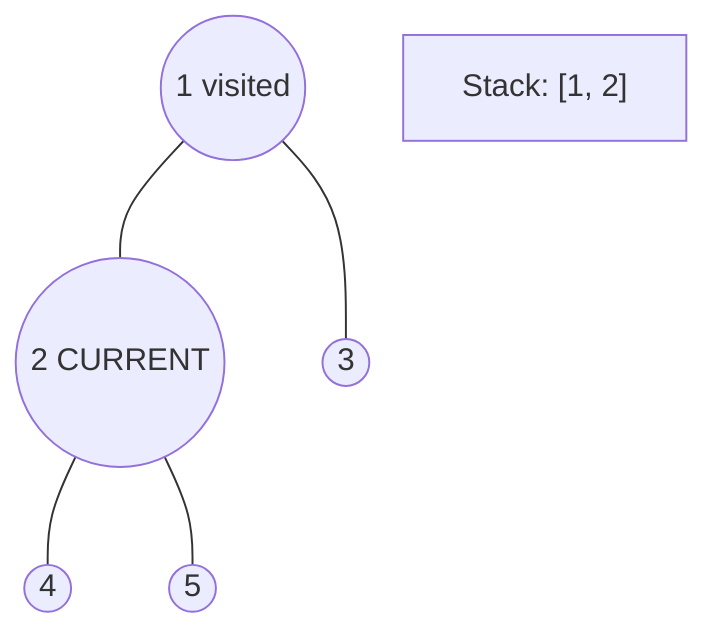
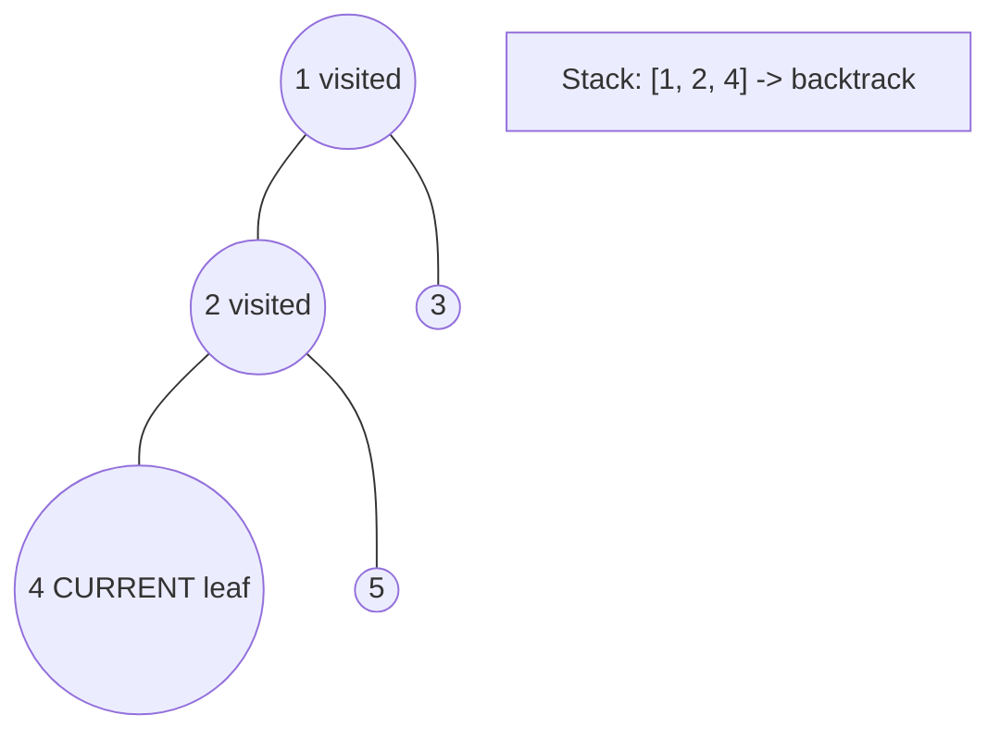
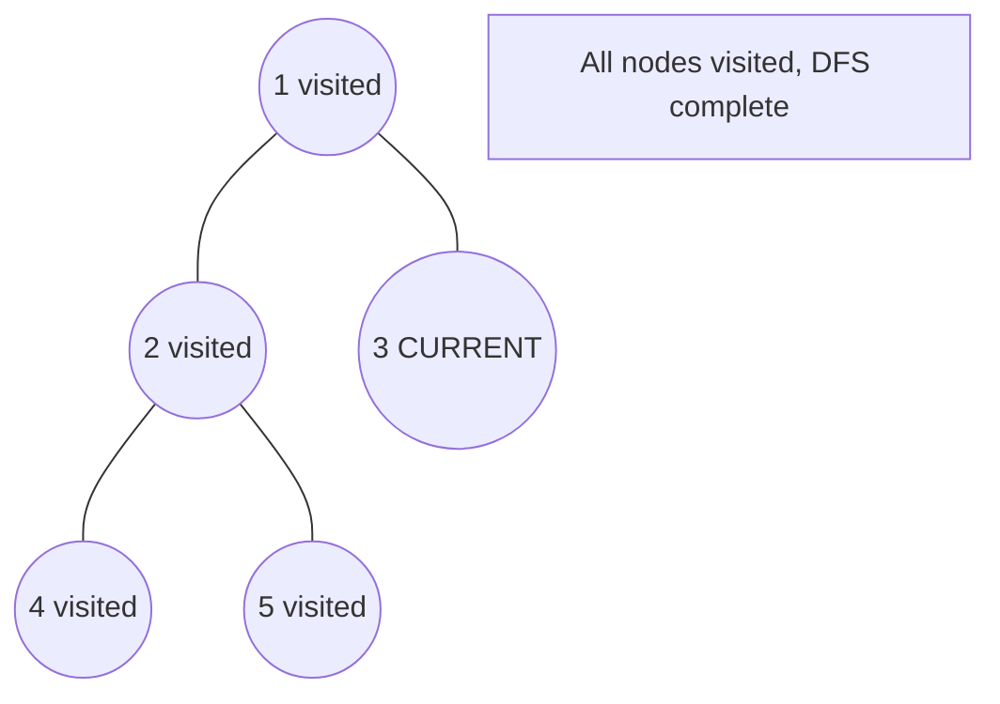

# Problem 129: Sum Root to Leaf Numbers

**Difficulty:** Medium  
**Tags:** Tree, Depth-First Search, Binary Tree  
**Pattern:** DFS Tree Traversal  
**Link:** [leetcode.com/problems/sum-root-to-leaf-numbers](https://leetcode.com/problems/sum-root-to-leaf-numbers/)

## Description

You are given the `root` of a binary tree containing digits from `0` to `9` only.

Each root-to-leaf path in the tree represents a number.

	- For example, the root-to-leaf path `1 -> 2 -> 3` represents the number `123`.

Return *the total sum of all root-to-leaf numbers*. Test cases are generated so that the answer will fit in a **32-bit** integer.

A **leaf** node is a node with no children.

 

Example 1:

```

**Input:** root = [1,2,3]
**Output:** 25
**Explanation:**
The root-to-leaf path `1->2` represents the number `12`.
The root-to-leaf path `1->3` represents the number `13`.
Therefore, sum = 12 + 13 = `25`.

```

Example 2:

```

**Input:** root = [4,9,0,5,1]
**Output:** 1026
**Explanation:**
The root-to-leaf path `4->9->5` represents the number 495.
The root-to-leaf path `4->9->1` represents the number 491.
The root-to-leaf path `4->0` represents the number 40.
Therefore, sum = 495 + 491 + 40 = `1026`.

```

 

**Constraints:**

	- The number of nodes in the tree is in the range `[1, 1000]`.
	- `0 <= Node.val <= 9`
	- The depth of the tree will not exceed `10`.

## Approach: DFS Tree Traversal

Perform depth-first search on the tree. Recurse on left and right subtrees, combining results bottom-up. Track state (path, depth, sum) during traversal.

## Pseudocode

```
1. Define dfs(node, state):
   a. Base case: if null, return default
   b. Process node with current state
   c. left_result = dfs(node.left, updated_state)
   d. right_result = dfs(node.right, updated_state)
   e. Return combine(left_result, right_result)
2. Return dfs(root, initial_state)
```

## Algorithm Flow



## Visual State Transitions

**DFS Tree Traversal Step-by-Step:**

**Frame 1: Start at root**


**Frame 2: Go left - visit node 2**


**Frame 3: Go left - visit node 4 (leaf)**


**Frame 4: Backtrack, visit node 5, then node 3**



## Complexity Analysis

- **Time:** O(n)
- **Space:** O(h)

## Solution (Python3)

```python
class Solution:
    def sumNumbers(self, root: Optional[TreeNode]) -> int:
        # DFS on binary tree - O(n) time, O(h) space
        def dfs(node):
            if not node:
                return 0
            left = dfs(node.left)
            right = dfs(node.right)
            return 1 + max(left, right)
        
        result = dfs(root)
        return result
```

## Solution (C++)

```cpp
#include <algorithm>
#include <functional>
#include <string>
#include <vector>
using namespace std;

class Solution {
public:
    int sumNumbers(TreeNode* root) {
        // DFS on binary tree - O(n) time, O(h) space
        function<int(TreeNode*)> dfs = [&](TreeNode* node) -> int {
            if (!node) return 0;
            int left = dfs(node->left);
            int right = dfs(node->right);
            return 1 + max(left, right);
        };
        return dfs(root);
    }
};
```
