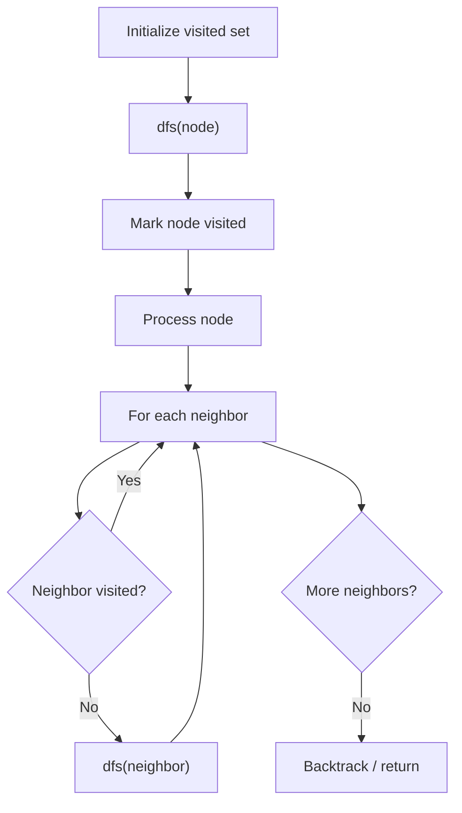

# Problem 133: Clone Graph

**Difficulty:** Medium  
**Tags:** Hash Table, Depth-First Search, Breadth-First Search, Graph Theory  
**Pattern:** DFS Graph Traversal  
**Link:** [leetcode.com/problems/clone-graph](https://leetcode.com/problems/clone-graph/)

## Description

Given a reference of a node in a **connected** undirected graph.

Return a **deep copy** (clone) of the graph.

Each node in the graph contains a value (`int`) and a list (`List[Node]`) of its neighbors.

```

class Node {
    public int val;
    public List<Node> neighbors;
}

```

 

**Test case format:**

For simplicity, each node's value is the same as the node's index (1-indexed). For example, the first node with `val == 1`, the second node with `val == 2`, and so on. The graph is represented in the test case using an adjacency list.

**An adjacency list** is a collection of unordered **lists** used to represent a finite graph. Each list describes the set of neighbors of a node in the graph.

The given node will always be the first node with `val = 1`. You must return the **copy of the given node** as a reference to the cloned graph.

 

Example 1:

```

**Input:** adjList = [[2,4],[1,3],[2,4],[1,3]]
**Output:** [[2,4],[1,3],[2,4],[1,3]]
**Explanation:** There are 4 nodes in the graph.
1st node (val = 1)'s neighbors are 2nd node (val = 2) and 4th node (val = 4).
2nd node (val = 2)'s neighbors are 1st node (val = 1) and 3rd node (val = 3).
3rd node (val = 3)'s neighbors are 2nd node (val = 2) and 4th node (val = 4).
4th node (val = 4)'s neighbors are 1st node (val = 1) and 3rd node (val = 3).

```

Example 2:

```

**Input:** adjList = [[]]
**Output:** [[]]
**Explanation:** Note that the input contains one empty list. The graph consists of only one node with val = 1 and it does not have any neighbors.

```

Example 3:

```

**Input:** adjList = []
**Output:** []
**Explanation:** This an empty graph, it does not have any nodes.

```

 

**Constraints:**

	- The number of nodes in the graph is in the range `[0, 100]`.
	- `1 <= Node.val <= 100`
	- `Node.val` is unique for each node.
	- There are no repeated edges and no self-loops in the graph.
	- The Graph is connected and all nodes can be visited starting from the given node.

## Approach: DFS Graph Traversal

Explore the graph depth-first using recursion or a stack. Mark nodes as visited to avoid cycles. Process each node and explore all unvisited neighbors.

## Pseudocode

```
1. Initialize visited set
2. Define dfs(node):
   a. Mark node as visited
   b. Process node
   c. For each neighbor of node:
      - If not visited: dfs(neighbor)
3. Call dfs(start) for each unvisited node
```

## Algorithm Flow



## Complexity Analysis

- **Time:** O(V + E)
- **Space:** O(V)

## Solution (Python3)

```python
class Node:
    def __init__(self, val = 0: int, neighbors = None: int):
        # Initialize data structure
        self.val = 0 = val = 0
        self.neighbors = None = neighbors = None

    def cloneGraph(self, node: Optional['Node']) -> Optional['Node']:
        return None

```

## Solution (C++)

```cpp
#include <functional>
#include <string>
#include <vector>
using namespace std;

class Node {
public:
    Node(int val = 0, int neighbors = None) {
        // Initialize
    }

    Node* cloneGraph(Node* node) {
        return nullptr;
    }

};
```
