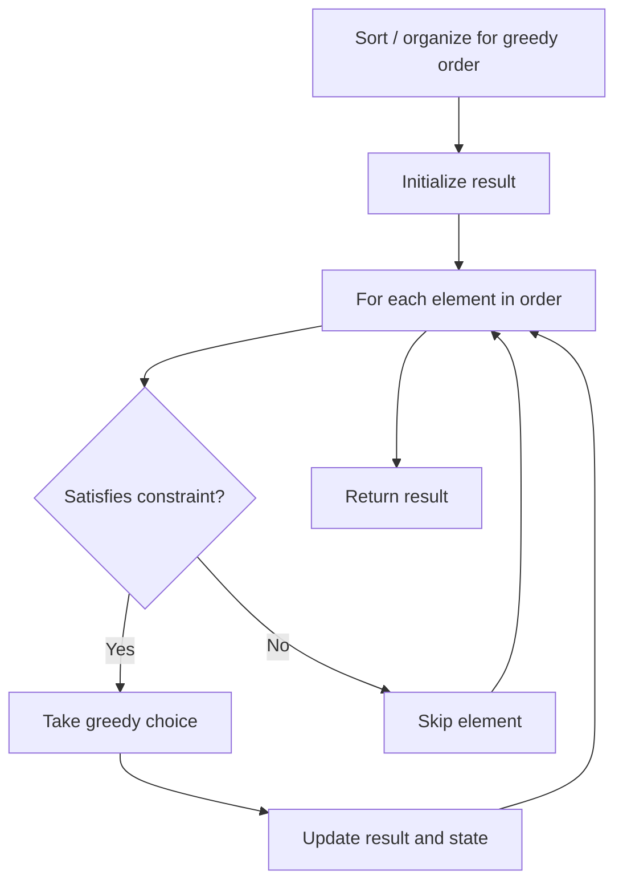

# Problem 134: Gas Station

**Difficulty:** Medium  
**Tags:** Array, Greedy  
**Pattern:** Greedy  
**Link:** [leetcode.com/problems/gas-station](https://leetcode.com/problems/gas-station/)

## Description

There are `n` gas stations along a circular route, where the amount of gas at the `i^th` station is `gas[i]`.

You have a car with an unlimited gas tank and it costs `cost[i]` of gas to travel from the `i^th` station to its next `(i + 1)^th` station. You begin the journey with an empty tank at one of the gas stations.

Given two integer arrays `gas` and `cost`, return *the starting gas station's index if you can travel around the circuit once in the clockwise direction, otherwise return* `-1`. If there exists a solution, it is **guaranteed** to be **unique**.

 

Example 1:

```

**Input:** gas = [1,2,3,4,5], cost = [3,4,5,1,2]
**Output:** 3
**Explanation:**
Start at station 3 (index 3) and fill up with 4 unit of gas. Your tank = 0 + 4 = 4
Travel to station 4. Your tank = 4 - 1 + 5 = 8
Travel to station 0. Your tank = 8 - 2 + 1 = 7
Travel to station 1. Your tank = 7 - 3 + 2 = 6
Travel to station 2. Your tank = 6 - 4 + 3 = 5
Travel to station 3. The cost is 5. Your gas is just enough to travel back to station 3.
Therefore, return 3 as the starting index.

```

Example 2:

```

**Input:** gas = [2,3,4], cost = [3,4,3]
**Output:** -1
**Explanation:**
You can't start at station 0 or 1, as there is not enough gas to travel to the next station.
Let's start at station 2 and fill up with 4 unit of gas. Your tank = 0 + 4 = 4
Travel to station 0. Your tank = 4 - 3 + 2 = 3
Travel to station 1. Your tank = 3 - 3 + 3 = 3
You cannot travel back to station 2, as it requires 4 unit of gas but you only have 3.
Therefore, you can't travel around the circuit once no matter where you start.

```

 

**Constraints:**

	- `n == gas.length == cost.length`
	- `1 <= n <= 10^5`
	- `0 <= gas[i], cost[i] <= 10^4`
	- The input is generated such that the answer is unique.

## Approach: Greedy

Make the locally optimal choice at each step, trusting it leads to a global optimum. Greedy works when the problem has the greedy-choice property and optimal substructure.

## Pseudocode

```
1. Sort or organize data for greedy ordering
2. Initialize result
3. For each element in greedy order:
   a. If element satisfies constraint:
      - Take the greedy choice
      - Update result and state
4. Return result
```

## Algorithm Flow



## Complexity Analysis

- **Time:** O(n log n)
- **Space:** O(1)

## Solution (Python3)

```python
class Solution:
    def canCompleteCircuit(self, gas: List[int], cost: List[int]) -> int:
        # Greedy approach - O(n) time
        result = 0
        curr_max = 0
        for i in range(len(gas)):
            if isinstance(gas[i], int):
                curr_max = max(curr_max, gas[i])
                result = max(result, curr_max)
            else:
                result += 1
        return result
```

## Solution (C++)

```cpp
#include <algorithm>
#include <string>
#include <vector>
using namespace std;

class Solution {
public:
    int canCompleteCircuit(vector<int>& gas, vector<int>& cost) {
        // Greedy approach - O(n) time
        int result = 0, curr_max = 0;
        for (int i = 0; i < (int)gas.size(); i++) {
            curr_max = max(curr_max, gas[i]);
            result = max(result, curr_max);
        }
        return result;
    }
};
```
