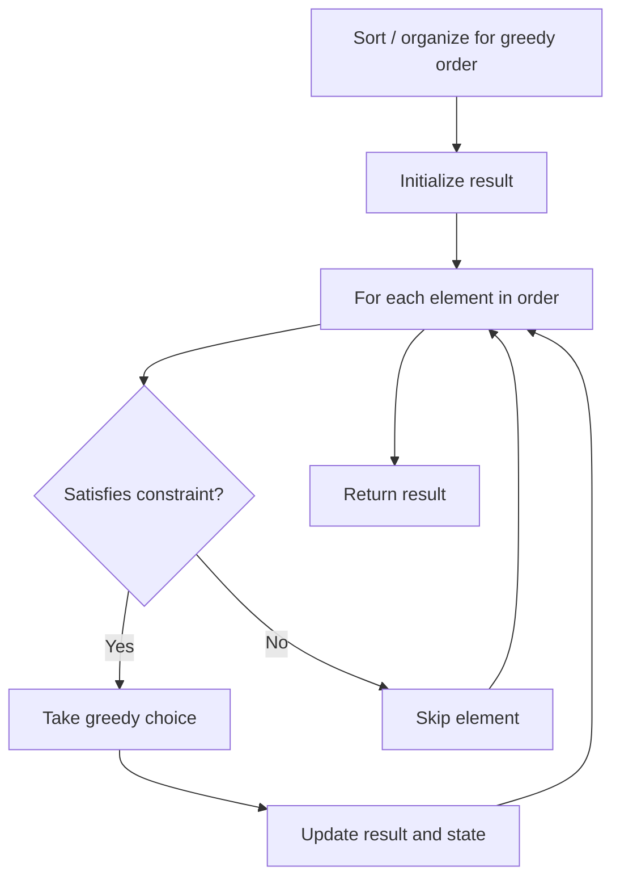

# Problem 135: Candy

**Difficulty:** Hard  
**Tags:** Array, Greedy  
**Pattern:** Greedy  
**Link:** [leetcode.com/problems/candy](https://leetcode.com/problems/candy/)

## Description

There are `n` children standing in a line. Each child is assigned a rating value given in the integer array `ratings`.

You are giving candies to these children subjected to the following requirements:

	- Each child must have at least one candy.
	- Children with a higher rating get more candies than their neighbors.

Return *the minimum number of candies you need to have to distribute the candies to the children*.

 

Example 1:

```

**Input:** ratings = [1,0,2]
**Output:** 5
**Explanation:** You can allocate to the first, second and third child with 2, 1, 2 candies respectively.

```

Example 2:

```

**Input:** ratings = [1,2,2]
**Output:** 4
**Explanation:** You can allocate to the first, second and third child with 1, 2, 1 candies respectively.
The third child gets 1 candy because it satisfies the above two conditions.

```

 

**Constraints:**

	- `n == ratings.length`
	- `1 <= n <= 2 * 10^4`
	- `0 <= ratings[i] <= 2 * 10^4`

## Approach: Greedy

Make the locally optimal choice at each step, trusting it leads to a global optimum. Greedy works when the problem has the greedy-choice property and optimal substructure.

## Pseudocode

```
1. Sort or organize data for greedy ordering
2. Initialize result
3. For each element in greedy order:
   a. If element satisfies constraint:
      - Take the greedy choice
      - Update result and state
4. Return result
```

## Algorithm Flow



## Complexity Analysis

- **Time:** O(n log n)
- **Space:** O(1)

## Solution (Python3)

```python
class Solution:
    def candy(self, ratings: List[int]) -> int:
        # Greedy approach - O(n) time
        result = 0
        curr_max = 0
        for i in range(len(ratings)):
            if isinstance(ratings[i], int):
                curr_max = max(curr_max, ratings[i])
                result = max(result, curr_max)
            else:
                result += 1
        return result
```

## Solution (C++)

```cpp
#include <algorithm>
#include <string>
#include <vector>
using namespace std;

class Solution {
public:
    int candy(vector<int>& ratings) {
        // Greedy approach - O(n) time
        int result = 0, curr_max = 0;
        for (int i = 0; i < (int)ratings.size(); i++) {
            curr_max = max(curr_max, ratings[i]);
            result = max(result, curr_max);
        }
        return result;
    }
};
```
