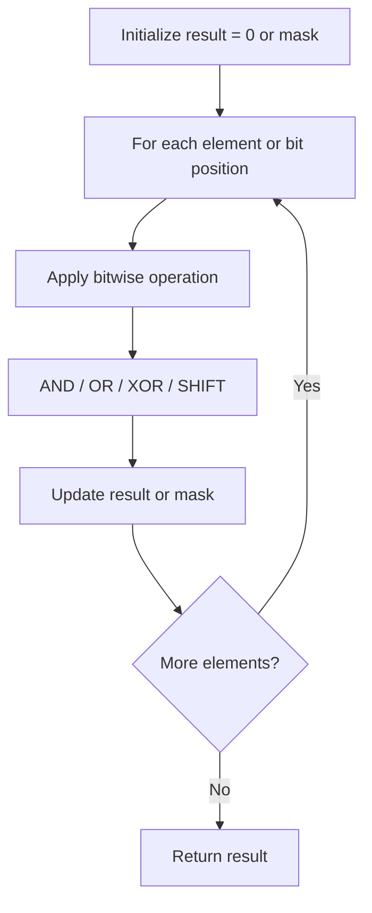

# Problem 136: Single Number

**Difficulty:** Easy  
**Tags:** Array, Bit Manipulation  
**Pattern:** Bit Manipulation (XOR)  
**Link:** [leetcode.com/problems/single-number](https://leetcode.com/problems/single-number/)

## Description

Given a **non-empty** array of integers `nums`, every element appears *twice* except for one. Find that single one.

You must implement a solution with a linear runtime complexity and use only constant extra space.

 

Example 1:

**Input:** nums = [2,2,1]

**Output:** 1

Example 2:

**Input:** nums = [4,1,2,1,2]

**Output:** 4

Example 3:

**Input:** nums = [1]

**Output:** 1

 

**Constraints:**

	- `1 <= nums.length <= 3 * 10^4`
	- `-3 * 10^4 <= nums[i] <= 3 * 10^4`
	- Each element in the array appears twice except for one element which appears only once.

## Approach: Bit Manipulation (XOR)

XOR all numbers. Pairs cancel out (a ^ a = 0), leaving the single number.

## Pseudocode

```
1. result = 0
2. For each num: result ^= num
3. Return result
```

## Algorithm Flow



## Complexity Analysis

- **Time:** O(n)
- **Space:** O(1)

## Solution (Python3)

```python
class Solution:
    def singleNumber(self, nums: list[int]) -> int:
        result = 0
        for num in nums:
            result ^= num
        return result
```

## Solution (C++)

```cpp
#include <string>
#include <vector>
using namespace std;

class Solution {
public:
    int singleNumber(vector<int>& nums) {
        // Bit manipulation - O(n) time, O(1) space
        int result = 0;
        for (int val : nums) {
            result ^= val;
        }
        return result;
    }
};
```
