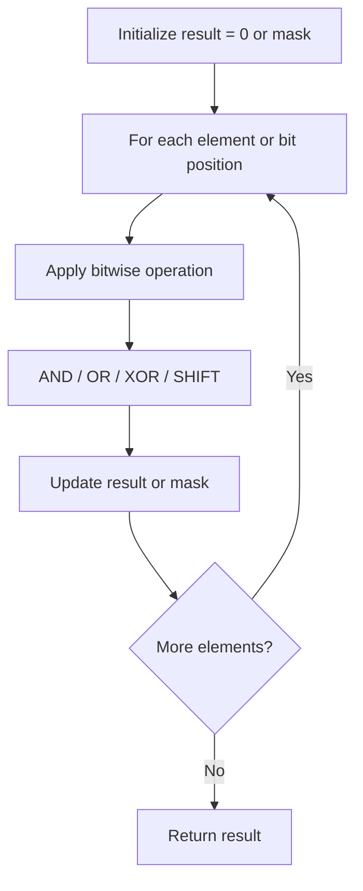

# Problem 137: Single Number II

**Difficulty:** Medium  
**Tags:** Array, Bit Manipulation  
**Pattern:** Bit Manipulation  
**Link:** [leetcode.com/problems/single-number-ii](https://leetcode.com/problems/single-number-ii/)

## Description

Given an integer array `nums` where every element appears **three times** except for one, which appears **exactly once**. *Find the single element and return it*.

You must implement a solution with a linear runtime complexity and use only constant extra space.

 

Example 1:

```
**Input:** nums = [2,2,3,2]
**Output:** 3

```
Example 2:

```
**Input:** nums = [0,1,0,1,0,1,99]
**Output:** 99

```

 

**Constraints:**

	- `1 <= nums.length <= 3 * 10^4`
	- `-2^31 <= nums[i] <= 2^31 - 1`
	- Each element in `nums` appears exactly **three times** except for one element which appears **once**.

## Approach: Bit Manipulation

Operate on individual bits using bitwise operators (AND, OR, XOR, shift). Common tricks: x & (x-1) removes lowest set bit, x ^ x = 0, XOR all elements to find unique.

## Pseudocode

```
1. Apply bitwise operations:
   - XOR all elements to cancel paired bits
   - Use bitmask to track state
   - Shift and mask to extract/set individual bits
2. Return result
```

## Algorithm Flow



## Complexity Analysis

- **Time:** O(n) or O(log n)
- **Space:** O(1)

## Solution (Python3)

```python
class Solution:
    def singleNumber(self, nums: List[int]) -> int:
        # Bit manipulation - O(n) time, O(1) space
        result = 0
        for val in nums:
            result ^= val
        return result
```

## Solution (C++)

```cpp
#include <string>
#include <vector>
using namespace std;

class Solution {
public:
    int singleNumber(vector<int>& nums) {
        // Bit manipulation - O(n) time, O(1) space
        int result = 0;
        for (int val : nums) {
            result ^= val;
        }
        return result;
    }
};
```
