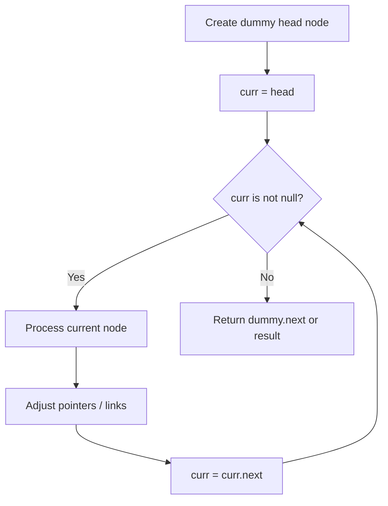
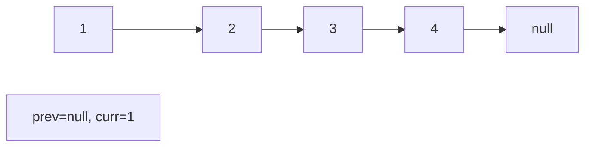
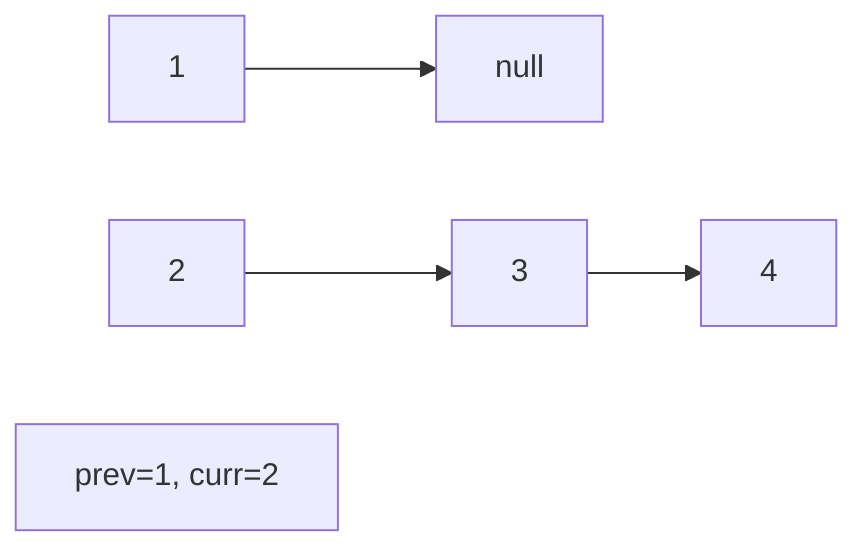
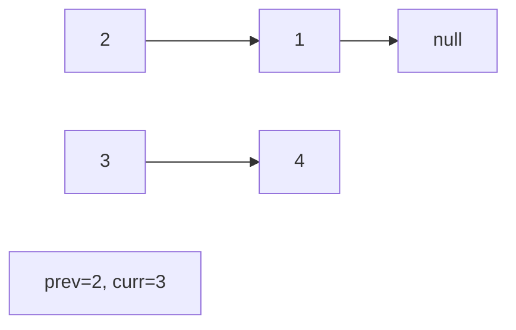
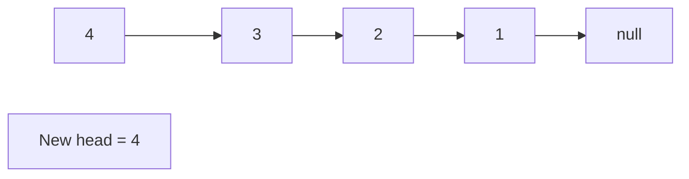

# Problem 138: Copy List with Random Pointer

**Difficulty:** Medium  
**Tags:** Hash Table, Linked List  
**Pattern:** Linked List  
**Link:** [leetcode.com/problems/copy-list-with-random-pointer](https://leetcode.com/problems/copy-list-with-random-pointer/)

## Description

A linked list of length `n` is given such that each node contains an additional random pointer, which could point to any node in the list, or `null`.

Construct a **deep copy** of the list. The deep copy should consist of exactly `n` **brand new** nodes, where each new node has its value set to the value of its corresponding original node. Both the `next` and `random` pointer of the new nodes should point to new nodes in the copied list such that the pointers in the original list and copied list represent the same list state. **None of the pointers in the new list should point to nodes in the original list**.

For example, if there are two nodes `X` and `Y` in the original list, where `X.random --> Y`, then for the corresponding two nodes `x` and `y` in the copied list, `x.random --> y`.

Return *the head of the copied linked list*.

The linked list is represented in the input/output as a list of `n` nodes. Each node is represented as a pair of `[val, random_index]` where:

	- `val`: an integer representing `Node.val`
	- `random_index`: the index of the node (range from `0` to `n-1`) that the `random` pointer points to, or `null` if it does not point to any node.

Your code will **only** be given the `head` of the original linked list.

 

Example 1:

```

**Input:** head = [[7,null],[13,0],[11,4],[10,2],[1,0]]
**Output:** [[7,null],[13,0],[11,4],[10,2],[1,0]]

```

Example 2:

```

**Input:** head = [[1,1],[2,1]]
**Output:** [[1,1],[2,1]]

```

Example 3:

****

```

**Input:** head = [[3,null],[3,0],[3,null]]
**Output:** [[3,null],[3,0],[3,null]]

```

 

**Constraints:**

	- `0 <= n <= 1000`
	- `-10^4 <= Node.val <= 10^4`
	- `Node.random` is `null` or is pointing to some node in the linked list.

## Approach: Linked List

Traverse or manipulate the linked list using pointer techniques. Common patterns: dummy head node for edge cases, fast/slow pointers for cycle detection or middle finding, in-place reversal, and merge operations.

## Pseudocode

```
1. Create dummy head if needed
2. Initialize pointer(s) at head
3. Traverse / modify list:
   a. Process current node
   b. Adjust next pointers as needed
   c. Move to next node
4. Return dummy.next or result
```

## Algorithm Flow



## Visual State Transitions

**Linked List Operation (Reverse):**

**Frame 1: Initial list**


**Frame 2: Reverse first link**


**Frame 3: Reverse second link**


**Frame 4: Fully reversed**



## Complexity Analysis

- **Time:** O(n)
- **Space:** O(1)

## Solution (Python3)

```python
class Node:
    def __init__(self, x: int, next: 'Node', random: 'Node'):
        # Initialize data structure
        self.x = x
        self.next = next
        self.random = random

    def copyRandomList(self, head: 'Optional[Node]') -> 'Optional[Node]':
        return None

```

## Solution (C++)

```cpp
#include <string>
#include <vector>
using namespace std;

class Node {
public:
    Node(int x, Node* next, Node* random) {
        // Initialize
    }

    Node* copyRandomList(Node* head) {
        return nullptr;
    }

};
```
