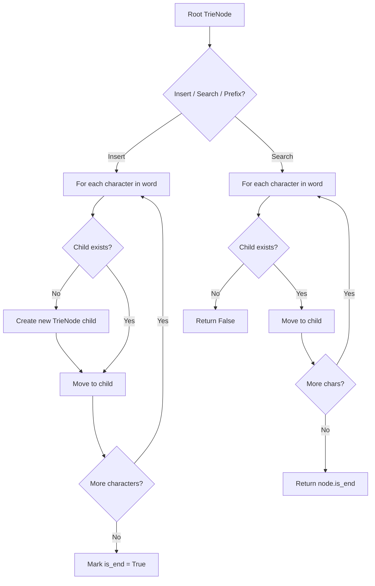
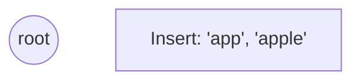
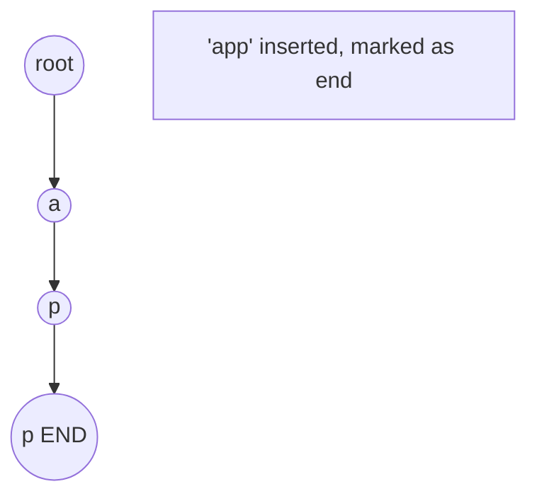
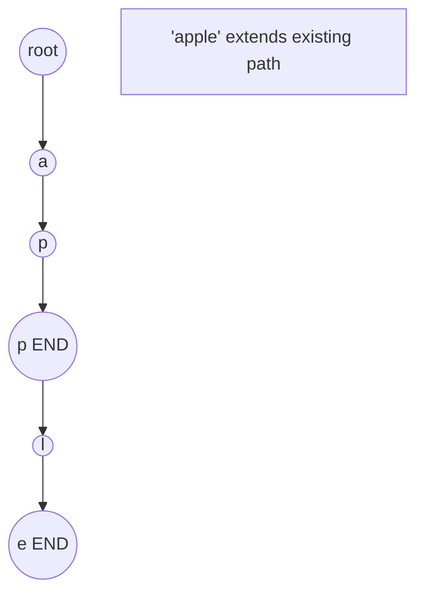
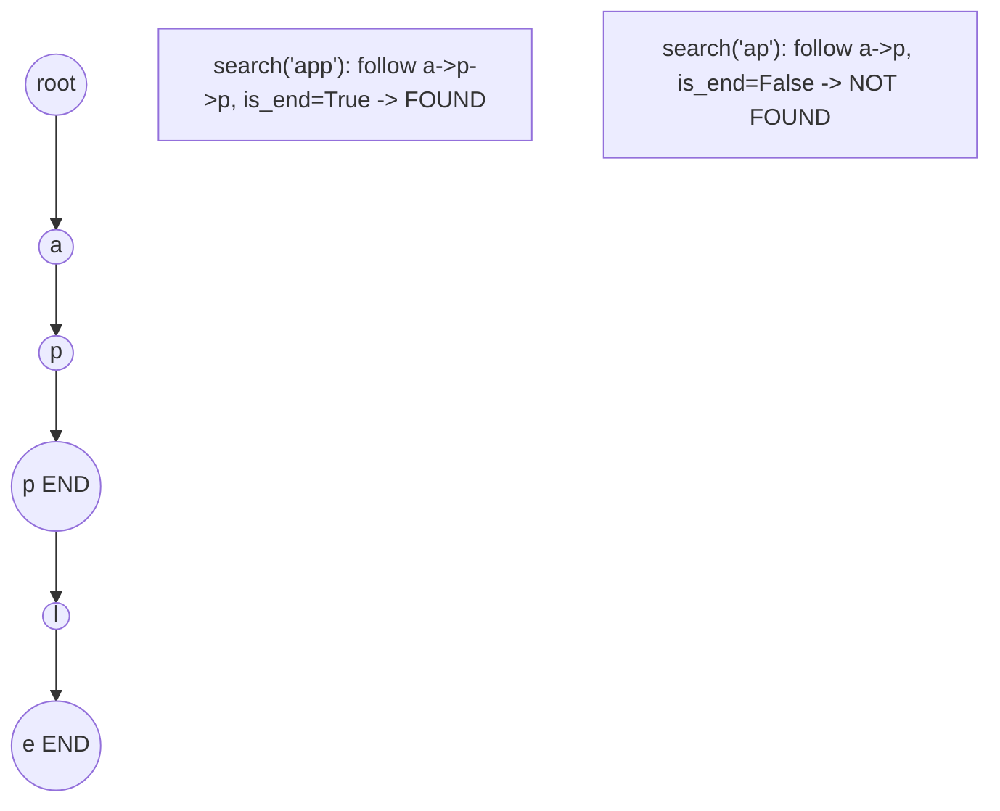

# Problem 139: Word Break

**Difficulty:** Medium  
**Tags:** Array, Hash Table, String, Dynamic Programming, Trie, Memoization  
**Pattern:** Trie / Prefix Tree  
**Link:** [leetcode.com/problems/word-break](https://leetcode.com/problems/word-break/)

## Description

Given a string `s` and a dictionary of strings `wordDict`, return `true` if `s` can be segmented into a space-separated sequence of one or more dictionary words.

**Note** that the same word in the dictionary may be reused multiple times in the segmentation.

 

Example 1:

```

**Input:** s = "leetcode", wordDict = ["leet","code"]
**Output:** true
**Explanation:** Return true because "leetcode" can be segmented as "leet code".

```

Example 2:

```

**Input:** s = "applepenapple", wordDict = ["apple","pen"]
**Output:** true
**Explanation:** Return true because "applepenapple" can be segmented as "apple pen apple".
Note that you are allowed to reuse a dictionary word.

```

Example 3:

```

**Input:** s = "catsandog", wordDict = ["cats","dog","sand","and","cat"]
**Output:** false

```

 

**Constraints:**

	- `1 <= s.length <= 300`
	- `1 <= wordDict.length <= 1000`
	- `1 <= wordDict[i].length <= 20`
	- `s` and `wordDict[i]` consist of only lowercase English letters.
	- All the strings of `wordDict` are **unique**.

## Approach: Trie / Prefix Tree

Build a trie (prefix tree) where each node represents a character. Insert words character by character, and search by following child pointers. Supports efficient prefix matching.

## Pseudocode

```
1. TrieNode: children = {}, is_end = False
2. Insert(word):
   - For each char: create child if absent, move to child
   - Mark last node as end
3. Search(word):
   - For each char: if child absent return False, move to child
   - Return node.is_end
4. StartsWith(prefix): same as search but return True at end
```

## Algorithm Flow



## Visual State Transitions

**Trie Insert and Search:**

**Frame 1: Empty trie**


**Frame 2: Insert 'app'**


**Frame 3: Insert 'apple'**


**Frame 4: Search 'app' = True, 'ap' = False**



## Complexity Analysis

- **Time:** O(L) per operation
- **Space:** O(N * L)

## Solution (Python3)

```python
class Solution:
    def wordBreak(self, s: str, wordDict: List[str]) -> bool:
        # Trie-based approach
        trie = {}
        # Build trie from word list
        words = s if isinstance(s, list) else [s]
        for word in words:
            node = trie
            for ch in word:
                if ch not in node:
                    node[ch] = {}
                node = node[ch]
            node['#'] = True
        
        # Search in trie
        def search(word):
            node = trie
            for ch in word:
                if ch not in node:
                    return False
                node = node[ch]
            return '#' in node
        
        return False
```

## Solution (C++)

```cpp
#include <string>
#include <vector>
using namespace std;

class Solution {
public:
    bool wordBreak(string& s, vector<string>& wordDict) {
        // Trie-based approach
        struct TrieNode {
            TrieNode* children[26] = {};
            bool isEnd = false;
        };
        TrieNode* root = new TrieNode();
        // Build trie
        for (auto& word : s) {
            TrieNode* node = root;
            for (char ch : word) {
                int idx = ch - 'a';
                if (!node->children[idx])
                    node->children[idx] = new TrieNode();
                node = node->children[idx];
            }
            node->isEnd = true;
        }
        return false;
    }
};
```
