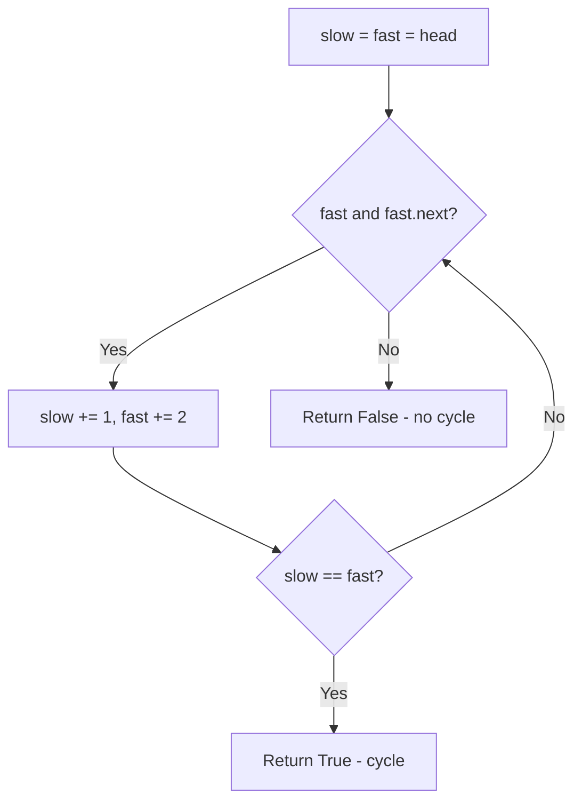
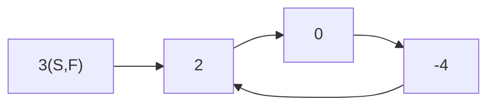
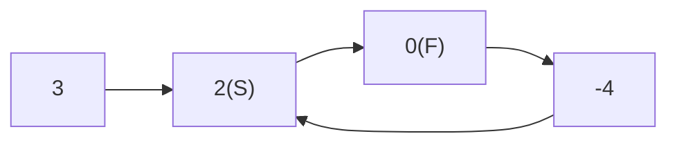
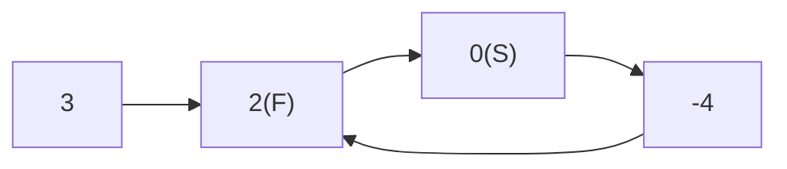

# Problem 141: Linked List Cycle

**Difficulty:** Easy  
**Tags:** Hash Table, Linked List, Two Pointers  
**Pattern:** Fast and Slow Pointers  
**Link:** [leetcode.com/problems/linked-list-cycle](https://leetcode.com/problems/linked-list-cycle/)

## Description

Given `head`, the head of a linked list, determine if the linked list has a cycle in it.

There is a cycle in a linked list if there is some node in the list that can be reached again by continuously following the `next` pointer. Internally, `pos` is used to denote the index of the node that tail's `next` pointer is connected to. **Note that `pos` is not passed as a parameter**.

Return `true`* if there is a cycle in the linked list*. Otherwise, return `false`.

 

Example 1:

```

**Input:** head = [3,2,0,-4], pos = 1
**Output:** true
**Explanation:** There is a cycle in the linked list, where the tail connects to the 1st node (0-indexed).

```

Example 2:

```

**Input:** head = [1,2], pos = 0
**Output:** true
**Explanation:** There is a cycle in the linked list, where the tail connects to the 0th node.

```

Example 3:

```

**Input:** head = [1], pos = -1
**Output:** false
**Explanation:** There is no cycle in the linked list.

```

 

**Constraints:**

	- The number of the nodes in the list is in the range `[0, 10^4]`.
	- `-10^5 <= Node.val <= 10^5`
	- `pos` is `-1` or a **valid index** in the linked-list.

 

**Follow up:** Can you solve it using `O(1)` (i.e. constant) memory?

## Approach: Fast and Slow Pointers

**Floyd's Cycle Detection:** Slow moves 1 step, fast moves 2. If they meet, there's a cycle.

## Pseudocode

```
1. slow = fast = head
2. While fast and fast.next:
   slow++, fast+=2
   If slow == fast: cycle!
3. Return False
```

## Algorithm Flow



## Visual State Transitions

**Floyd's Cycle Detection on [3,2,0,-4] with cycle at pos 1:**

**Step 1:** Both at start



**Step 2:** slow=2, fast=0



**Step 3:** slow=0, fast=2 -- They meet!



Cycle detected at step 3!

## Complexity Analysis

- **Time:** O(n)
- **Space:** O(1)

## Solution (Python3)

```python
class Solution:
    def hasCycle(self, head) -> bool:
        slow = fast = head
        while fast and fast.next:
            slow = slow.next
            fast = fast.next.next
            if slow == fast:
                return True
        return False
```

## Solution (C++)

```cpp
#include <string>
#include <vector>
using namespace std;

class Solution {
public:
    bool hasCycle(ListNode* head) {
        // Linked list traversal/manipulation
        ListNode dummy(0);
        dummy.next = head;
        ListNode* prev = &dummy;
        ListNode* curr = head;
        while (curr) {
            ListNode* nxt = curr->next;
            // Process current node
            prev = curr;
            curr = nxt;
        }
        return dummy.next;
    }
};
```
