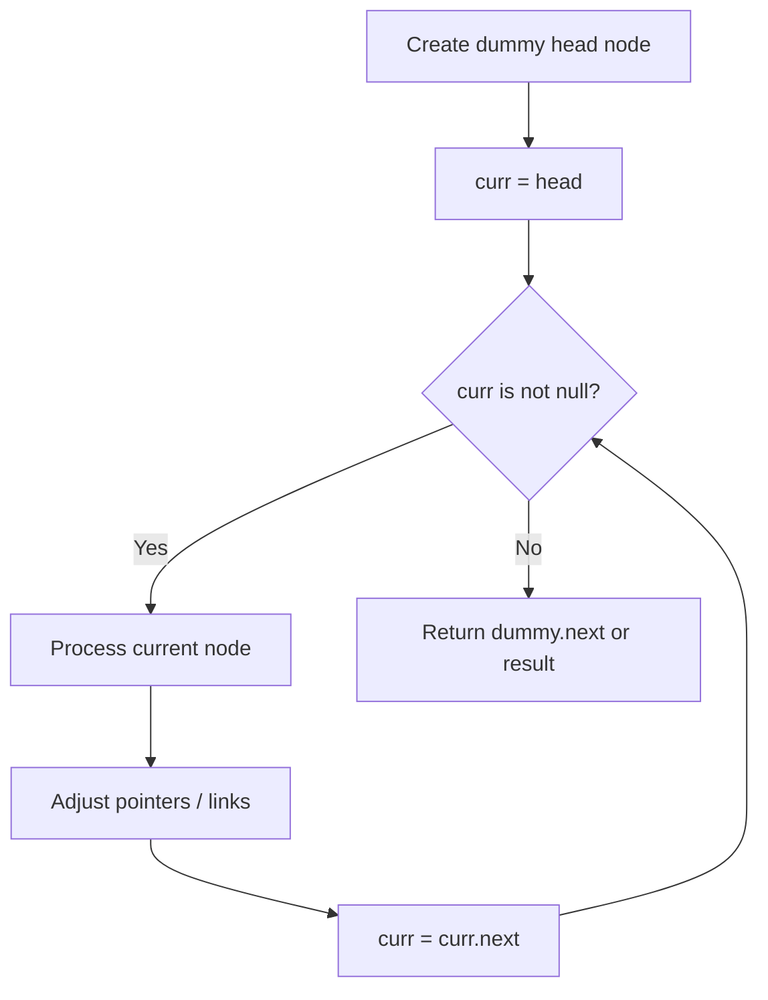
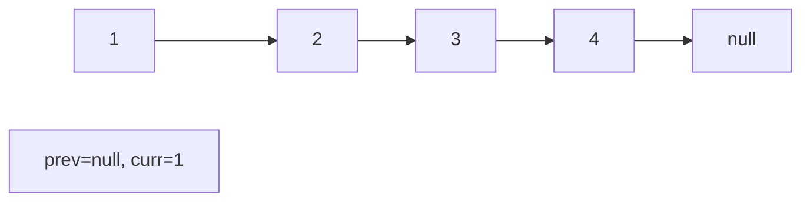
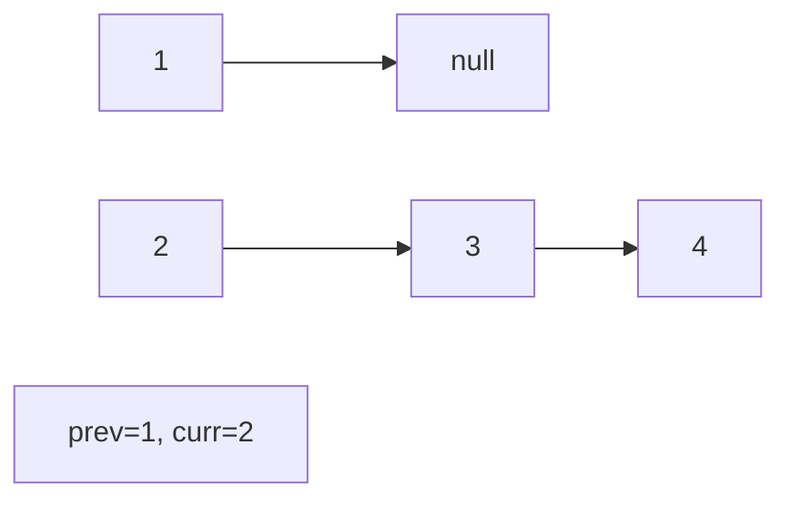
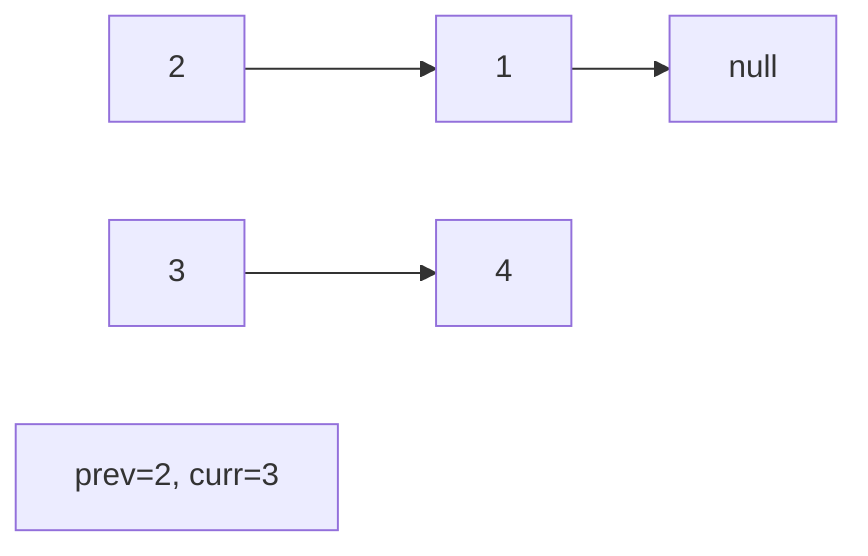
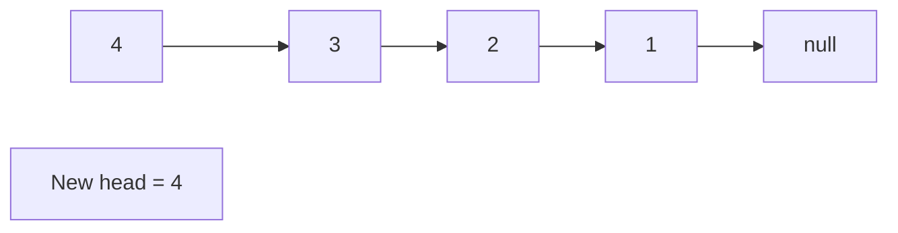

# Problem 142: Linked List Cycle II

**Difficulty:** Medium  
**Tags:** Hash Table, Linked List, Two Pointers  
**Pattern:** Linked List  
**Link:** [leetcode.com/problems/linked-list-cycle-ii](https://leetcode.com/problems/linked-list-cycle-ii/)

## Description

Given the `head` of a linked list, return *the node where the cycle begins. If there is no cycle, return *`null`.

There is a cycle in a linked list if there is some node in the list that can be reached again by continuously following the `next` pointer. Internally, `pos` is used to denote the index of the node that tail's `next` pointer is connected to (**0-indexed**). It is `-1` if there is no cycle. **Note that** `pos` **is not passed as a parameter**.

**Do not modify** the linked list.

 

Example 1:

```

**Input:** head = [3,2,0,-4], pos = 1
**Output:** tail connects to node index 1
**Explanation:** There is a cycle in the linked list, where tail connects to the second node.

```

Example 2:

```

**Input:** head = [1,2], pos = 0
**Output:** tail connects to node index 0
**Explanation:** There is a cycle in the linked list, where tail connects to the first node.

```

Example 3:

```

**Input:** head = [1], pos = -1
**Output:** no cycle
**Explanation:** There is no cycle in the linked list.

```

 

**Constraints:**

	- The number of the nodes in the list is in the range `[0, 10^4]`.
	- `-10^5 <= Node.val <= 10^5`
	- `pos` is `-1` or a **valid index** in the linked-list.

 

**Follow up:** Can you solve it using `O(1)` (i.e. constant) memory?

## Approach: Linked List

Traverse or manipulate the linked list using pointer techniques. Common patterns: dummy head node for edge cases, fast/slow pointers for cycle detection or middle finding, in-place reversal, and merge operations.

## Pseudocode

```
1. Create dummy head if needed
2. Initialize pointer(s) at head
3. Traverse / modify list:
   a. Process current node
   b. Adjust next pointers as needed
   c. Move to next node
4. Return dummy.next or result
```

## Algorithm Flow



## Visual State Transitions

**Linked List Operation (Reverse):**

**Frame 1: Initial list**


**Frame 2: Reverse first link**


**Frame 3: Reverse second link**


**Frame 4: Fully reversed**



## Complexity Analysis

- **Time:** O(n)
- **Space:** O(1)

## Solution (Python3)

```python
class Solution:
    def detectCycle(self, head: Optional[ListNode]) -> Optional[ListNode]:
        # Linked list traversal/manipulation
        dummy = ListNode(0)
        dummy.next = head
        prev, curr = dummy, head
        while curr:
            nxt = curr.next
            # Process current node
            prev = curr
            curr = nxt
        return dummy.next
```

## Solution (C++)

```cpp
#include <string>
#include <vector>
using namespace std;

class Solution {
public:
    ListNode* detectCycle(ListNode* head) {
        // Linked list traversal/manipulation
        ListNode dummy(0);
        dummy.next = head;
        ListNode* prev = &dummy;
        ListNode* curr = head;
        while (curr) {
            ListNode* nxt = curr->next;
            // Process current node
            prev = curr;
            curr = nxt;
        }
        return dummy.next;
    }
};
```
