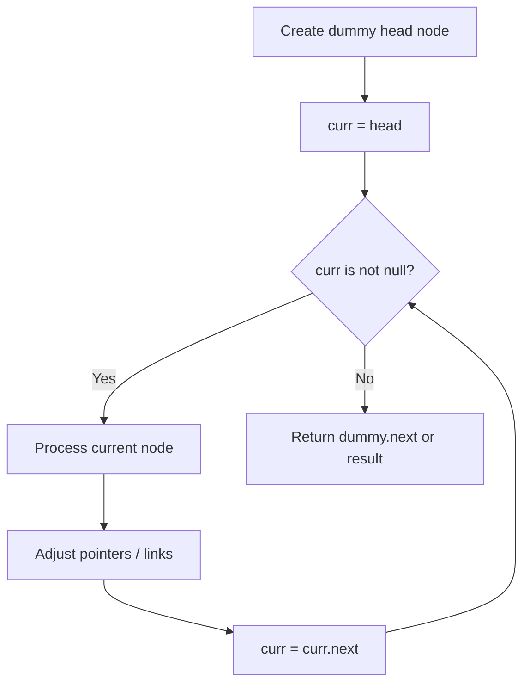
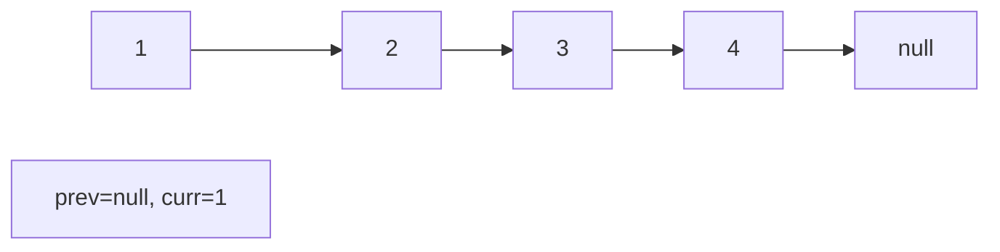
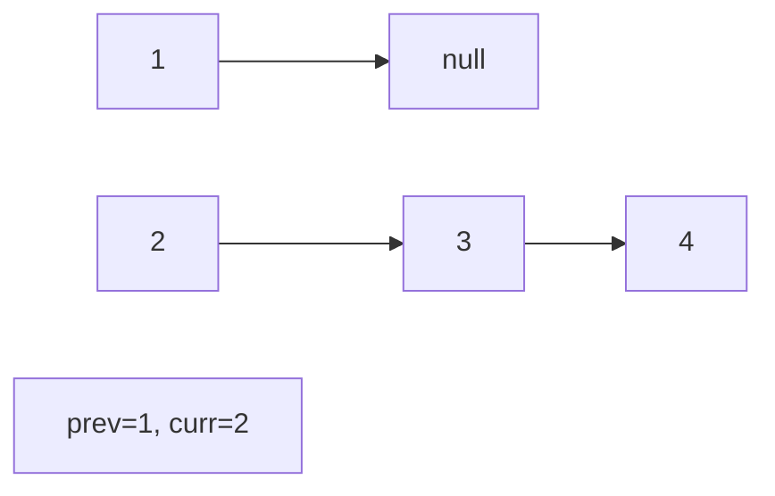
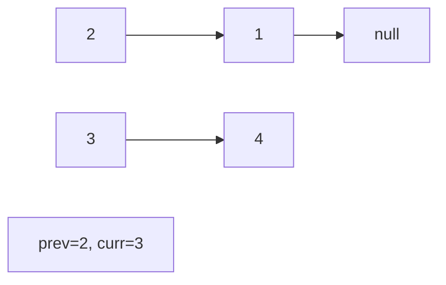
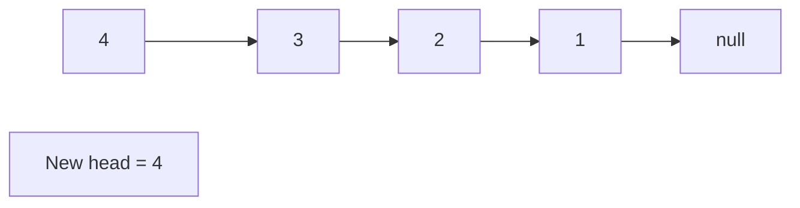

# Problem 143: Reorder List

**Difficulty:** Medium  
**Tags:** Linked List, Two Pointers, Stack, Recursion  
**Pattern:** Linked List  
**Link:** [leetcode.com/problems/reorder-list](https://leetcode.com/problems/reorder-list/)

## Description

You are given the head of a singly linked-list. The list can be represented as:

```

L0 → L1 → … → Ln - 1 → Ln

```

*Reorder the list to be on the following form:*

```

L0 → Ln → L1 → Ln - 1 → L2 → Ln - 2 → …

```

You may not modify the values in the list's nodes. Only nodes themselves may be changed.

 

Example 1:

```

**Input:** head = [1,2,3,4]
**Output:** [1,4,2,3]

```

Example 2:

```

**Input:** head = [1,2,3,4,5]
**Output:** [1,5,2,4,3]

```

 

**Constraints:**

	- The number of nodes in the list is in the range `[1, 5 * 10^4]`.
	- `1 <= Node.val <= 1000`

## Approach: Linked List

Traverse or manipulate the linked list using pointer techniques. Common patterns: dummy head node for edge cases, fast/slow pointers for cycle detection or middle finding, in-place reversal, and merge operations.

## Pseudocode

```
1. Create dummy head if needed
2. Initialize pointer(s) at head
3. Traverse / modify list:
   a. Process current node
   b. Adjust next pointers as needed
   c. Move to next node
4. Return dummy.next or result
```

## Algorithm Flow



## Visual State Transitions

**Linked List Operation (Reverse):**

**Frame 1: Initial list**


**Frame 2: Reverse first link**


**Frame 3: Reverse second link**


**Frame 4: Fully reversed**



## Complexity Analysis

- **Time:** O(n)
- **Space:** O(1)

## Solution (Python3)

```python
class Solution:
    def reorderList(self, head: Optional[ListNode]) -> None:
        # Linked list traversal/manipulation
        dummy = ListNode(0)
        dummy.next = head
        prev, curr = dummy, head
        while curr:
            nxt = curr.next
            # Process current node
            prev = curr
            curr = nxt
        return dummy.next
```

## Solution (C++)

```cpp
#include <string>
#include <vector>
using namespace std;

class Solution {
public:
    void reorderList(ListNode* head) {
        // Linked list traversal/manipulation
        ListNode dummy(0);
        dummy.next = head;
        ListNode* prev = &dummy;
        ListNode* curr = head;
        while (curr) {
            ListNode* nxt = curr->next;
            // Process current node
            prev = curr;
            curr = nxt;
        }
        return dummy.next;
    }
};
```
