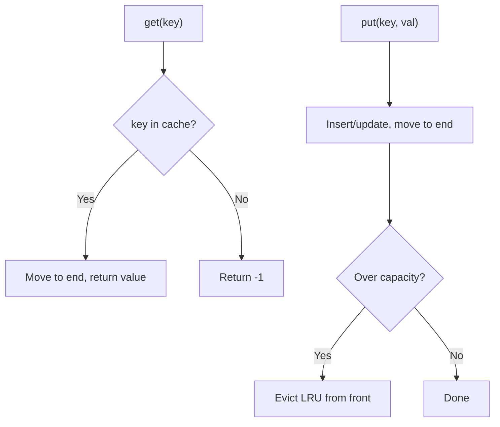
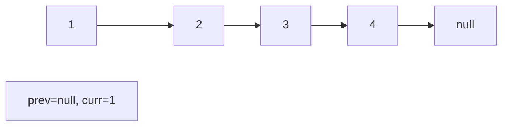
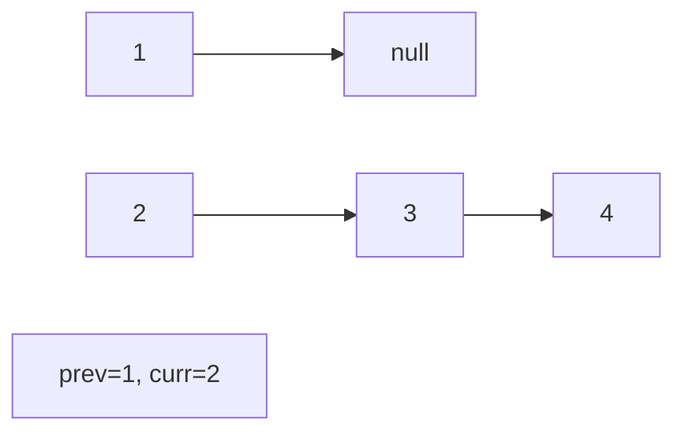
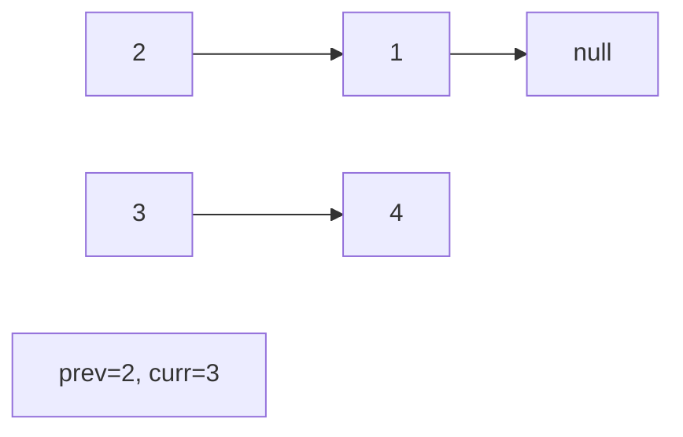
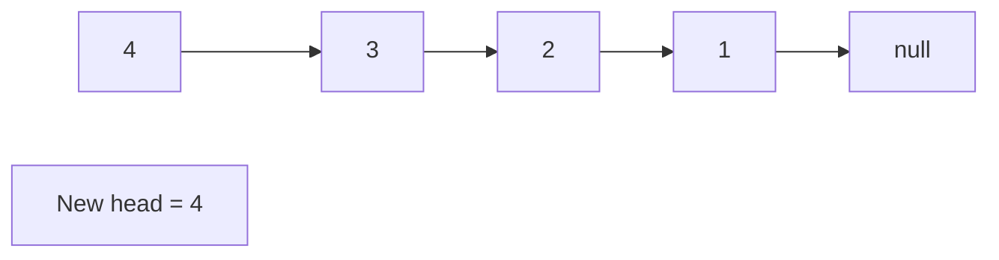

# Problem 146: LRU Cache

**Difficulty:** Medium  
**Tags:** Hash Table, Linked List, Design, Doubly-Linked List  
**Pattern:** Design / Hash Map + Linked List  
**Link:** [leetcode.com/problems/lru-cache](https://leetcode.com/problems/lru-cache/)

## Description

Design a data structure that follows the constraints of a **Least Recently Used (LRU) cache**.

Implement the `LRUCache` class:

	- `LRUCache(int capacity)` Initialize the LRU cache with **positive** size `capacity`.
	- `int get(int key)` Return the value of the `key` if the key exists, otherwise return `-1`.
	- `void put(int key, int value)` Update the value of the `key` if the `key` exists. Otherwise, add the `key-value` pair to the cache. If the number of keys exceeds the `capacity` from this operation, **evict** the least recently used key.

The functions `get` and `put` must each run in `O(1)` average time complexity.

 

Example 1:

```

**Input**
["LRUCache", "put", "put", "get", "put", "get", "put", "get", "get", "get"]
[[2], [1, 1], [2, 2], [1], [3, 3], [2], [4, 4], [1], [3], [4]]
**Output**
[null, null, null, 1, null, -1, null, -1, 3, 4]

**Explanation**
LRUCache lRUCache = new LRUCache(2);
lRUCache.put(1, 1); // cache is {1=1}
lRUCache.put(2, 2); // cache is {1=1, 2=2}
lRUCache.get(1);    // return 1
lRUCache.put(3, 3); // LRU key was 2, evicts key 2, cache is {1=1, 3=3}
lRUCache.get(2);    // returns -1 (not found)
lRUCache.put(4, 4); // LRU key was 1, evicts key 1, cache is {4=4, 3=3}
lRUCache.get(1);    // return -1 (not found)
lRUCache.get(3);    // return 3
lRUCache.get(4);    // return 4

```

 

**Constraints:**

	- `1 <= capacity <= 3000`
	- `0 <= key <= 10^4`
	- `0 <= value <= 10^5`
	- At most `2 * 10^5` calls will be made to `get` and `put`.

## Approach: Design / Hash Map + Linked List

OrderedDict gives O(1) access + ordering. Move to end on access, pop from front when full.

## Pseudocode

```
1. get: if exists, move to end, return value
2. put: insert/update, move to end
3. If over capacity: evict least recently used (front)
```

## Algorithm Flow



## Visual State Transitions

**Linked List Operation (Reverse):**

**Frame 1: Initial list**


**Frame 2: Reverse first link**


**Frame 3: Reverse second link**


**Frame 4: Fully reversed**



## Complexity Analysis

- **Time:** O(1) per operation
- **Space:** O(capacity)

## Solution (Python3)

```python
from collections import OrderedDict

class Solution:
    pass

class LRUCache:
    def __init__(self, capacity: int):
        self.cache = OrderedDict()
        self.capacity = capacity

    def get(self, key: int) -> int:
        if key not in self.cache:
            return -1
        self.cache.move_to_end(key)
        return self.cache[key]

    def put(self, key: int, value: int) -> None:
        if key in self.cache:
            self.cache.move_to_end(key)
        self.cache[key] = value
        if len(self.cache) > self.capacity:
            self.cache.popitem(last=False)
```

## Solution (C++)

```cpp
class LRUCache {
    int cap;
    list<pair<int,int>> lst;
    unordered_map<int, list<pair<int,int>>::iterator> mp;
public:
    LRUCache(int capacity) : cap(capacity) {}
    
    int get(int key) {
        if (!mp.count(key)) return -1;
        lst.splice(lst.end(), lst, mp[key]);
        return mp[key]->second;
    }
    
    void put(int key, int value) {
        if (mp.count(key)) {
            mp[key]->second = value;
            lst.splice(lst.end(), lst, mp[key]);
            return;
        }
        if ((int)lst.size() == cap) {
            mp.erase(lst.front().first);
            lst.pop_front();
        }
        lst.push_back({key, value});
        mp[key] = prev(lst.end());
    }
};
```
