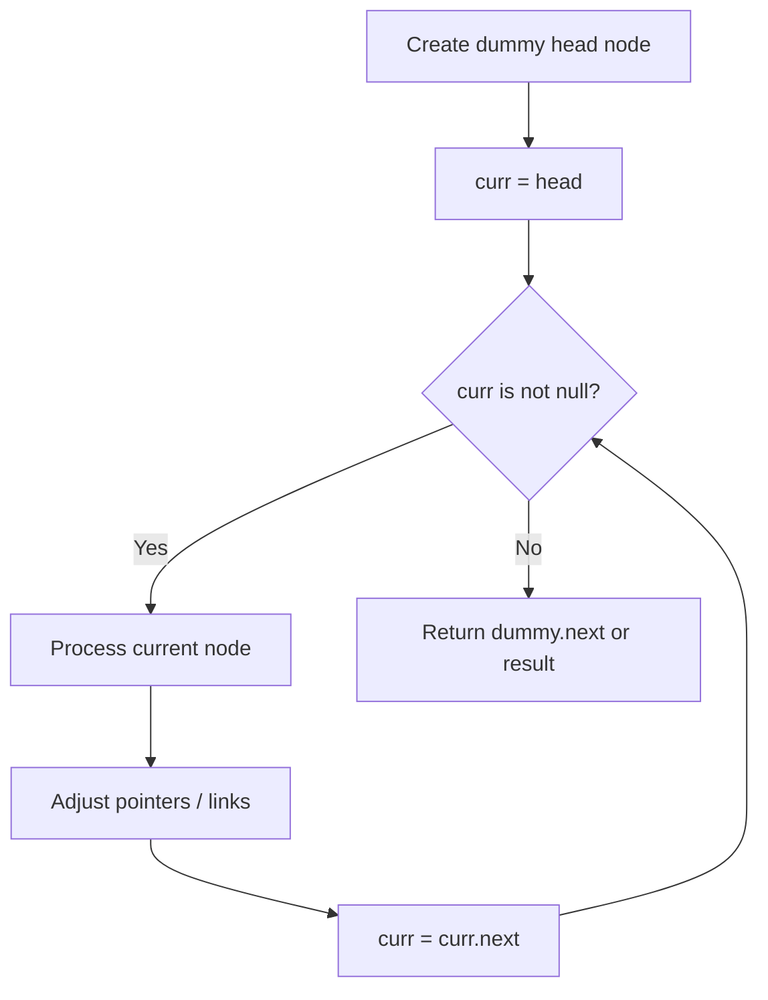
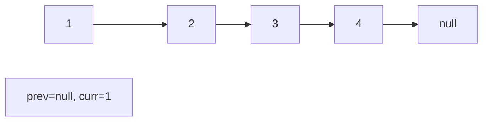
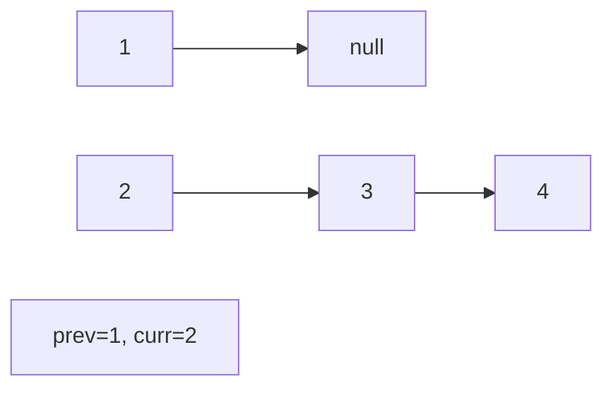
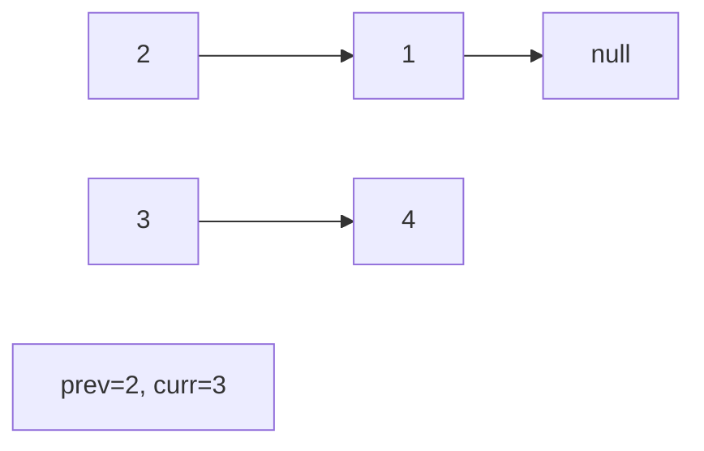
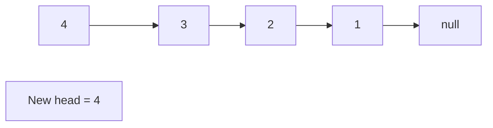

# Problem 147: Insertion Sort List

**Difficulty:** Medium  
**Tags:** Linked List, Sorting  
**Pattern:** Linked List  
**Link:** [leetcode.com/problems/insertion-sort-list](https://leetcode.com/problems/insertion-sort-list/)

## Description

Given the `head` of a singly linked list, sort the list using **insertion sort**, and return *the sorted list's head*.

The steps of the **insertion sort** algorithm:

	- Insertion sort iterates, consuming one input element each repetition and growing a sorted output list.
	- At each iteration, insertion sort removes one element from the input data, finds the location it belongs within the sorted list and inserts it there.
	- It repeats until no input elements remain.

The following is a graphical example of the insertion sort algorithm. The partially sorted list (black) initially contains only the first element in the list. One element (red) is removed from the input data and inserted in-place into the sorted list with each iteration.

 

Example 1:

```

**Input:** head = [4,2,1,3]
**Output:** [1,2,3,4]

```

Example 2:

```

**Input:** head = [-1,5,3,4,0]
**Output:** [-1,0,3,4,5]

```

 

**Constraints:**

	- The number of nodes in the list is in the range `[1, 5000]`.
	- `-5000 <= Node.val <= 5000`

## Approach: Linked List

Traverse or manipulate the linked list using pointer techniques. Common patterns: dummy head node for edge cases, fast/slow pointers for cycle detection or middle finding, in-place reversal, and merge operations.

## Pseudocode

```
1. Create dummy head if needed
2. Initialize pointer(s) at head
3. Traverse / modify list:
   a. Process current node
   b. Adjust next pointers as needed
   c. Move to next node
4. Return dummy.next or result
```

## Algorithm Flow



## Visual State Transitions

**Linked List Operation (Reverse):**

**Frame 1: Initial list**


**Frame 2: Reverse first link**


**Frame 3: Reverse second link**


**Frame 4: Fully reversed**



## Complexity Analysis

- **Time:** O(n)
- **Space:** O(1)

## Solution (Python3)

```python
class Solution:
    def insertionSortList(self, head: Optional[ListNode]) -> Optional[ListNode]:
        # Linked list traversal/manipulation
        dummy = ListNode(0)
        dummy.next = head
        prev, curr = dummy, head
        while curr:
            nxt = curr.next
            # Process current node
            prev = curr
            curr = nxt
        return dummy.next
```

## Solution (C++)

```cpp
#include <string>
#include <vector>
using namespace std;

class Solution {
public:
    ListNode* insertionSortList(ListNode* head) {
        // Linked list traversal/manipulation
        ListNode dummy(0);
        dummy.next = head;
        ListNode* prev = &dummy;
        ListNode* curr = head;
        while (curr) {
            ListNode* nxt = curr->next;
            // Process current node
            prev = curr;
            curr = nxt;
        }
        return dummy.next;
    }
};
```
