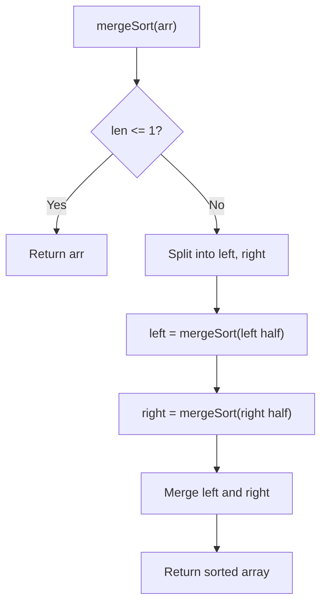

# Problem 148: Sort List

**Difficulty:** Medium  
**Tags:** Linked List, Two Pointers, Divide and Conquer, Sorting, Merge Sort  
**Pattern:** Merge Sort / Linked List  
**Link:** [leetcode.com/problems/sort-list](https://leetcode.com/problems/sort-list/)

## Description

Given the `head` of a linked list, return *the list after sorting it in **ascending order***.

 

Example 1:

```

**Input:** head = [4,2,1,3]
**Output:** [1,2,3,4]

```

Example 2:

```

**Input:** head = [-1,5,3,4,0]
**Output:** [-1,0,3,4,5]

```

Example 3:

```

**Input:** head = []
**Output:** []

```

 

**Constraints:**

	- The number of nodes in the list is in the range `[0, 5 * 10^4]`.
	- `-10^5 <= Node.val <= 10^5`

 

**Follow up:** Can you sort the linked list in `O(n logn)` time and `O(1)` memory (i.e. constant space)?

## Approach: Merge Sort / Linked List

Merge sort on linked list: find middle, split, sort halves, merge.

## Pseudocode

```
1. Find middle with slow/fast
2. Split list in two
3. Recursively sort each half
4. Merge sorted halves
```

## Algorithm Flow



## Complexity Analysis

- **Time:** O(n log n)
- **Space:** O(log n)

## Solution (Python3)

```python
class Solution:
    def sortList(self, head):
        if not head or not head.next:
            return head
        slow, fast = head, head.next
        while fast and fast.next:
            slow = slow.next
            fast = fast.next.next
        mid = slow.next
        slow.next = None
        left = self.sortList(head)
        right = self.sortList(mid)
        dummy = ListNode(0)
        curr = dummy
        while left and right:
            if left.val <= right.val:
                curr.next = left; left = left.next
            else:
                curr.next = right; right = right.next
            curr = curr.next
        curr.next = left or right
        return dummy.next
```

## Solution (C++)

```cpp
#include <functional>
#include <string>
#include <vector>
using namespace std;

class Solution {
public:
    ListNode* sortList(ListNode* head) {
        // Merge sort - O(n log n)
        function<void(int, int)> mergeSort = [&](int l, int r) {
            if (l >= r) return;
            int mid = (l + r) / 2;
            mergeSort(l, mid);
            mergeSort(mid + 1, r);
            vector<int> temp;
            int i = l, j = mid + 1;
            while (i <= mid && j <= r) {
                if (head[i] <= head[j]) temp.push_back(head[i++]);
                else temp.push_back(head[j++]);
            }
            while (i <= mid) temp.push_back(head[i++]);
            while (j <= r) temp.push_back(head[j++]);
            for (int k = l; k <= r; k++) head[k] = temp[k - l];
        };
        mergeSort(0, head.size() - 1);
        return head;
    }
};
```
