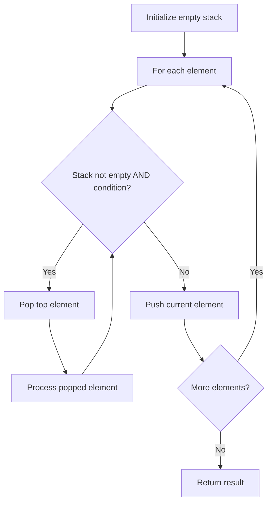

# Problem 150: Evaluate Reverse Polish Notation

**Difficulty:** Medium  
**Tags:** Array, Math, Stack  
**Pattern:** Stack  
**Link:** [leetcode.com/problems/evaluate-reverse-polish-notation](https://leetcode.com/problems/evaluate-reverse-polish-notation/)

## Description

You are given an array of strings `tokens` that represents an arithmetic expression in a Reverse Polish Notation.

Evaluate the expression. Return *an integer that represents the value of the expression*.

**Note** that:

	- The valid operators are `'+'`, `'-'`, `'*'`, and `'/'`.
	- Each operand may be an integer or another expression.
	- The division between two integers always **truncates toward zero**.
	- There will not be any division by zero.
	- The input represents a valid arithmetic expression in a reverse polish notation.
	- The answer and all the intermediate calculations can be represented in a **32-bit** integer.

 

Example 1:

```

**Input:** tokens = ["2","1","+","3","*"]
**Output:** 9
**Explanation:** ((2 + 1) * 3) = 9

```

Example 2:

```

**Input:** tokens = ["4","13","5","/","+"]
**Output:** 6
**Explanation:** (4 + (13 / 5)) = 6

```

Example 3:

```

**Input:** tokens = ["10","6","9","3","+","-11","*","/","*","17","+","5","+"]
**Output:** 22
**Explanation:** ((10 * (6 / ((9 + 3) * -11))) + 17) + 5
= ((10 * (6 / (12 * -11))) + 17) + 5
= ((10 * (6 / -132)) + 17) + 5
= ((10 * 0) + 17) + 5
= (0 + 17) + 5
= 17 + 5
= 22

```

 

**Constraints:**

	- `1 <= tokens.length <= 10^4`
	- `tokens[i]` is either an operator: `"+"`, `"-"`, `"*"`, or `"/"`, or an integer in the range `[-200, 200]`.

## Approach: Stack

Use a stack (LIFO) to process elements. Push elements when they might be needed later; pop when a matching or resolving condition is found. Common uses: parentheses matching, expression evaluation, next greater element.

## Pseudocode

```
1. Initialize empty stack
2. For each element:
   a. While stack is not empty and condition met:
      - Pop and process top element
   b. Push current element onto stack
3. Process remaining elements in stack if needed
4. Return result
```

## Algorithm Flow



## Complexity Analysis

- **Time:** O(n)
- **Space:** O(n)

## Solution (Python3)

```python
class Solution:
    def evalRPN(self, tokens: List[str]) -> int:
        # Stack-based approach - O(n) time
        stack = []
        for ch in tokens:
            if stack and self._matches(stack[-1], ch):
                stack.pop()
            else:
                stack.append(ch)
        return len(stack) == 0 if isinstance(0, bool) else stack

    def _matches(self, a, b):
        pairs = {'(': ')', '[': ']', '{': '}'}
        return pairs.get(a) == b
```

## Solution (C++)

```cpp
#include <stack>
#include <string>
#include <unordered_map>
#include <vector>
using namespace std;

class Solution {
public:
    int evalRPN(vector<string>& tokens) {
        // Stack-based approach - O(n) time
        stack<char> st;
        unordered_map<char, char> pairs = {{'(', ')'}, {'[', ']'}, {'{', '}'}};
        for (char ch : tokens) {
            if (!st.empty() && pairs.count(st.top()) && pairs[st.top()] == ch) {
                st.pop();
            } else {
                st.push(ch);
            }
        }
        return st.empty();
    }
};
```
