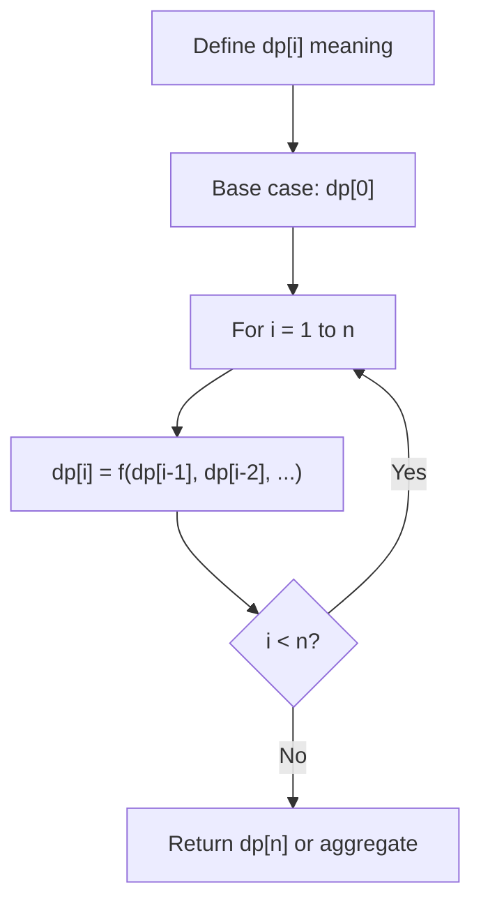
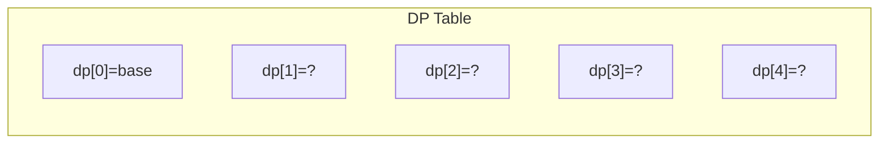
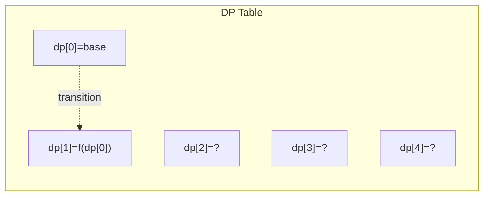
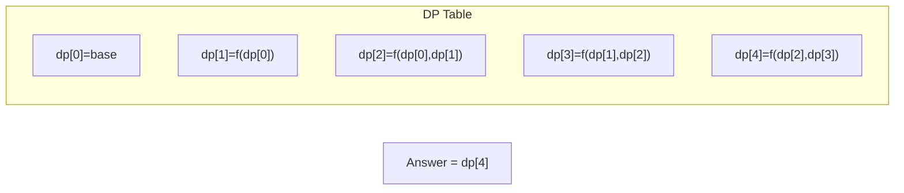

# Problem 152: Maximum Product Subarray

**Difficulty:** Medium  
**Tags:** Array, Dynamic Programming  
**Pattern:** Dynamic Programming  
**Link:** [leetcode.com/problems/maximum-product-subarray](https://leetcode.com/problems/maximum-product-subarray/)

## Description

Given an integer array `nums`, find a subarray that has the largest product, and return *the product*.

The test cases are generated so that the answer will fit in a **32-bit** integer.

**Note** that the product of an array with a single element is the value of that element.

 

Example 1:

```

**Input:** nums = [2,3,-2,4]
**Output:** 6
**Explanation:** [2,3] has the largest product 6.

```

Example 2:

```

**Input:** nums = [-2,0,-1]
**Output:** 0
**Explanation:** The result cannot be 2, because [-2,-1] is not a subarray.

```

 

**Constraints:**

	- `1 <= nums.length <= 2 * 10^4`
	- `-10 <= nums[i] <= 10`
	- The product of any subarray of `nums` is **guaranteed** to fit in a **32-bit** integer.

## Approach: Dynamic Programming

Track both max and min products (negatives can flip). Swap on negative numbers.

## Pseudocode

```
1. max_prod = min_prod = result = nums[0]
2. For each num: if negative swap max/min
3. Update max/min products
4. Track global max
```

## Algorithm Flow



## Visual State Transitions

**1D Dynamic Programming Table Build:**

**Frame 1: Initialize base cases**


**Frame 2: Fill dp[1] from dp[0]**


**Frame 3: Fill remaining cells**



## Complexity Analysis

- **Time:** O(n)
- **Space:** O(1)

## Solution (Python3)

```python
class Solution:
    def maxProduct(self, nums: list[int]) -> int:
        max_prod = min_prod = result = nums[0]
        for num in nums[1:]:
            if num < 0:
                max_prod, min_prod = min_prod, max_prod
            max_prod = max(num, max_prod * num)
            min_prod = min(num, min_prod * num)
            result = max(result, max_prod)
        return result
```

## Solution (C++)

```cpp
#include <string>
#include <vector>
using namespace std;

class Solution {
public:
    int maxProduct(vector<int>& nums) {
        // Dynamic programming (1D) - O(n) time, O(n) space
        int n = nums;
        if (n <= 0) return 0;
        vector<int> dp(n + 1, 0);
        dp[0] = 1;
        for (int i = 1; i <= n; i++) {
            dp[i] = dp[i-1];
            if (i >= 2) dp[i] += dp[i-2];
        }
        return dp[n];
    }
};
```
