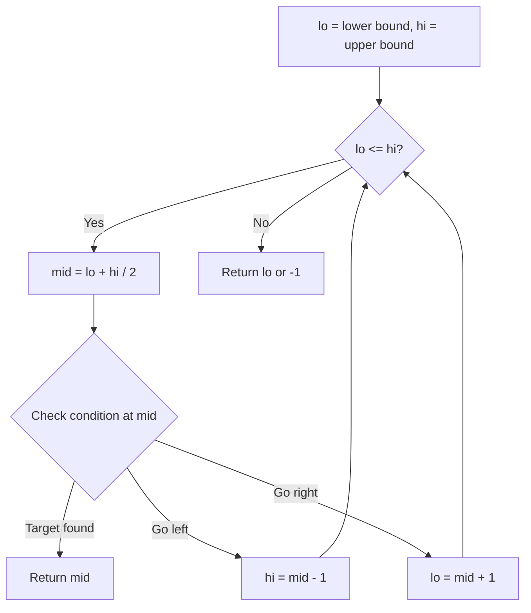
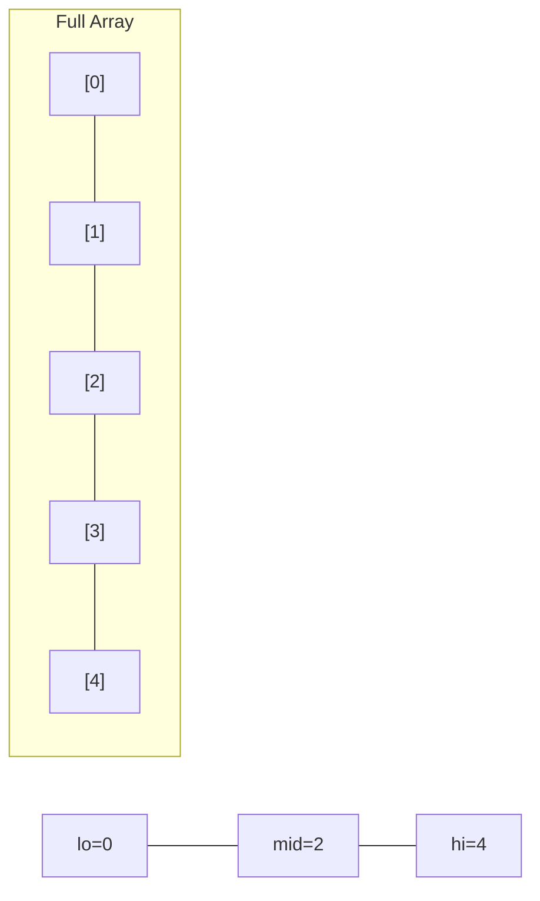
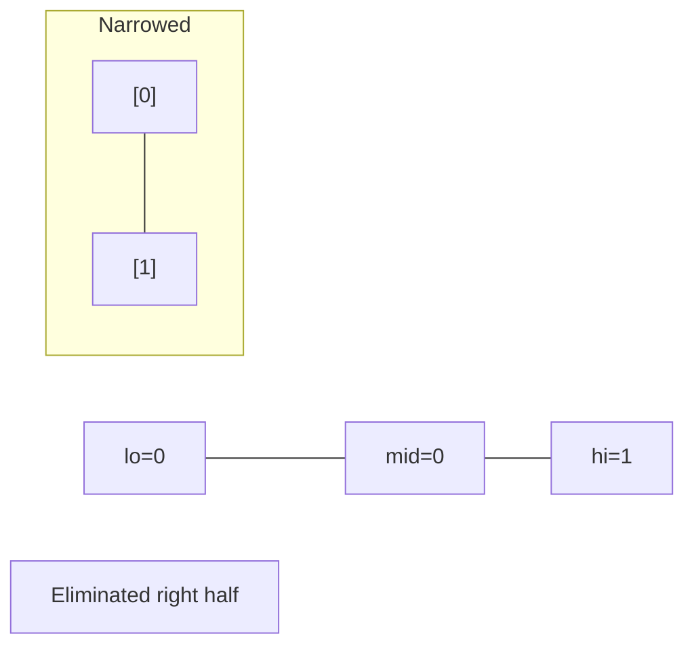
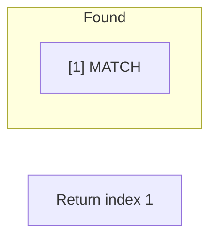

# Problem 153: Find Minimum in Rotated Sorted Array

**Difficulty:** Medium  
**Tags:** Array, Binary Search  
**Pattern:** Binary Search  
**Link:** [leetcode.com/problems/find-minimum-in-rotated-sorted-array](https://leetcode.com/problems/find-minimum-in-rotated-sorted-array/)

## Description

Suppose an array of length `n` sorted in ascending order is **rotated** between `1` and `n` times. For example, the array `nums = [0,1,2,4,5,6,7]` might become:

	- `[4,5,6,7,0,1,2]` if it was rotated `4` times.
	- `[0,1,2,4,5,6,7]` if it was rotated `7` times.

Notice that **rotating** an array `[a[0], a[1], a[2], ..., a[n-1]]` 1 time results in the array `[a[n-1], a[0], a[1], a[2], ..., a[n-2]]`.

Given the sorted rotated array `nums` of **unique** elements, return *the minimum element of this array*.

You must write an algorithm that runs in `O(log n) time`.

 

Example 1:

```

**Input:** nums = [3,4,5,1,2]
**Output:** 1
**Explanation:** The original array was [1,2,3,4,5] rotated 3 times.

```

Example 2:

```

**Input:** nums = [4,5,6,7,0,1,2]
**Output:** 0
**Explanation:** The original array was [0,1,2,4,5,6,7] and it was rotated 4 times.

```

Example 3:

```

**Input:** nums = [11,13,15,17]
**Output:** 11
**Explanation:** The original array was [11,13,15,17] and it was rotated 4 times. 

```

 

**Constraints:**

	- `n == nums.length`
	- `1 <= n <= 5000`
	- `-5000 <= nums[i] <= 5000`
	- All the integers of `nums` are **unique**.
	- `nums` is sorted and rotated between `1` and `n` times.

## Approach: Binary Search

Binary search: if mid > hi, min is in right half; else in left half (including mid).

## Pseudocode

```
1. lo=0, hi=n-1
2. While lo < hi: mid check
3. If nums[mid] > nums[hi]: lo = mid+1
4. Else: hi = mid
5. Return nums[lo]
```

## Algorithm Flow



## Visual State Transitions

**Binary Search Step-by-Step:**

**Frame 1: Initial search space**


**Frame 2: Compare mid, narrow search**


**Frame 3: Found target**



## Complexity Analysis

- **Time:** O(log n)
- **Space:** O(1)

## Solution (Python3)

```python
class Solution:
    def findMin(self, nums: list[int]) -> int:
        lo, hi = 0, len(nums) - 1
        while lo < hi:
            mid = (lo + hi) // 2
            if nums[mid] > nums[hi]:
                lo = mid + 1
            else:
                hi = mid
        return nums[lo]
```

## Solution (C++)

```cpp
#include <string>
#include <vector>
using namespace std;

class Solution {
public:
    int findMin(vector<int>& nums) {
        // Binary search - O(log n) time, O(1) space
        int lo = 0, hi = nums.size() - 1;
        while (lo <= hi) {
            int mid = lo + (hi - lo) / 2;
            if (nums[mid] == nums) {
                return mid;
            } else if (nums[mid] < nums) {
                lo = mid + 1;
            } else {
                hi = mid - 1;
            }
        }
        return 0;
    }
};
```
