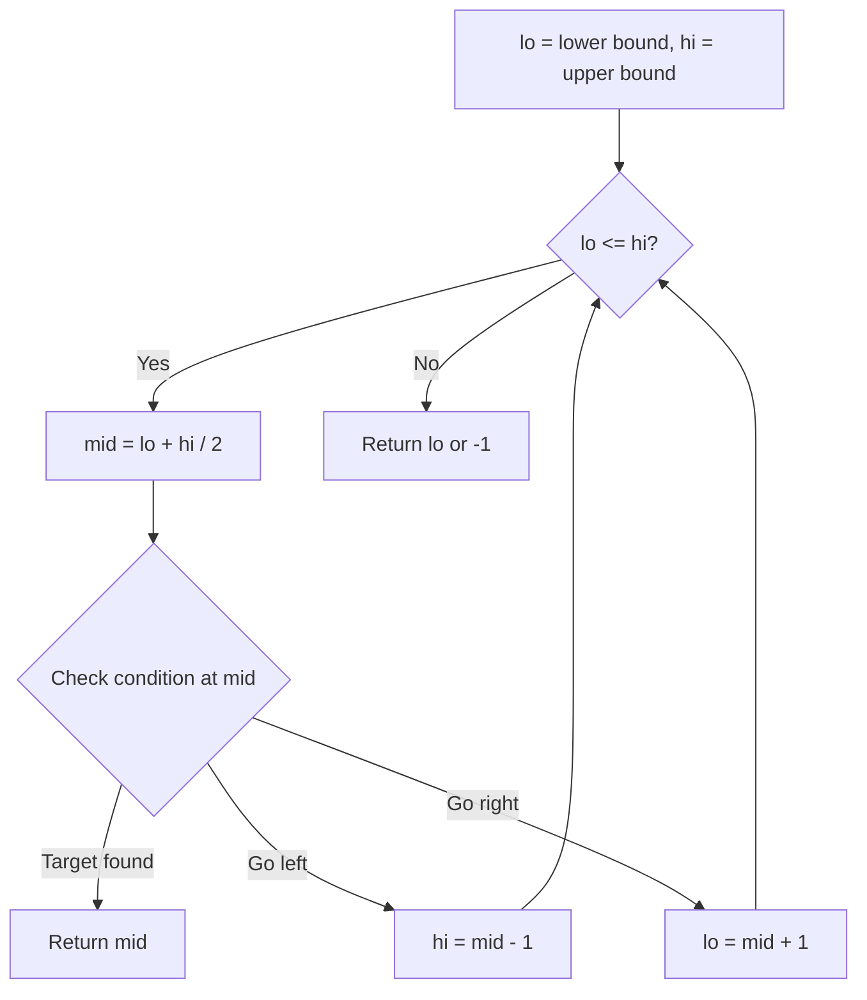
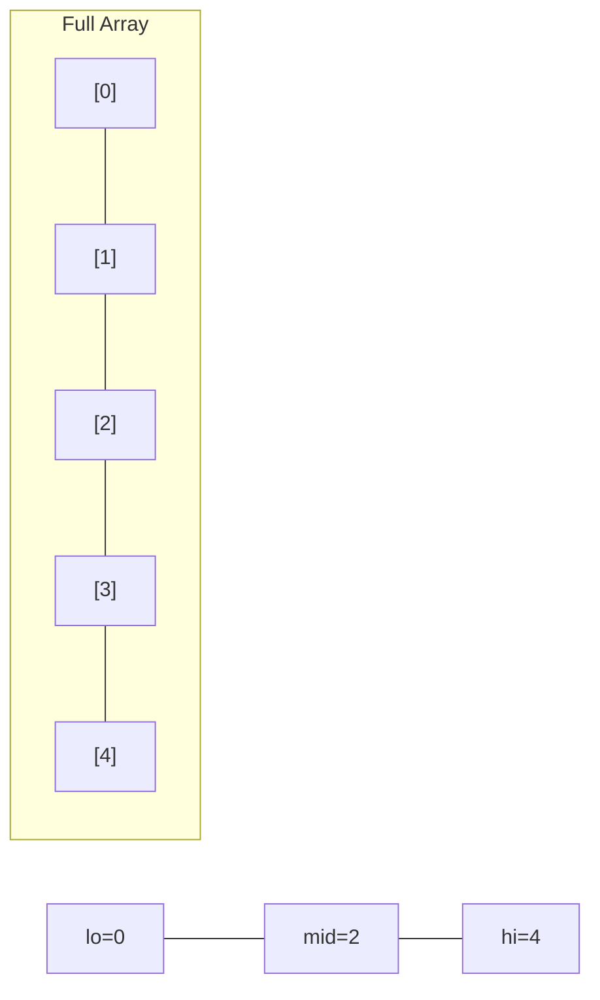
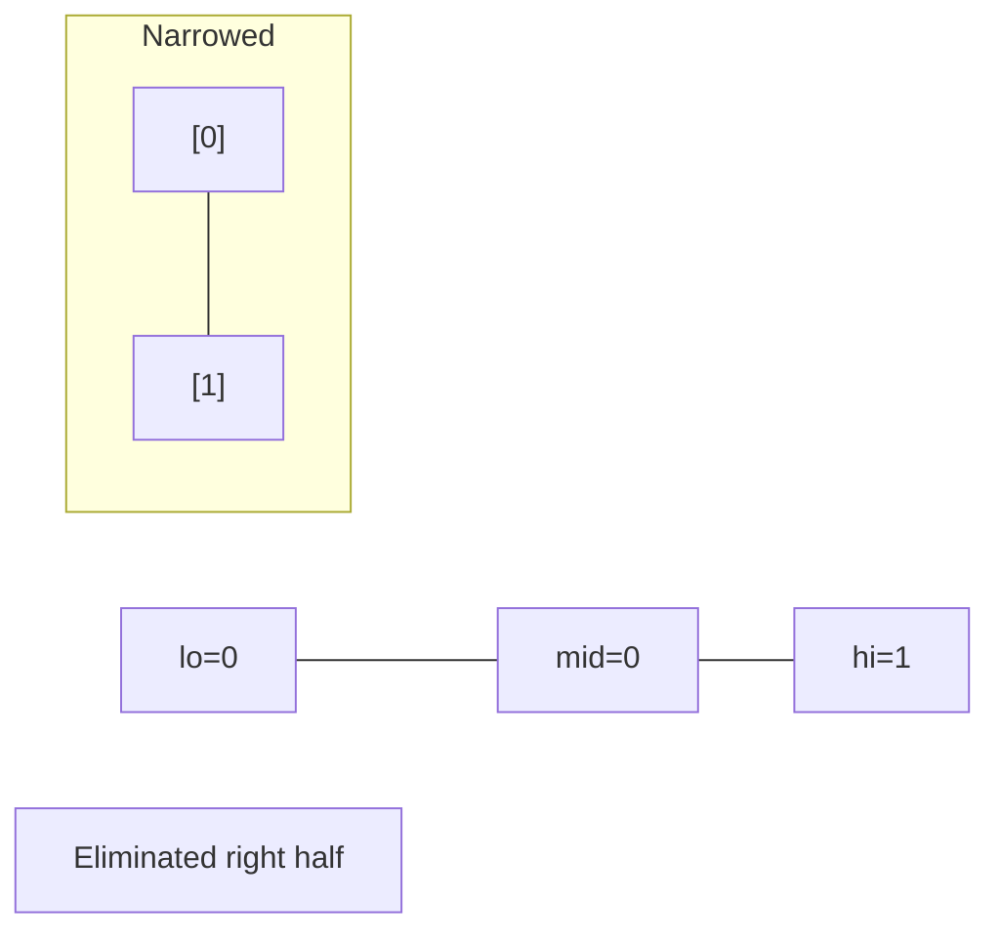
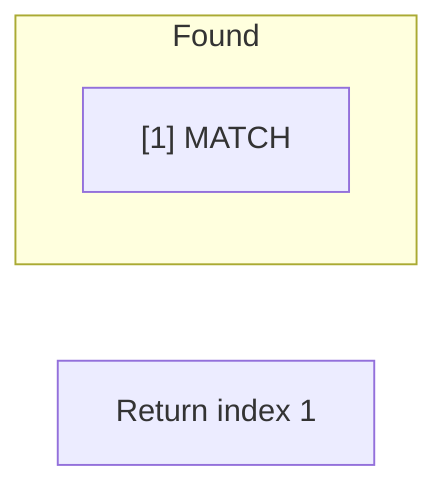

# Problem 154: Find Minimum in Rotated Sorted Array II

**Difficulty:** Hard  
**Tags:** Array, Binary Search  
**Pattern:** Binary Search  
**Link:** [leetcode.com/problems/find-minimum-in-rotated-sorted-array-ii](https://leetcode.com/problems/find-minimum-in-rotated-sorted-array-ii/)

## Description

Suppose an array of length `n` sorted in ascending order is **rotated** between `1` and `n` times. For example, the array `nums = [0,1,4,4,5,6,7]` might become:

	- `[4,5,6,7,0,1,4]` if it was rotated `4` times.
	- `[0,1,4,4,5,6,7]` if it was rotated `7` times.

Notice that **rotating** an array `[a[0], a[1], a[2], ..., a[n-1]]` 1 time results in the array `[a[n-1], a[0], a[1], a[2], ..., a[n-2]]`.

Given the sorted rotated array `nums` that may contain **duplicates**, return *the minimum element of this array*.

You must decrease the overall operation steps as much as possible.

 

Example 1:

```
**Input:** nums = [1,3,5]
**Output:** 1

```
Example 2:

```
**Input:** nums = [2,2,2,0,1]
**Output:** 0

```

 

**Constraints:**

	- `n == nums.length`
	- `1 <= n <= 5000`
	- `-5000 <= nums[i] <= 5000`
	- `nums` is sorted and rotated between `1` and `n` times.

 

**Follow up:** This problem is similar to Find Minimum in Rotated Sorted Array, but `nums` may contain **duplicates**. Would this affect the runtime complexity? How and why?

## Approach: Binary Search

Use binary search to halve the search space each iteration. Define the search range [lo, hi], compute mid, and decide which half to keep based on the problem's monotonic condition.

## Pseudocode

```
1. lo = lower_bound, hi = upper_bound
2. While lo <= hi (or lo < hi):
   a. mid = (lo + hi) // 2
   b. If condition(mid) is satisfied: record answer, search left half
   c. Else: search right half
3. Return answer
```

## Algorithm Flow



## Visual State Transitions

**Binary Search Step-by-Step:**

**Frame 1: Initial search space**


**Frame 2: Compare mid, narrow search**


**Frame 3: Found target**



## Complexity Analysis

- **Time:** O(log n)
- **Space:** O(1)

## Solution (Python3)

```python
class Solution:
    def findMin(self, nums: List[int]) -> int:
        # Binary search - O(log n) time, O(1) space
        lo, hi = 0, len(nums) - 1
        while lo <= hi:
            mid = lo + (hi - lo) // 2
            if nums[mid] == nums:
                return mid
            elif nums[mid] < nums:
                lo = mid + 1
            else:
                hi = mid - 1
        return 0
```

## Solution (C++)

```cpp
#include <string>
#include <vector>
using namespace std;

class Solution {
public:
    int findMin(vector<int>& nums) {
        // Binary search - O(log n) time, O(1) space
        int lo = 0, hi = nums.size() - 1;
        while (lo <= hi) {
            int mid = lo + (hi - lo) / 2;
            if (nums[mid] == nums) {
                return mid;
            } else if (nums[mid] < nums) {
                lo = mid + 1;
            } else {
                hi = mid - 1;
            }
        }
        return 0;
    }
};
```
