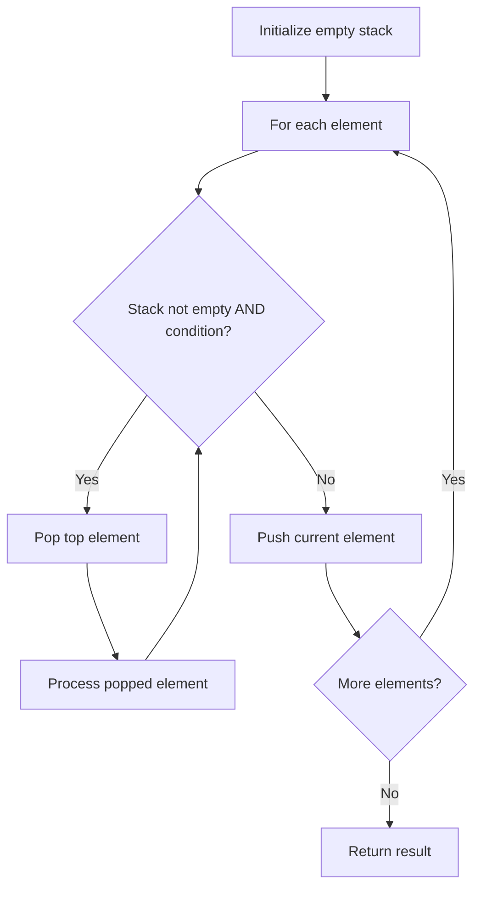

# Problem 155: Min Stack

**Difficulty:** Medium  
**Tags:** Stack, Design  
**Pattern:** Stack / Design  
**Link:** [leetcode.com/problems/min-stack](https://leetcode.com/problems/min-stack/)

## Description

Design a stack that supports push, pop, top, and retrieving the minimum element in constant time.

Implement the `MinStack` class:

	- `MinStack()` initializes the stack object.
	- `void push(int val)` pushes the element `val` onto the stack.
	- `void pop()` removes the element on the top of the stack.
	- `int top()` gets the top element of the stack.
	- `int getMin()` retrieves the minimum element in the stack.

You must implement a solution with `O(1)` time complexity for each function.

 

Example 1:

```

**Input**
["MinStack","push","push","push","getMin","pop","top","getMin"]
[[],[-2],[0],[-3],[],[],[],[]]

**Output**
[null,null,null,null,-3,null,0,-2]

**Explanation**
MinStack minStack = new MinStack();
minStack.push(-2);
minStack.push(0);
minStack.push(-3);
minStack.getMin(); // return -3
minStack.pop();
minStack.top();    // return 0
minStack.getMin(); // return -2

```

 

**Constraints:**

	- `-2^31 <= val <= 2^31 - 1`
	- Methods `pop`, `top` and `getMin` operations will always be called on **non-empty** stacks.
	- At most `3 * 10^4` calls will be made to `push`, `pop`, `top`, and `getMin`.

## Approach: Stack / Design

Maintain a parallel min stack that tracks the minimum at each level.

## Pseudocode

```
1. Two stacks: main + min tracker
2. Push: push val and min(val, current min)
3. Pop: pop both
4. getMin: peek min stack
```

## Algorithm Flow



## Complexity Analysis

- **Time:** O(1) per operation
- **Space:** O(n)

## Solution (Python3)

```python
class Solution:
    pass

class MinStack:
    def __init__(self):
        self.stack = []
        self.min_stack = []

    def push(self, val: int) -> None:
        self.stack.append(val)
        self.min_stack.append(min(val, self.min_stack[-1] if self.min_stack else val))

    def pop(self) -> None:
        self.stack.pop()
        self.min_stack.pop()

    def top(self) -> int:
        return self.stack[-1]

    def getMin(self) -> int:
        return self.min_stack[-1]
```

## Solution (C++)

```cpp
class MinStack {
    stack<int> st, minSt;
public:
    MinStack() {}
    void push(int val) {
        st.push(val);
        minSt.push(minSt.empty() ? val : min(val, minSt.top()));
    }
    void pop() { st.pop(); minSt.pop(); }
    int top() { return st.top(); }
    int getMin() { return minSt.top(); }
};
```
