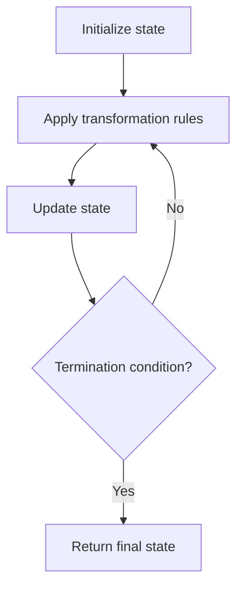

# Problem 157: Read N Characters Given Read4

**Difficulty:** Easy  
**Tags:** Array, Simulation, Interactive  
**Pattern:** Simulation  
**Link:** [leetcode.com/problems/read-n-characters-given-read4](https://leetcode.com/problems/read-n-characters-given-read4/)

## Description

*(Premium problem -- description requires LeetCode subscription)*

## Approach: Simulation

Simulate the process described in the problem step by step. Follow the rules exactly, tracking state at each step.

## Pseudocode

```
1. Initialize state (grid, pointers, counters)
2. For each step / iteration:
   a. Apply the transformation rules
   b. Update state
   c. Check termination condition
3. Return final state or result
```

## Algorithm Flow



## Complexity Analysis

- **Time:** O(n) or O(n * k)
- **Space:** O(n)

## Solution (Python3)

```python
class Solution:
    pass
```

## Solution (C++)

```cpp
class Solution {
public:
    // Design problem stub
};
```
