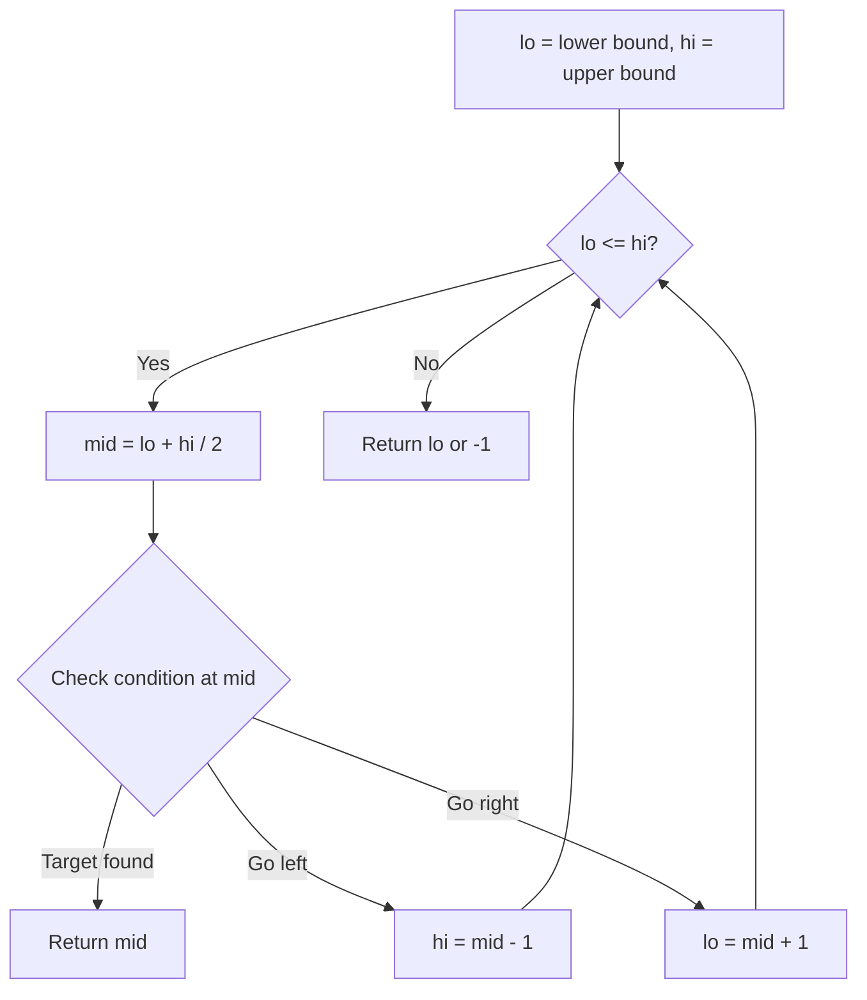
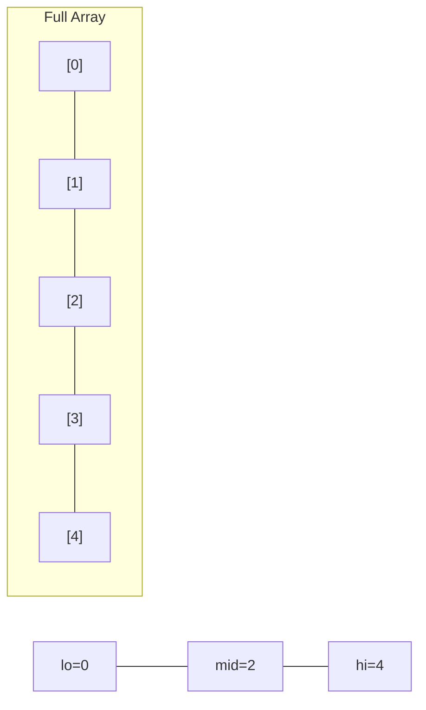
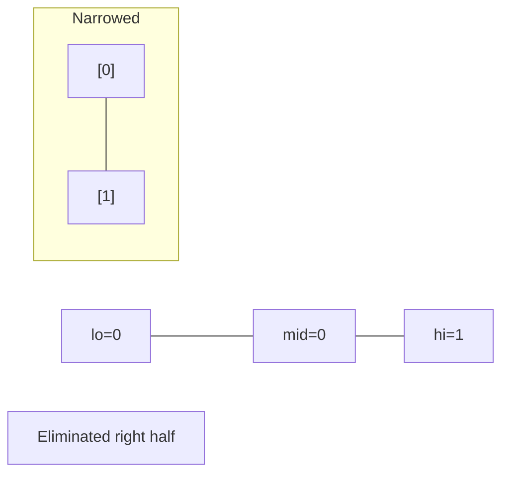
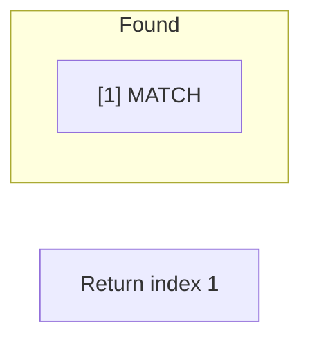

# Problem 162: Find Peak Element

**Difficulty:** Medium  
**Tags:** Array, Binary Search  
**Pattern:** Binary Search  
**Link:** [leetcode.com/problems/find-peak-element](https://leetcode.com/problems/find-peak-element/)

## Description

A peak element is an element that is strictly greater than its neighbors.

Given a **0-indexed** integer array `nums`, find a peak element, and return its index. If the array contains multiple peaks, return the index to **any of the peaks**.

You may imagine that `nums[-1] = nums[n] = -∞`. In other words, an element is always considered to be strictly greater than a neighbor that is outside the array.

You must write an algorithm that runs in `O(log n)` time.

 

Example 1:

```

**Input:** nums = [1,2,3,1]
**Output:** 2
**Explanation:** 3 is a peak element and your function should return the index number 2.
```

Example 2:

```

**Input:** nums = [1,2,1,3,5,6,4]
**Output:** 5
**Explanation:** Your function can return either index number 1 where the peak element is 2, or index number 5 where the peak element is 6.
```

 

**Constraints:**

	- `1 <= nums.length <= 1000`
	- `-2^31 <= nums[i] <= 2^31 - 1`
	- `nums[i] != nums[i + 1]` for all valid `i`.

## Approach: Binary Search

Use binary search to halve the search space each iteration. Define the search range [lo, hi], compute mid, and decide which half to keep based on the problem's monotonic condition.

## Pseudocode

```
1. lo = lower_bound, hi = upper_bound
2. While lo <= hi (or lo < hi):
   a. mid = (lo + hi) // 2
   b. If condition(mid) is satisfied: record answer, search left half
   c. Else: search right half
3. Return answer
```

## Algorithm Flow



## Visual State Transitions

**Binary Search Step-by-Step:**

**Frame 1: Initial search space**


**Frame 2: Compare mid, narrow search**


**Frame 3: Found target**



## Complexity Analysis

- **Time:** O(log n)
- **Space:** O(1)

## Solution (Python3)

```python
class Solution:
    def findPeakElement(self, nums: List[int]) -> int:
        # Binary search - O(log n) time, O(1) space
        lo, hi = 0, len(nums) - 1
        while lo <= hi:
            mid = lo + (hi - lo) // 2
            if nums[mid] == nums:
                return mid
            elif nums[mid] < nums:
                lo = mid + 1
            else:
                hi = mid - 1
        return 0
```

## Solution (C++)

```cpp
#include <string>
#include <vector>
using namespace std;

class Solution {
public:
    int findPeakElement(vector<int>& nums) {
        // Binary search - O(log n) time, O(1) space
        int lo = 0, hi = nums.size() - 1;
        while (lo <= hi) {
            int mid = lo + (hi - lo) / 2;
            if (nums[mid] == nums) {
                return mid;
            } else if (nums[mid] < nums) {
                lo = mid + 1;
            } else {
                hi = mid - 1;
            }
        }
        return 0;
    }
};
```
