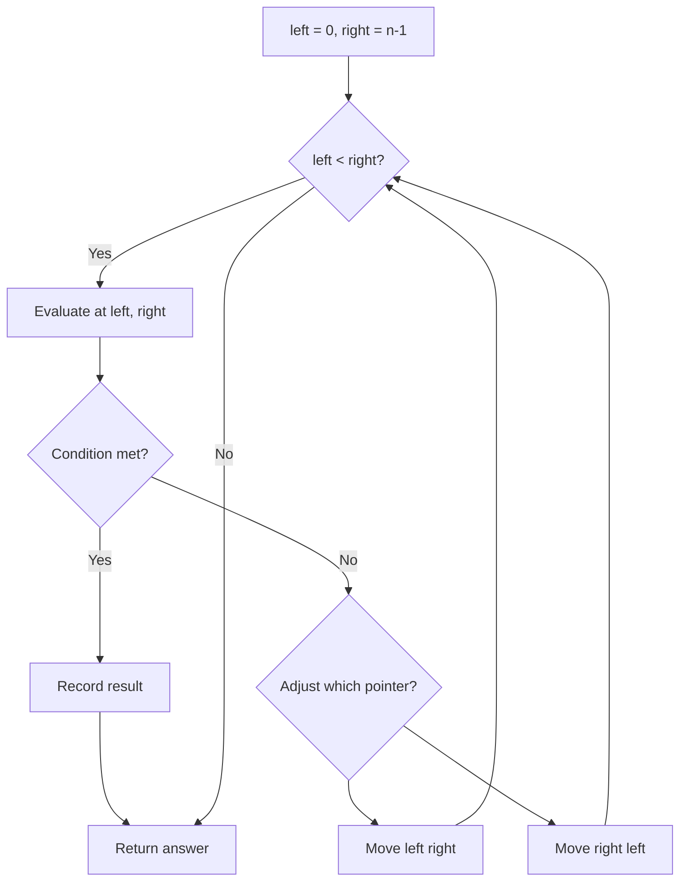
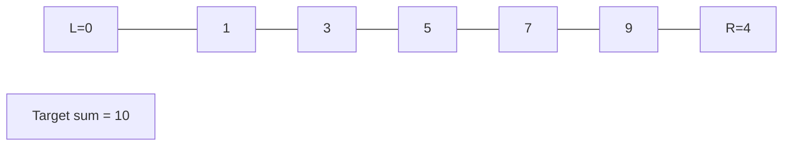
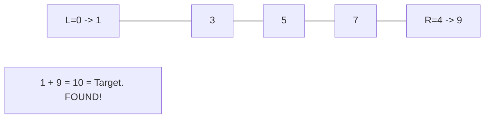

# Problem 165: Compare Version Numbers

**Difficulty:** Medium  
**Tags:** Two Pointers, String  
**Pattern:** Two Pointers  
**Link:** [leetcode.com/problems/compare-version-numbers](https://leetcode.com/problems/compare-version-numbers/)

## Description

Given two **version strings**, `version1` and `version2`, compare them. A version string consists of **revisions** separated by dots `'.'`. The **value of the revision** is its **integer conversion** ignoring leading zeros.

To compare version strings, compare their revision values in **left-to-right order**. If one of the version strings has fewer revisions, treat the missing revision values as `0`.

Return the following:

	- If `version1 < version2`, return -1.
	- If `version1 > version2`, return 1.
	- Otherwise, return 0.

 

Example 1:

**Input:** version1 = "1.2", version2 = "1.10"

**Output:** -1

**Explanation:**

version1's second revision is "2" and version2's second revision is "10": 2 < 10, so version1 < version2.

Example 2:

**Input:** version1 = "1.01", version2 = "1.001"

**Output:** 0

**Explanation:**

Ignoring leading zeroes, both "01" and "001" represent the same integer "1".

Example 3:

**Input:** version1 = "1.0", version2 = "1.0.0.0"

**Output:** 0

**Explanation:**

version1 has less revisions, which means every missing revision are treated as "0".

 

**Constraints:**

	- `1 <= version1.length, version2.length <= 500`
	- `version1` and `version2` only contain digits and `'.'`.
	- `version1` and `version2` **are valid version numbers**.
	- All the given revisions in `version1` and `version2` can be stored in a **32-bit integer**.

## Approach: Two Pointers

Use two pointers moving through the data structure. Depending on the problem, pointers may move toward each other (converging), in the same direction (fast/slow), or independently.

## Pseudocode

```
1. Initialize left = 0, right = n-1 (or two independent pointers)
2. While pointers haven't crossed:
   a. Evaluate condition at pointer positions
   b. Move left pointer right or right pointer left
3. Return result
```

## Algorithm Flow



## Visual State Transitions

**Two Pointer Convergence:**

**Frame 1: Initialize pointers**


**Frame 2: Sum = 1+9 = 10, found!**



## Complexity Analysis

- **Time:** O(n)
- **Space:** O(1)

## Solution (Python3)

```python
class Solution:
    def compareVersion(self, version1: str, version2: str) -> int:
        # Two pointer approach - O(n) time, O(1) space
        left, right = 0, len(version1) - 1
        while left < right:
            curr = version1[left] + version1[right]
            if curr == version2:
                return [left, right]
            elif curr < version2:
                left += 1
            else:
                right -= 1
        return 0
```

## Solution (C++)

```cpp
#include <string>
#include <vector>
using namespace std;

class Solution {
public:
    int compareVersion(string& version1, string& version2) {
        // Two pointer approach - O(n) time, O(1) space
        int left = 0, right = version1.size() - 1;
        while (left < right) {
            int curr = version1[left] + version1[right];
            if (curr == version2) {
                return {left, right};
            } else if (curr < version2) {
                left++;
            } else {
                right--;
            }
        }
        return 0;
    }
};
```
