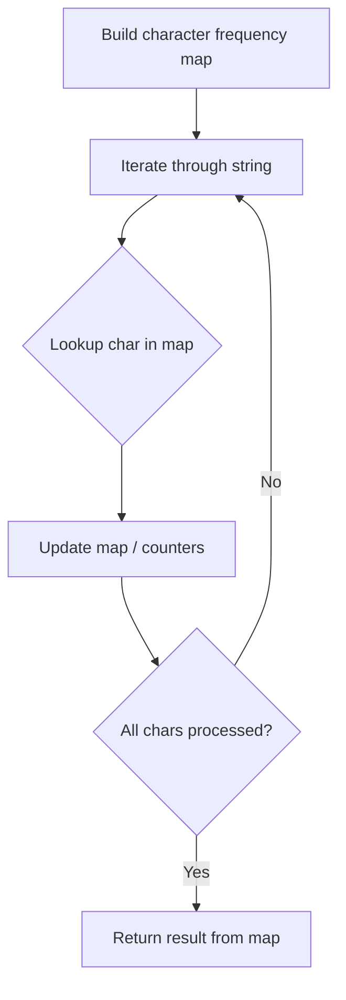

# Problem 166: Fraction to Recurring Decimal

**Difficulty:** Medium  
**Tags:** Hash Table, Math, String  
**Pattern:** Hash Map String Processing  
**Link:** [leetcode.com/problems/fraction-to-recurring-decimal](https://leetcode.com/problems/fraction-to-recurring-decimal/)

## Description

Given two integers representing the `numerator` and `denominator` of a fraction, return *the fraction in string format*.

If the fractional part is repeating, enclose the repeating part in parentheses

If multiple answers are possible, return **any of them**.

It is **guaranteed** that the length of the answer string is less than `10^4` for all the given inputs.

**Note** that if the fraction can be represented as a *finite length string*, you **must** return it.

 

Example 1:

```

**Input:** numerator = 1, denominator = 2
**Output:** "0.5"

```

Example 2:

```

**Input:** numerator = 2, denominator = 1
**Output:** "2"

```

Example 3:

```

**Input:** numerator = 4, denominator = 333
**Output:** "0.(012)"

```

 

**Constraints:**

	- `-2^31 <= numerator, denominator <= 2^31 - 1`
	- `denominator != 0`

## Approach: Hash Map String Processing

Use a hash map to count character frequencies or map characters/strings for O(1) lookups. Process the string in one or two passes.

## Pseudocode

```
1. Build frequency map / char-to-index map
2. Iterate through string:
   a. Look up character in map
   b. Update counts or mappings
3. Return result based on map state
```

## Algorithm Flow



## Complexity Analysis

- **Time:** O(n)
- **Space:** O(n)

## Solution (Python3)

```python
class Solution:
    def fractionToDecimal(self, numerator: int, denominator: int) -> str:
        # Hash map for string/character frequency - O(n) time
        freq = {}
        for ch in numerator:
            freq[ch] = freq.get(ch, 0) + 1
        # Process frequency map
        for ch, cnt in freq.items():
            if cnt == 1:
                return numerator.index(ch)
        return ""
```

## Solution (C++)

```cpp
#include <string>
#include <unordered_map>
#include <vector>
using namespace std;

class Solution {
public:
    string fractionToDecimal(int numerator, int denominator) {
        // Hash map for string/character frequency - O(n) time
        unordered_map<char, int> freq;
        for (char ch : numerator) {
            freq[ch]++;
        }
        // Process frequency map
        for (int i = 0; i < numerator.size(); i++) {
            if (freq[numerator[i]] == 1) return i;
        }
        return "";
    }
};
```
