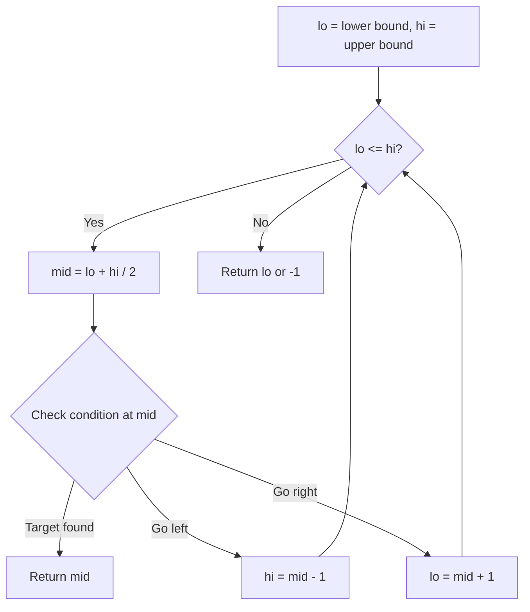
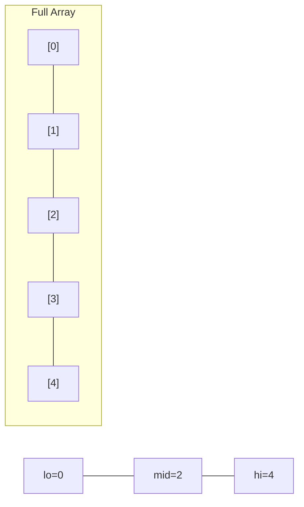
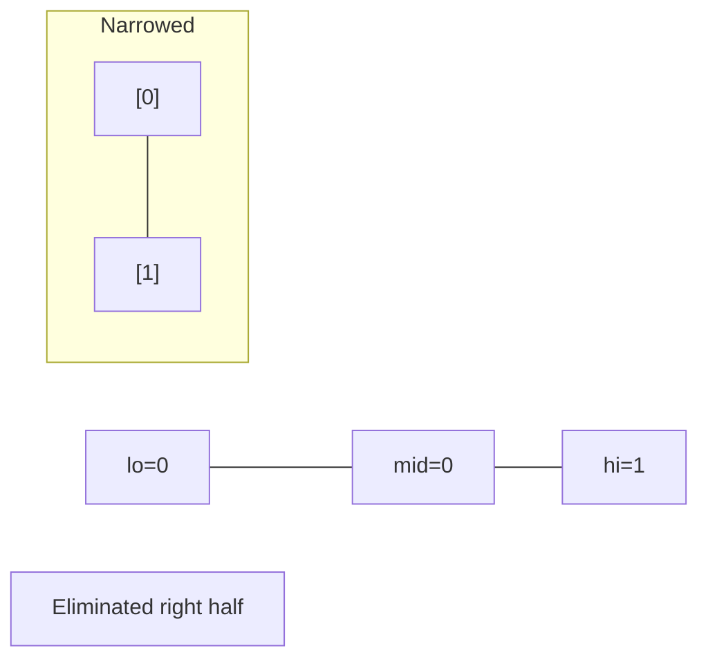
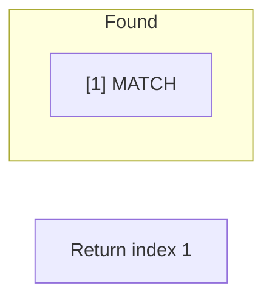

# Problem 167: Two Sum II - Input Array Is Sorted

**Difficulty:** Medium  
**Tags:** Array, Two Pointers, Binary Search  
**Pattern:** Binary Search  
**Link:** [leetcode.com/problems/two-sum-ii-input-array-is-sorted](https://leetcode.com/problems/two-sum-ii-input-array-is-sorted/)

## Description

Given a **1-indexed** array of integers `numbers` that is already ***sorted in non-decreasing order***, find two numbers such that they add up to a specific `target` number. Let these two numbers be `numbers[index1]` and `numbers[index2]` where `1 <= index1 < index2 <= numbers.length`.

Return* the indices of the two numbers, *`index1`* and *`index2`*, **added by one** as an integer array *`[index1, index2]`* of length 2.*

The tests are generated such that there is **exactly one solution**. You **may not** use the same element twice.

Your solution must use only constant extra space.

 

Example 1:

```

**Input:** numbers = [2,7,11,15], target = 9
**Output:** [1,2]
**Explanation:** The sum of 2 and 7 is 9. Therefore, index1 = 1, index2 = 2. We return [1, 2].

```

Example 2:

```

**Input:** numbers = [2,3,4], target = 6
**Output:** [1,3]
**Explanation:** The sum of 2 and 4 is 6. Therefore index1 = 1, index2 = 3. We return [1, 3].

```

Example 3:

```

**Input:** numbers = [-1,0], target = -1
**Output:** [1,2]
**Explanation:** The sum of -1 and 0 is -1. Therefore index1 = 1, index2 = 2. We return [1, 2].

```

 

**Constraints:**

	- `2 <= numbers.length <= 3 * 10^4`
	- `-1000 <= numbers[i] <= 1000`
	- `numbers` is sorted in **non-decreasing order**.
	- `-1000 <= target <= 1000`
	- The tests are generated such that there is **exactly one solution**.

## Approach: Binary Search

Use binary search to halve the search space each iteration. Define the search range [lo, hi], compute mid, and decide which half to keep based on the problem's monotonic condition.

## Pseudocode

```
1. lo = lower_bound, hi = upper_bound
2. While lo <= hi (or lo < hi):
   a. mid = (lo + hi) // 2
   b. If condition(mid) is satisfied: record answer, search left half
   c. Else: search right half
3. Return answer
```

## Algorithm Flow



## Visual State Transitions

**Binary Search Step-by-Step:**

**Frame 1: Initial search space**


**Frame 2: Compare mid, narrow search**


**Frame 3: Found target**



## Complexity Analysis

- **Time:** O(log n)
- **Space:** O(1)

## Solution (Python3)

```python
class Solution:
    def twoSum(self, numbers: List[int], target: int) -> List[int]:
        # Binary search - O(log n) time, O(1) space
        lo, hi = 0, len(numbers) - 1
        while lo <= hi:
            mid = lo + (hi - lo) // 2
            if numbers[mid] == target:
                return mid
            elif numbers[mid] < target:
                lo = mid + 1
            else:
                hi = mid - 1
        return []
```

## Solution (C++)

```cpp
#include <string>
#include <vector>
using namespace std;

class Solution {
public:
    vector<int> twoSum(vector<int>& numbers, int target) {
        // Binary search - O(log n) time, O(1) space
        int lo = 0, hi = numbers.size() - 1;
        while (lo <= hi) {
            int mid = lo + (hi - lo) / 2;
            if (numbers[mid] == target) {
                return mid;
            } else if (numbers[mid] < target) {
                lo = mid + 1;
            } else {
                hi = mid - 1;
            }
        }
        return {};
    }
};
```
