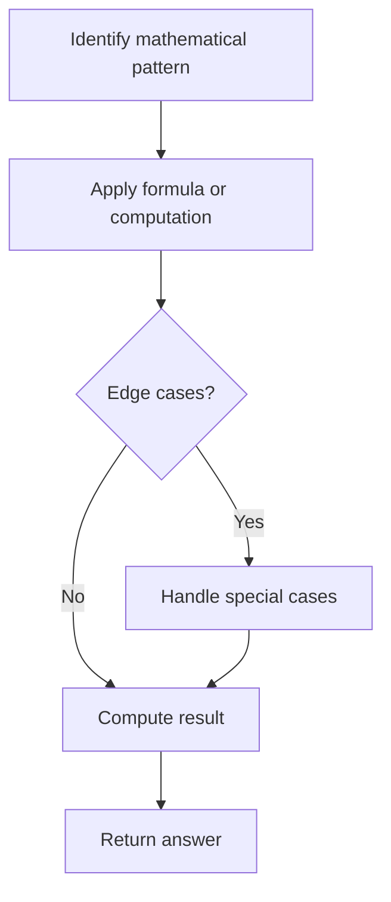

# Problem 168: Excel Sheet Column Title

**Difficulty:** Easy  
**Tags:** Math, String  
**Pattern:** Math  
**Link:** [leetcode.com/problems/excel-sheet-column-title](https://leetcode.com/problems/excel-sheet-column-title/)

## Description

Given an integer `columnNumber`, return *its corresponding column title as it appears in an Excel sheet*.

For example:

```

A -> 1
B -> 2
C -> 3
...
Z -> 26
AA -> 27
AB -> 28 
...

```

 

Example 1:

```

**Input:** columnNumber = 1
**Output:** "A"

```

Example 2:

```

**Input:** columnNumber = 28
**Output:** "AB"

```

Example 3:

```

**Input:** columnNumber = 701
**Output:** "ZY"

```

 

**Constraints:**

	- `1 <= columnNumber <= 2^31 - 1`

## Approach: Math

Apply mathematical properties, formulas, or number-theoretic concepts. Look for patterns, modular arithmetic, or closed-form solutions.

## Pseudocode

```
1. Identify the mathematical pattern or formula
2. Apply computation:
   - Modular arithmetic for large numbers
   - GCD/LCM for divisibility
   - Sieve for primes
3. Handle edge cases
4. Return result
```

## Algorithm Flow



## Complexity Analysis

- **Time:** O(n) or O(sqrt(n))
- **Space:** O(1)

## Solution (Python3)

```python
class Solution:
    def convertToTitle(self, columnNumber: int) -> str:
        # Mathematical approach
        result = 0
        x = columnNumber
        while x != 0:
            result = result * 10 + x % 10
            x //= 10 if isinstance(x, int) else 1
        return result
```

## Solution (C++)

```cpp
#include <string>
#include <vector>
using namespace std;

class Solution {
public:
    string convertToTitle(int columnNumber) {
        // Mathematical approach
        long long result = 0;
        int x = columnNumber;
        while (x != 0) {
            result = result * 10 + x % 10;
            x /= 10;
        }
        return (int)result;
    }
};
```
