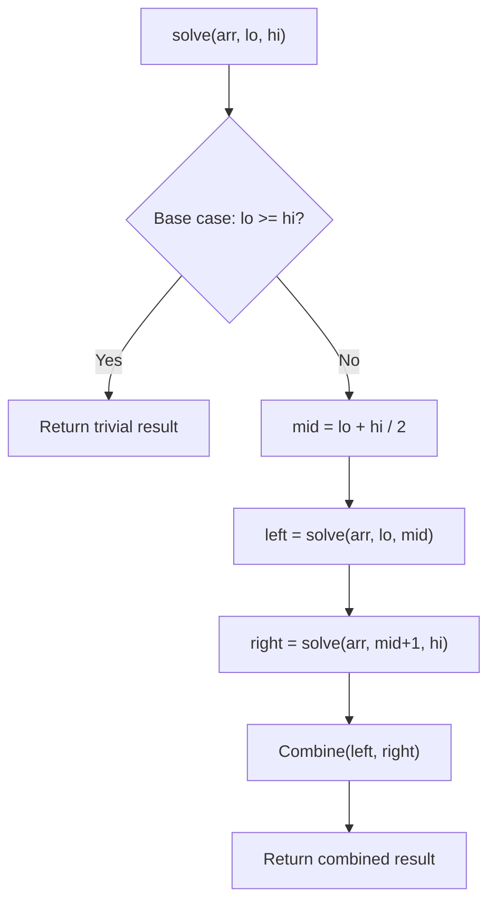

# Problem 169: Majority Element

**Difficulty:** Easy  
**Tags:** Array, Hash Table, Divide and Conquer, Sorting, Counting  
**Pattern:** Boyer-Moore Voting  
**Link:** [leetcode.com/problems/majority-element](https://leetcode.com/problems/majority-element/)

## Description

Given an array `nums` of size `n`, return *the majority element*.

The majority element is the element that appears more than `⌊n / 2⌋` times. You may assume that the majority element always exists in the array.

 

Example 1:

```
**Input:** nums = [3,2,3]
**Output:** 3

```
Example 2:

```
**Input:** nums = [2,2,1,1,1,2,2]
**Output:** 2

```

 

**Constraints:**

	- `n == nums.length`
	- `1 <= n <= 5 * 10^4`
	- `-10^9 <= nums[i] <= 10^9`
	- The input is generated such that a majority element will exist in the array.

 

**Follow-up:** Could you solve the problem in linear time and in `O(1)` space?

## Approach: Boyer-Moore Voting

**Boyer-Moore Voting:** Maintain a candidate and count. The majority element survives all cancellations.

## Pseudocode

```
1. candidate=0, count=0
2. For each num:
   If count==0: candidate = num
   count += 1 if same else -1
3. Return candidate
```

## Algorithm Flow



## Complexity Analysis

- **Time:** O(n)
- **Space:** O(1)

## Solution (Python3)

```python
class Solution:
    def majorityElement(self, nums: list[int]) -> int:
        candidate = count = 0
        for num in nums:
            if count == 0:
                candidate = num
            count += 1 if num == candidate else -1
        return candidate
```

## Solution (C++)

```cpp
#include <algorithm>
#include <functional>
#include <string>
#include <vector>
using namespace std;

class Solution {
public:
    int majorityElement(vector<int>& nums) {
        // Divide and conquer - O(n log n) time
        function<int(int, int)> solve = [&](int left, int right) -> int {
            if (left >= right) return left < (int)nums.size() ? nums[left] : 0;
            int mid = (left + right) / 2;
            int leftRes = solve(left, mid);
            int rightRes = solve(mid + 1, right);
            return max(leftRes, rightRes);
        };
        return nums.empty() ? 0 : solve(0, nums.size() - 1);
    }
};
```
