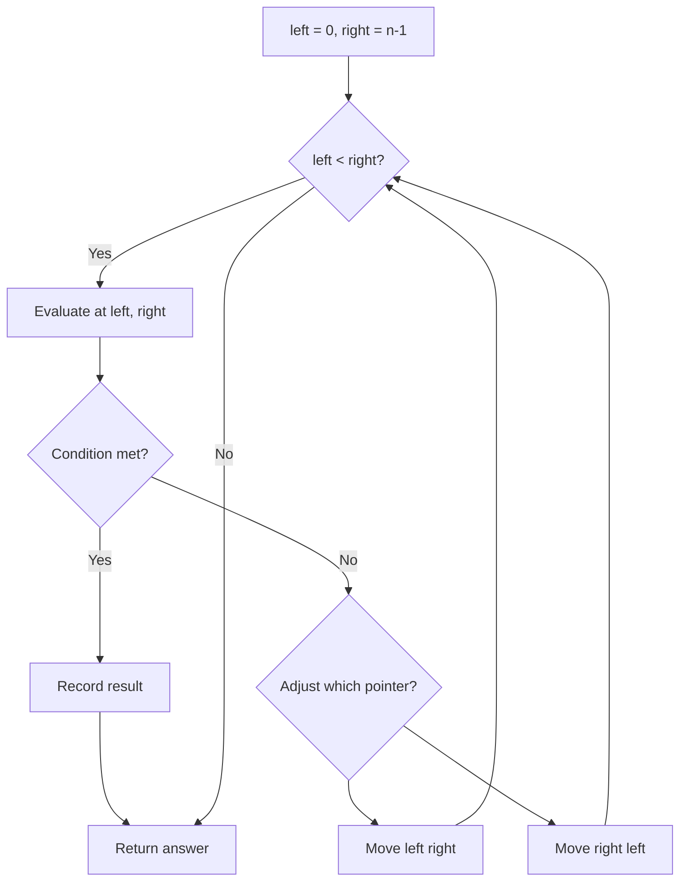
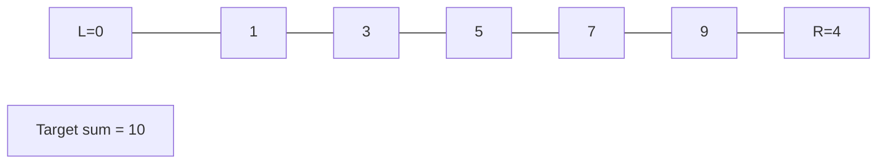
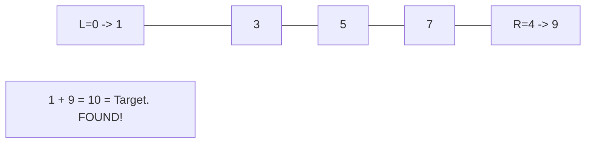

# Problem 170: Two Sum III - Data structure design

**Difficulty:** Easy  
**Tags:** Array, Hash Table, Two Pointers, Design, Data Stream  
**Pattern:** Two Pointers  
**Link:** [leetcode.com/problems/two-sum-iii-data-structure-design](https://leetcode.com/problems/two-sum-iii-data-structure-design/)

## Description

*(Premium problem -- description requires LeetCode subscription)*

## Approach: Two Pointers

Use two pointers moving through the data structure. Depending on the problem, pointers may move toward each other (converging), in the same direction (fast/slow), or independently.

## Pseudocode

```
1. Initialize left = 0, right = n-1 (or two independent pointers)
2. While pointers haven't crossed:
   a. Evaluate condition at pointer positions
   b. Move left pointer right or right pointer left
3. Return result
```

## Algorithm Flow



## Visual State Transitions

**Two Pointer Convergence:**

**Frame 1: Initialize pointers**


**Frame 2: Sum = 1+9 = 10, found!**



## Complexity Analysis

- **Time:** O(n)
- **Space:** O(1)

## Solution (Python3)

```python
class Solution:
    pass
```

## Solution (C++)

```cpp
class Solution {
public:
    // Design problem stub
};
```
