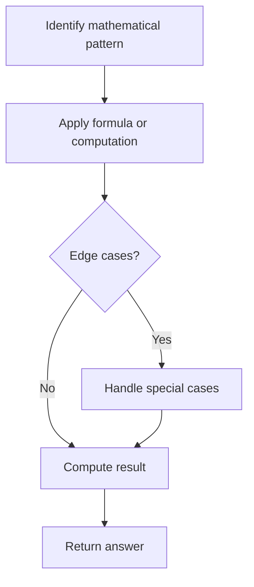

# Problem 171: Excel Sheet Column Number

**Difficulty:** Easy  
**Tags:** Math, String  
**Pattern:** Math  
**Link:** [leetcode.com/problems/excel-sheet-column-number](https://leetcode.com/problems/excel-sheet-column-number/)

## Description

Given a string `columnTitle` that represents the column title as appears in an Excel sheet, return *its corresponding column number*.

For example:

```

A -> 1
B -> 2
C -> 3
...
Z -> 26
AA -> 27
AB -> 28 
...

```

 

Example 1:

```

**Input:** columnTitle = "A"
**Output:** 1

```

Example 2:

```

**Input:** columnTitle = "AB"
**Output:** 28

```

Example 3:

```

**Input:** columnTitle = "ZY"
**Output:** 701

```

 

**Constraints:**

	- `1 <= columnTitle.length <= 7`
	- `columnTitle` consists only of uppercase English letters.
	- `columnTitle` is in the range `["A", "FXSHRXW"]`.

## Approach: Math

Apply mathematical properties, formulas, or number-theoretic concepts. Look for patterns, modular arithmetic, or closed-form solutions.

## Pseudocode

```
1. Identify the mathematical pattern or formula
2. Apply computation:
   - Modular arithmetic for large numbers
   - GCD/LCM for divisibility
   - Sieve for primes
3. Handle edge cases
4. Return result
```

## Algorithm Flow



## Complexity Analysis

- **Time:** O(n) or O(sqrt(n))
- **Space:** O(1)

## Solution (Python3)

```python
class Solution:
    def titleToNumber(self, columnTitle: str) -> int:
        # Mathematical approach
        result = 0
        x = columnTitle
        while x != 0:
            result = result * 10 + x % 10
            x //= 10 if isinstance(x, int) else 1
        return result
```

## Solution (C++)

```cpp
#include <string>
#include <vector>
using namespace std;

class Solution {
public:
    int titleToNumber(string& columnTitle) {
        // Mathematical approach
        long long result = 0;
        int x = columnTitle;
        while (x != 0) {
            result = result * 10 + x % 10;
            x /= 10;
        }
        return (int)result;
    }
};
```
