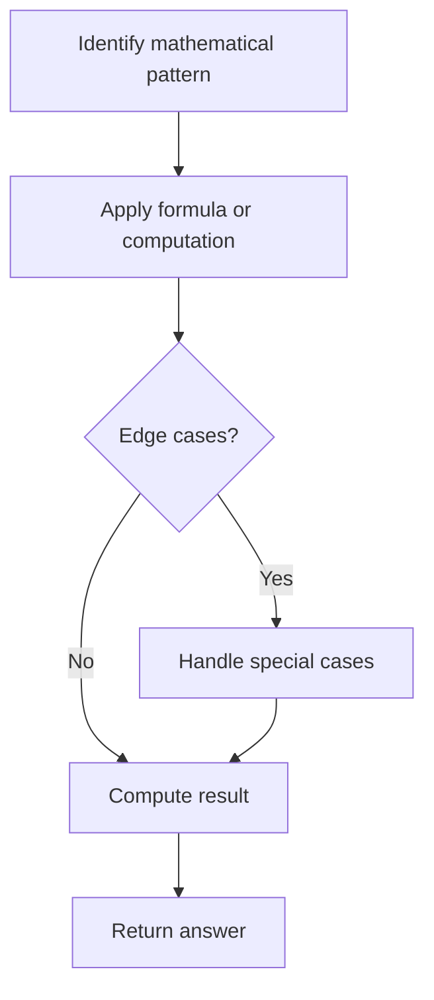

# Problem 172: Factorial Trailing Zeroes

**Difficulty:** Medium  
**Tags:** Math  
**Pattern:** Math  
**Link:** [leetcode.com/problems/factorial-trailing-zeroes](https://leetcode.com/problems/factorial-trailing-zeroes/)

## Description

Given an integer `n`, return *the number of trailing zeroes in *`n!`.

Note that `n! = n * (n - 1) * (n - 2) * ... * 3 * 2 * 1`.

 

Example 1:

```

**Input:** n = 3
**Output:** 0
**Explanation:** 3! = 6, no trailing zero.

```

Example 2:

```

**Input:** n = 5
**Output:** 1
**Explanation:** 5! = 120, one trailing zero.

```

Example 3:

```

**Input:** n = 0
**Output:** 0

```

 

**Constraints:**

	- `0 <= n <= 10^4`

 

**Follow up:** Could you write a solution that works in logarithmic time complexity?

## Approach: Math

Apply mathematical properties, formulas, or number-theoretic concepts. Look for patterns, modular arithmetic, or closed-form solutions.

## Pseudocode

```
1. Identify the mathematical pattern or formula
2. Apply computation:
   - Modular arithmetic for large numbers
   - GCD/LCM for divisibility
   - Sieve for primes
3. Handle edge cases
4. Return result
```

## Algorithm Flow



## Complexity Analysis

- **Time:** O(n) or O(sqrt(n))
- **Space:** O(1)

## Solution (Python3)

```python
class Solution:
    def trailingZeroes(self, n: int) -> int:
        # Mathematical approach
        result = 0
        x = n
        while x != 0:
            result = result * 10 + x % 10
            x //= 10 if isinstance(x, int) else 1
        return result
```

## Solution (C++)

```cpp
#include <string>
#include <vector>
using namespace std;

class Solution {
public:
    int trailingZeroes(int n) {
        // Mathematical approach
        long long result = 0;
        int x = n;
        while (x != 0) {
            result = result * 10 + x % 10;
            x /= 10;
        }
        return (int)result;
    }
};
```
