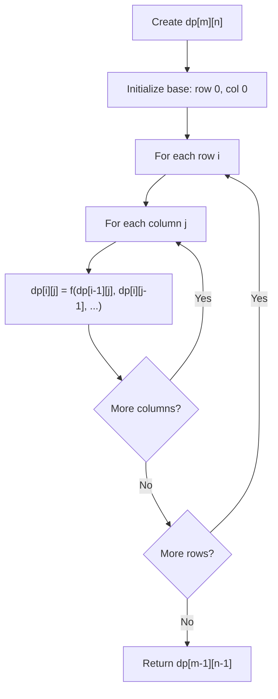
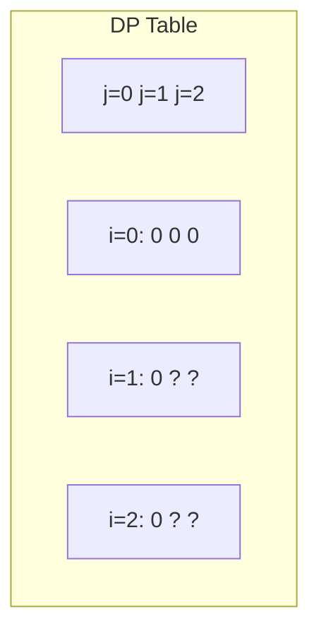
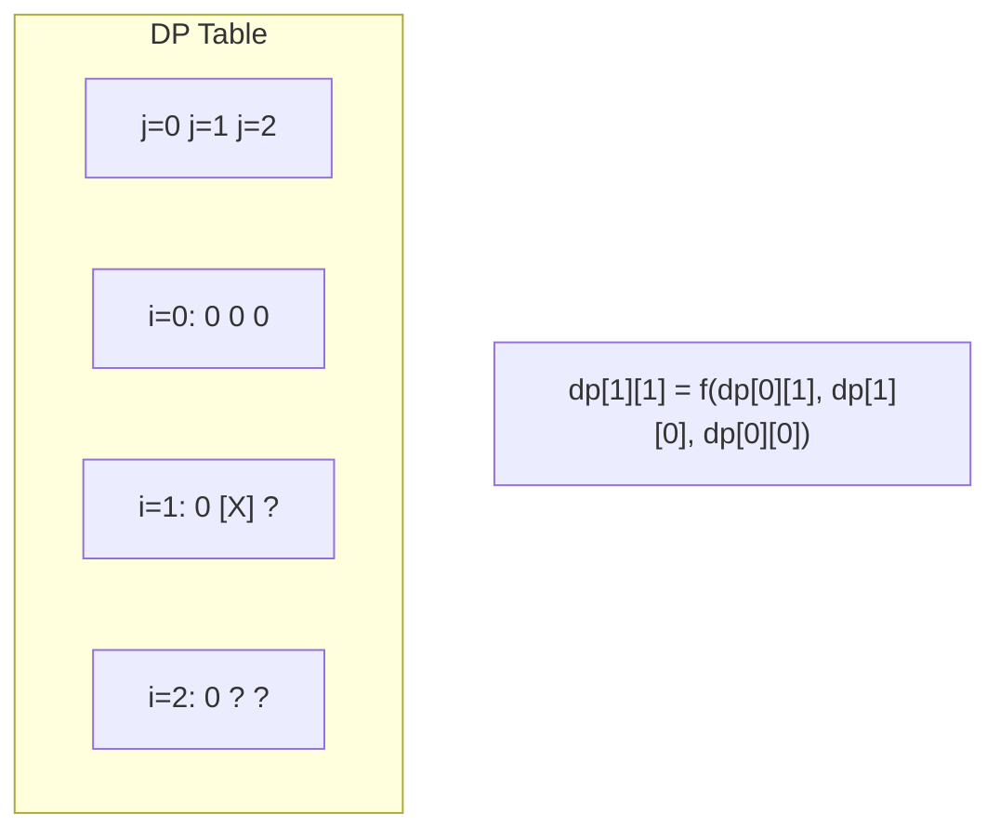
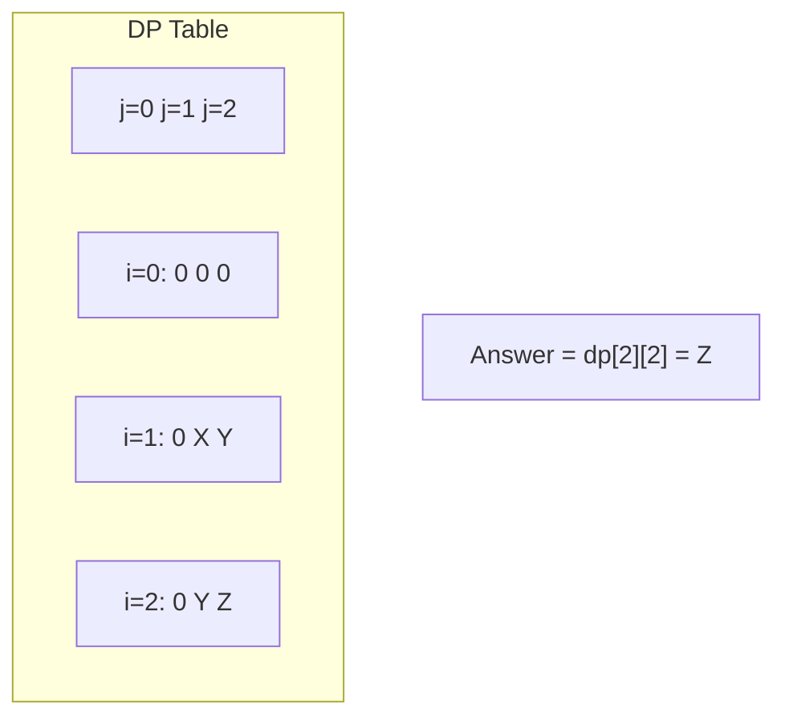

# Problem 174: Dungeon Game

**Difficulty:** Hard  
**Tags:** Array, Dynamic Programming, Matrix  
**Pattern:** Dynamic Programming (2D Grid/Matrix)  
**Link:** [leetcode.com/problems/dungeon-game](https://leetcode.com/problems/dungeon-game/)

## Description

The demons had captured the princess and imprisoned her in **the bottom-right corner** of a `dungeon`. The `dungeon` consists of `m x n` rooms laid out in a 2D grid. Our valiant knight was initially positioned in **the top-left room** and must fight his way through `dungeon` to rescue the princess.

The knight has an initial health point represented by a positive integer. If at any point his health point drops to `0` or below, he dies immediately.

Some of the rooms are guarded by demons (represented by negative integers), so the knight loses health upon entering these rooms; other rooms are either empty (represented as 0) or contain magic orbs that increase the knight's health (represented by positive integers).

To reach the princess as quickly as possible, the knight decides to move only **rightward** or **downward** in each step.

Return *the knight's minimum initial health so that he can rescue the princess*.

**Note** that any room can contain threats or power-ups, even the first room the knight enters and the bottom-right room where the princess is imprisoned.

 

Example 1:

```

**Input:** dungeon = [[-2,-3,3],[-5,-10,1],[10,30,-5]]
**Output:** 7
**Explanation:** The initial health of the knight must be at least 7 if he follows the optimal path: RIGHT-> RIGHT -> DOWN -> DOWN.

```

Example 2:

```

**Input:** dungeon = [[0]]
**Output:** 1

```

 

**Constraints:**

	- `m == dungeon.length`
	- `n == dungeon[i].length`
	- `1 <= m, n <= 200`
	- `-1000 <= dungeon[i][j] <= 1000`

## Approach: Dynamic Programming (2D Grid/Matrix)

Use a 2D DP table where dp[i][j] represents the optimal value for the subproblem defined by rows 0..i and columns 0..j. Fill row by row or column by column.

## Pseudocode

```
1. Create dp[m][n] table
2. Initialize base cases (first row, first column)
3. For i from 1 to m-1:
   For j from 1 to n-1:
     dp[i][j] = recurrence(dp[i-1][j], dp[i][j-1], dp[i-1][j-1])
4. Return dp[m-1][n-1]
```

## Algorithm Flow



## Visual State Transitions

**2D DP Table Build:**

**Frame 1: Initialize borders**


**Frame 2: Fill cell by cell**


**Frame 3: Table complete**



## Complexity Analysis

- **Time:** O(m * n)
- **Space:** O(m * n)

## Solution (Python3)

```python
class Solution:
    def calculateMinimumHP(self, dungeon: List[List[int]]) -> int:
        # Dynamic programming (2D) - O(m*n) time and space
        if not dungeon:
            return 0
        m, n = len(dungeon), len(dungeon[0])
        dp = [[0] * (n + 1) for _ in range(m + 1)]
        for i in range(1, m + 1):
            for j in range(1, n + 1):
                dp[i][j] = max(dp[i-1][j], dp[i][j-1])
                # Add problem-specific transition
        return dp[m][n]
```

## Solution (C++)

```cpp
#include <algorithm>
#include <string>
#include <vector>
using namespace std;

class Solution {
public:
    int calculateMinimumHP(vector<vector<int>>& dungeon) {
        // Dynamic programming (2D) - O(m*n) time and space
        if (dungeon.empty()) return 0;
        int m = dungeon.size(), n = dungeon[0].size();
        vector<vector<int>> dp(m + 1, vector<int>(n + 1, 0));
        for (int i = 1; i <= m; i++) {
            for (int j = 1; j <= n; j++) {
                dp[i][j] = max(dp[i-1][j], dp[i][j-1]);
            }
        }
        return dp[m][n];
    }
};
```
