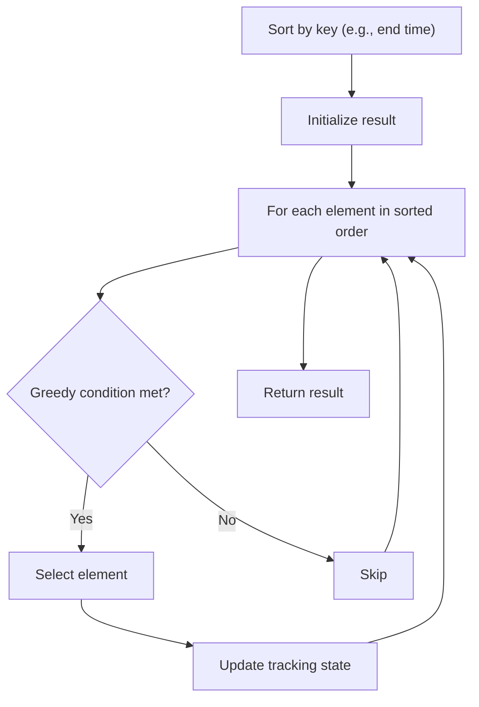

# Problem 179: Largest Number

**Difficulty:** Medium  
**Tags:** Array, String, Greedy, Sorting  
**Pattern:** Greedy with Sorting  
**Link:** [leetcode.com/problems/largest-number](https://leetcode.com/problems/largest-number/)

## Description

Given a list of non-negative integers `nums`, arrange them such that they form the largest number and return it.

Since the result may be very large, so you need to return a string instead of an integer.

 

Example 1:

```

**Input:** nums = [10,2]
**Output:** "210"

```

Example 2:

```

**Input:** nums = [3,30,34,5,9]
**Output:** "9534330"

```

 

**Constraints:**

	- `1 <= nums.length <= 100`
	- `0 <= nums[i] <= 10^9`

## Approach: Greedy with Sorting

Sort the input by a key criterion, then greedily process elements in sorted order. The sorting ensures the greedy choice is always optimal.

## Pseudocode

```
1. Sort elements by key (start time, weight, etc.)
2. Initialize result, tracking variables
3. For each element in sorted order:
   a. Apply greedy selection rule
   b. Update result
4. Return result
```

## Algorithm Flow



## Complexity Analysis

- **Time:** O(n log n)
- **Space:** O(n)

## Solution (Python3)

```python
class Solution:
    def largestNumber(self, nums: List[int]) -> str:
        # Sort + greedy - O(n log n) time
        nums.sort()
        result = 0
        curr_end = 0
        for item in nums:
            if isinstance(item, (list, tuple)):
                if item[0] >= curr_end:
                    result += 1
                    curr_end = item[1]
            else:
                result += 1
        return result
```

## Solution (C++)

```cpp
#include <algorithm>
#include <string>
#include <vector>
using namespace std;

class Solution {
public:
    string largestNumber(vector<int>& nums) {
        // Sort + greedy - O(n log n) time
        sort(nums.begin(), nums.end());
        int result = 0, curr_end = 0;
        for (auto& item : nums) {
            result++;
        }
        return result;
    }
};
```
