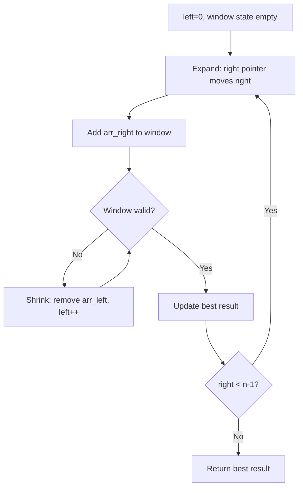
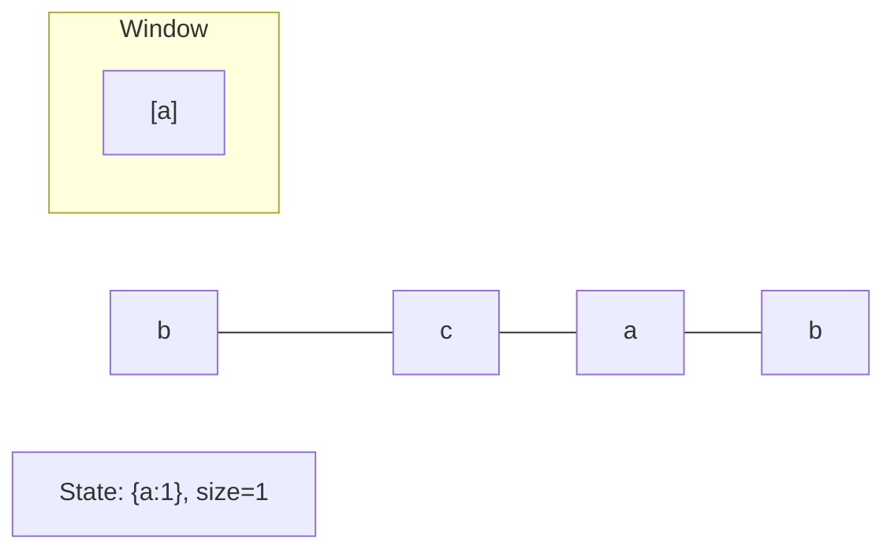
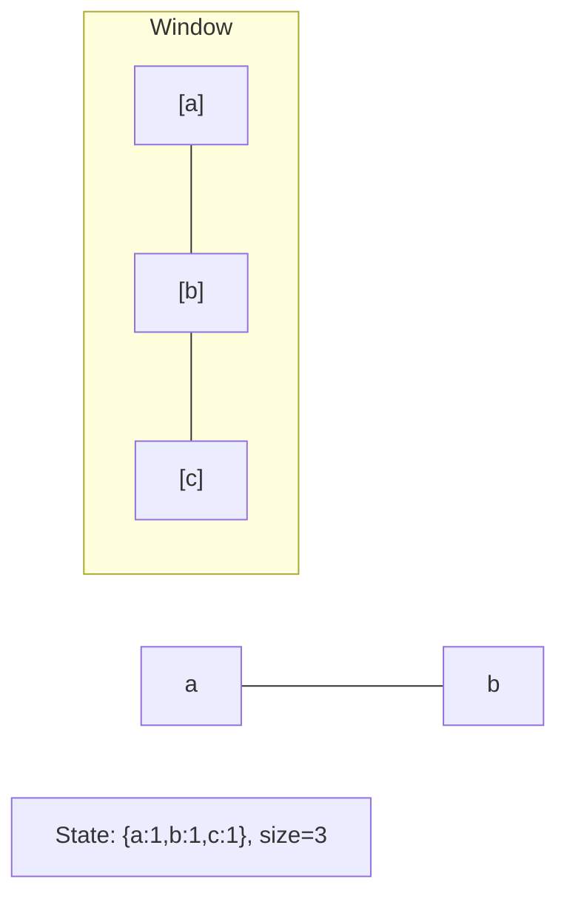
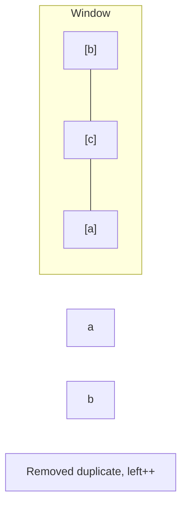
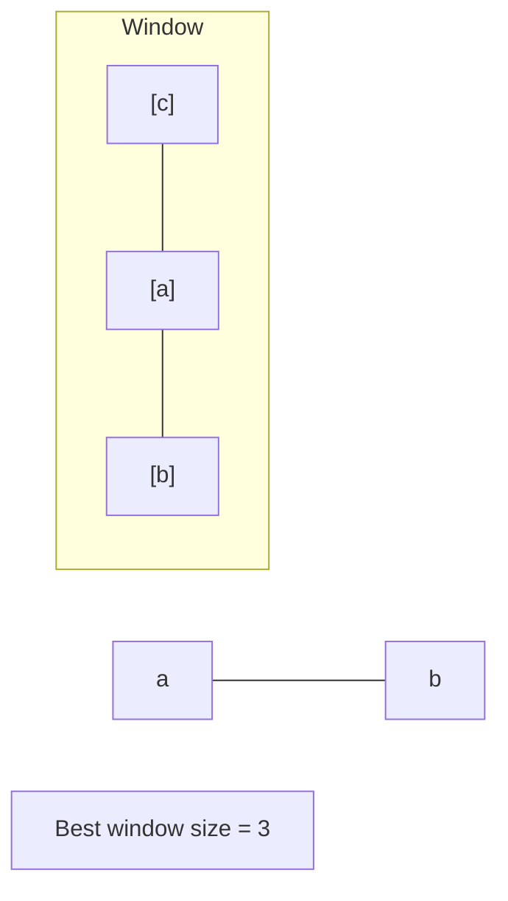

# Problem 187: Repeated DNA Sequences

**Difficulty:** Medium  
**Tags:** Hash Table, String, Bit Manipulation, Sliding Window, Rolling Hash, Hash Function  
**Pattern:** Sliding Window  
**Link:** [leetcode.com/problems/repeated-dna-sequences](https://leetcode.com/problems/repeated-dna-sequences/)

## Description

The **DNA sequence** is composed of a series of nucleotides abbreviated as `'A'`, `'C'`, `'G'`, and `'T'`.

	- For example, `"ACGAATTCCG"` is a **DNA sequence**.

When studying **DNA**, it is useful to identify repeated sequences within the DNA.

Given a string `s` that represents a **DNA sequence**, return all the **`10`-letter-long** sequences (substrings) that occur more than once in a DNA molecule. You may return the answer in **any order**.

 

Example 1:

```
**Input:** s = "AAAAACCCCCAAAAACCCCCCAAAAAGGGTTT"
**Output:** ["AAAAACCCCC","CCCCCAAAAA"]

```
Example 2:

```
**Input:** s = "AAAAAAAAAAAAA"
**Output:** ["AAAAAAAAAA"]

```

 

**Constraints:**

	- `1 <= s.length <= 10^5`
	- `s[i]` is either `'A'`, `'C'`, `'G'`, or `'T'`.

## Approach: Sliding Window

Maintain a window over the data using two pointers. Expand the right boundary to include new elements, and shrink the left boundary when the window constraint is violated. Track the optimal window.

## Pseudocode

```
1. Initialize left = 0, result = initial_value
2. For right in range(n):
   a. Add element at right to window state
   b. While window is invalid:
      - Remove element at left from window state
      - left++
   c. Update result = best of (result, window size/value)
3. Return result
```

## Algorithm Flow



## Visual State Transitions

**Sliding Window Step-by-Step:**

**Frame 1: Initial window (left=0, right=0)**


**Frame 2: Expand right (right=2)**


**Frame 3: Violation - shrink left**


**Frame 4: Continue expanding**



## Complexity Analysis

- **Time:** O(n)
- **Space:** O(k)

## Solution (Python3)

```python
class Solution:
    def findRepeatedDnaSequences(self, s: str) -> List[str]:
        # Sliding window approach - O(n) time, O(k) space
        from collections import defaultdict
        window = defaultdict(int)
        left = 0
        result = 0
        for right in range(len(s)):
            window[s[right]] += 1
            while len(window) > (s if isinstance(s, int) else len(s)):
                window[s[left]] -= 1
                if window[s[left]] == 0:
                    del window[s[left]]
                left += 1
            result = max(result, right - left + 1)
        return result
```

## Solution (C++)

```cpp
#include <algorithm>
#include <string>
#include <unordered_map>
#include <vector>
using namespace std;

class Solution {
public:
    vector<string> findRepeatedDnaSequences(string& s) {
        // Sliding window approach - O(n) time, O(k) space
        unordered_map<char, int> window;
        int left = 0, result = 0;
        for (int right = 0; right < s.size(); right++) {
            window[s[right]]++;
            while ((int)window.size() > s) {
                window[s[left]]--;
                if (window[s[left]] == 0)
                    window.erase(s[left]);
                left++;
            }
            result = max(result, right - left + 1);
        }
        return result;
    }
};
```
