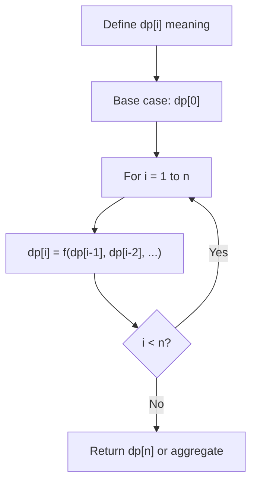
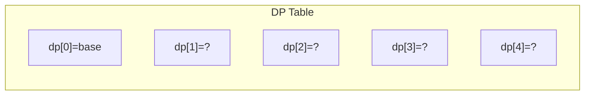
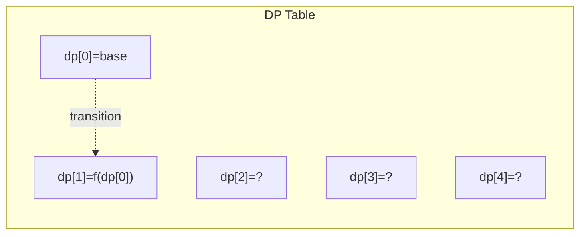
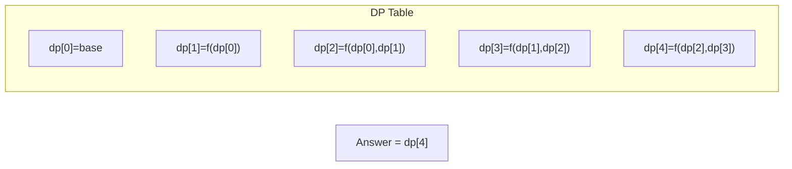

# Problem 188: Best Time to Buy and Sell Stock IV

**Difficulty:** Hard  
**Tags:** Array, Dynamic Programming  
**Pattern:** Dynamic Programming (1D)  
**Link:** [leetcode.com/problems/best-time-to-buy-and-sell-stock-iv](https://leetcode.com/problems/best-time-to-buy-and-sell-stock-iv/)

## Description

You are given an integer array `prices` where `prices[i]` is the price of a given stock on the `i^th` day, and an integer `k`.

Find the maximum profit you can achieve. You may complete at most `k` transactions: i.e. you may buy at most `k` times and sell at most `k` times.

**Note:** You may not engage in multiple transactions simultaneously (i.e., you must sell the stock before you buy again).

 

Example 1:

```

**Input:** k = 2, prices = [2,4,1]
**Output:** 2
**Explanation:** Buy on day 1 (price = 2) and sell on day 2 (price = 4), profit = 4-2 = 2.

```

Example 2:

```

**Input:** k = 2, prices = [3,2,6,5,0,3]
**Output:** 7
**Explanation:** Buy on day 2 (price = 2) and sell on day 3 (price = 6), profit = 6-2 = 4. Then buy on day 5 (price = 0) and sell on day 6 (price = 3), profit = 3-0 = 3.

```

 

**Constraints:**

	- `1 <= k <= 100`
	- `1 <= prices.length <= 1000`
	- `0 <= prices[i] <= 1000`

## Approach: Dynamic Programming (1D)

Break the problem into overlapping subproblems. Define dp[i] as the optimal value for the subproblem ending at or considering index i. Build the solution bottom-up, using previously computed dp values.

## Pseudocode

```
1. Define dp[i] = optimal value for subproblem i
2. Base case: dp[0] = initial value
3. For i from 1 to n:
   a. dp[i] = recurrence(dp[i-1], dp[i-2], ...)
4. Return dp[n] or max/min of dp
```

## Algorithm Flow



## Visual State Transitions

**1D Dynamic Programming Table Build:**

**Frame 1: Initialize base cases**


**Frame 2: Fill dp[1] from dp[0]**


**Frame 3: Fill remaining cells**



## Complexity Analysis

- **Time:** O(n)
- **Space:** O(n)

## Solution (Python3)

```python
class Solution:
    def maxProfit(self, k: int, prices: List[int]) -> int:
        # Dynamic programming (1D) - O(n) time, O(n) space
        if not k:
            return 0
        n = len(k) if isinstance(k, list) else k
        dp = [0] * (n + 1)
        dp[0] = 1  # base case
        for i in range(1, n + 1):
            dp[i] = dp[i-1]  # transition (customize per problem)
            if i >= 2:
                dp[i] += dp[i-2]
        return dp[n]
```

## Solution (C++)

```cpp
#include <string>
#include <vector>
using namespace std;

class Solution {
public:
    int maxProfit(int k, vector<int>& prices) {
        // Dynamic programming (1D) - O(n) time, O(n) space
        int n = k;
        if (n <= 0) return 0;
        vector<int> dp(n + 1, 0);
        dp[0] = 1;
        for (int i = 1; i <= n; i++) {
            dp[i] = dp[i-1];
            if (i >= 2) dp[i] += dp[i-2];
        }
        return dp[n];
    }
};
```
