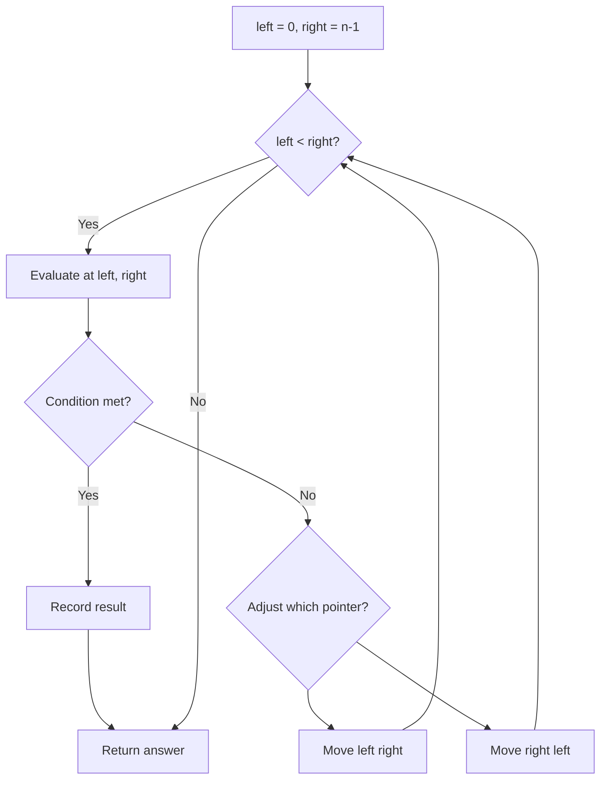
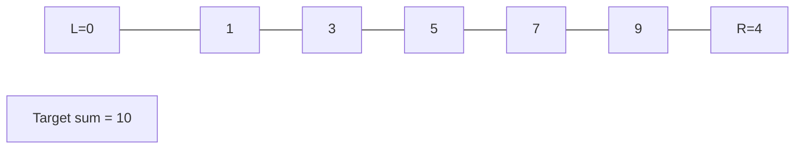
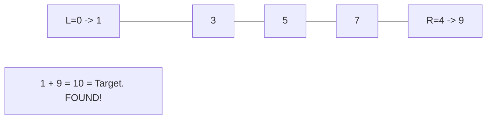

# Problem 189: Rotate Array

**Difficulty:** Medium  
**Tags:** Array, Math, Two Pointers  
**Pattern:** Two Pointers  
**Link:** [leetcode.com/problems/rotate-array](https://leetcode.com/problems/rotate-array/)

## Description

Given an integer array `nums`, rotate the array to the right by `k` steps, where `k` is non-negative.

 

Example 1:

```

**Input:** nums = [1,2,3,4,5,6,7], k = 3
**Output:** [5,6,7,1,2,3,4]
**Explanation:**
rotate 1 steps to the right: [7,1,2,3,4,5,6]
rotate 2 steps to the right: [6,7,1,2,3,4,5]
rotate 3 steps to the right: [5,6,7,1,2,3,4]

```

Example 2:

```

**Input:** nums = [-1,-100,3,99], k = 2
**Output:** [3,99,-1,-100]
**Explanation:** 
rotate 1 steps to the right: [99,-1,-100,3]
rotate 2 steps to the right: [3,99,-1,-100]

```

 

**Constraints:**

	- `1 <= nums.length <= 10^5`
	- `-2^31 <= nums[i] <= 2^31 - 1`
	- `0 <= k <= 10^5`

 

**Follow up:**

	- Try to come up with as many solutions as you can. There are at least **three** different ways to solve this problem.
	- Could you do it in-place with `O(1)` extra space?

## Approach: Two Pointers

Use two pointers moving through the data structure. Depending on the problem, pointers may move toward each other (converging), in the same direction (fast/slow), or independently.

## Pseudocode

```
1. Initialize left = 0, right = n-1 (or two independent pointers)
2. While pointers haven't crossed:
   a. Evaluate condition at pointer positions
   b. Move left pointer right or right pointer left
3. Return result
```

## Algorithm Flow



## Visual State Transitions

**Two Pointer Convergence:**

**Frame 1: Initialize pointers**


**Frame 2: Sum = 1+9 = 10, found!**



## Complexity Analysis

- **Time:** O(n)
- **Space:** O(1)

## Solution (Python3)

```python
class Solution:
    def rotate(self, nums: List[int], k: int) -> None:
        # Two pointer approach - O(n) time, O(1) space
        left, right = 0, len(nums) - 1
        while left < right:
            curr = nums[left] + nums[right]
            if curr == k:
                return [left, right]
            elif curr < k:
                left += 1
            else:
                right -= 1
        return None
```

## Solution (C++)

```cpp
#include <string>
#include <vector>
using namespace std;

class Solution {
public:
    void rotate(vector<int>& nums, int k) {
        // Two pointer approach - O(n) time, O(1) space
        int left = 0, right = nums.size() - 1;
        while (left < right) {
            int curr = nums[left] + nums[right];
            if (curr == k) {
                return {left, right};
            } else if (curr < k) {
                left++;
            } else {
                right--;
            }
        }
        return ;
    }
};
```
