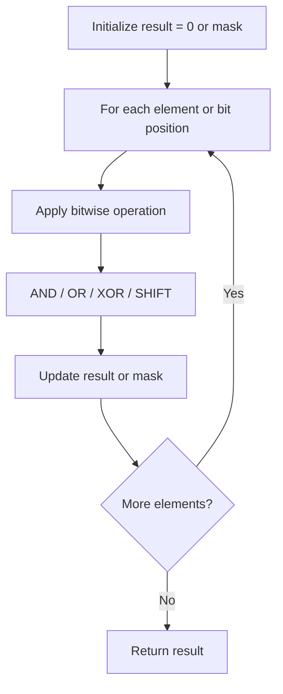

# Problem 190: Reverse Bits

**Difficulty:** Easy  
**Tags:** Divide and Conquer, Bit Manipulation  
**Pattern:** Bit Manipulation  
**Link:** [leetcode.com/problems/reverse-bits](https://leetcode.com/problems/reverse-bits/)

## Description

Reverse bits of a given 32 bits signed integer.

 

Example 1:

**Input:** n = 43261596

**Output:** 964176192

**Explanation:**

	
		
			Integer
			Binary
		
		
			43261596
			00000010100101000001111010011100
		
		
			964176192
			00111001011110000010100101000000
		
	

Example 2:

**Input:** n = 2147483644

**Output:** 1073741822

**Explanation:**

	
		
			Integer
			Binary
		
		
			2147483644
			01111111111111111111111111111100
		
		
			1073741822
			00111111111111111111111111111110
		
	

 

**Constraints:**

	- `0 <= n <= 2^31 - 2`
	- `n` is even.

 

**Follow up:** If this function is called many times, how would you optimize it?

## Approach: Bit Manipulation

Operate on individual bits using bitwise operators (AND, OR, XOR, shift). Common tricks: x & (x-1) removes lowest set bit, x ^ x = 0, XOR all elements to find unique.

## Pseudocode

```
1. Apply bitwise operations:
   - XOR all elements to cancel paired bits
   - Use bitmask to track state
   - Shift and mask to extract/set individual bits
2. Return result
```

## Algorithm Flow



## Complexity Analysis

- **Time:** O(n) or O(log n)
- **Space:** O(1)

## Solution (Python3)

```python
class Solution:
    def reverseBits(self, n: int) -> int:
        # Bit manipulation - O(n) time, O(1) space
        result = 0
        for val in n:
            result ^= val
        return result
```

## Solution (C++)

```cpp
#include <string>
#include <vector>
using namespace std;

class Solution {
public:
    int reverseBits(int n) {
        // Bit manipulation - O(n) time, O(1) space
        int result = 0;
        for (int val : n) {
            result ^= val;
        }
        return result;
    }
};
```
