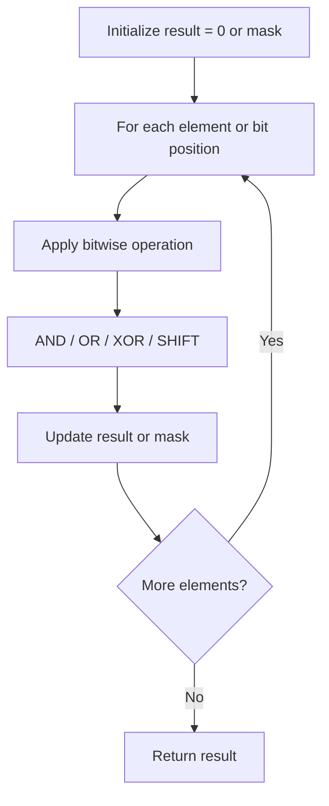

# Problem 191: Number of 1 Bits

**Difficulty:** Easy  
**Tags:** Divide and Conquer, Bit Manipulation  
**Pattern:** Bit Manipulation  
**Link:** [leetcode.com/problems/number-of-1-bits](https://leetcode.com/problems/number-of-1-bits/)

## Description

Given a positive integer `n`, write a function that returns the number of set bits in its binary representation (also known as the Hamming weight).

 

Example 1:

**Input:** n = 11

**Output:** 3

**Explanation:**

The input binary string **1011** has a total of three set bits.

Example 2:

**Input:** n = 128

**Output:** 1

**Explanation:**

The input binary string **10000000** has a total of one set bit.

Example 3:

**Input:** n = 2147483645

**Output:** 30

**Explanation:**

The input binary string **1111111111111111111111111111101** has a total of thirty set bits.

 

**Constraints:**

	- `1 <= n <= 2^31 - 1`

 

**Follow up:** If this function is called many times, how would you optimize it?

## Approach: Bit Manipulation

Operate on individual bits using bitwise operators (AND, OR, XOR, shift). Common tricks: x & (x-1) removes lowest set bit, x ^ x = 0, XOR all elements to find unique.

## Pseudocode

```
1. Apply bitwise operations:
   - XOR all elements to cancel paired bits
   - Use bitmask to track state
   - Shift and mask to extract/set individual bits
2. Return result
```

## Algorithm Flow



## Complexity Analysis

- **Time:** O(n) or O(log n)
- **Space:** O(1)

## Solution (Python3)

```python
class Solution:
    def hammingWeight(self, n: int) -> int:
        # Bit manipulation - O(n) time, O(1) space
        result = 0
        for val in n:
            result ^= val
        return result
```

## Solution (C++)

```cpp
#include <string>
#include <vector>
using namespace std;

class Solution {
public:
    int hammingWeight(int n) {
        // Bit manipulation - O(n) time, O(1) space
        int result = 0;
        for (int val : n) {
            result ^= val;
        }
        return result;
    }
};
```
