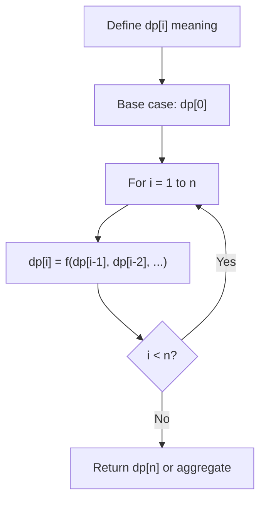
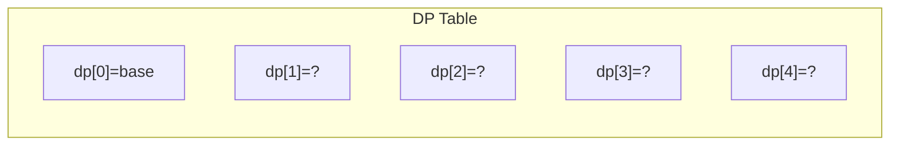
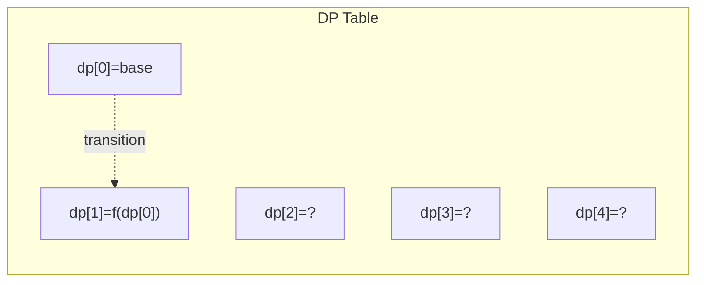
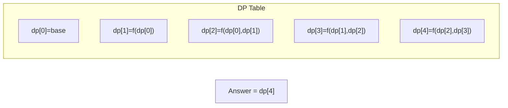

# Problem 198: House Robber

**Difficulty:** Medium  
**Tags:** Array, Dynamic Programming  
**Pattern:** Dynamic Programming  
**Link:** [leetcode.com/problems/house-robber](https://leetcode.com/problems/house-robber/)

## Description

You are a professional robber planning to rob houses along a street. Each house has a certain amount of money stashed, the only constraint stopping you from robbing each of them is that adjacent houses have security systems connected and **it will automatically contact the police if two adjacent houses were broken into on the same night**.

Given an integer array `nums` representing the amount of money of each house, return *the maximum amount of money you can rob tonight **without alerting the police***.

 

Example 1:

```

**Input:** nums = [1,2,3,1]
**Output:** 4
**Explanation:** Rob house 1 (money = 1) and then rob house 3 (money = 3).
Total amount you can rob = 1 + 3 = 4.

```

Example 2:

```

**Input:** nums = [2,7,9,3,1]
**Output:** 12
**Explanation:** Rob house 1 (money = 2), rob house 3 (money = 9) and rob house 5 (money = 1).
Total amount you can rob = 2 + 9 + 1 = 12.

```

 

**Constraints:**

	- `1 <= nums.length <= 100`
	- `0 <= nums[i] <= 400`

## Approach: Dynamic Programming

DP: rob[i] = max(rob[i-1], rob[i-2] + nums[i]). Can't rob adjacent houses.

## Pseudocode

```
1. prev2 = nums[0], prev1 = max(nums[0:2])
2. For i >= 2: prev = max(skip, rob current + prev2)
3. Return prev1
```

## Algorithm Flow



## Visual State Transitions

**1D Dynamic Programming Table Build:**

**Frame 1: Initialize base cases**


**Frame 2: Fill dp[1] from dp[0]**


**Frame 3: Fill remaining cells**



## Complexity Analysis

- **Time:** O(n)
- **Space:** O(1)

## Solution (Python3)

```python
class Solution:
    def rob(self, nums: list[int]) -> int:
        if len(nums) <= 2:
            return max(nums)
        prev2, prev1 = nums[0], max(nums[0], nums[1])
        for i in range(2, len(nums)):
            prev2, prev1 = prev1, max(prev1, prev2 + nums[i])
        return prev1
```

## Solution (C++)

```cpp
#include <string>
#include <vector>
using namespace std;

class Solution {
public:
    int rob(vector<int>& nums) {
        // Dynamic programming (1D) - O(n) time, O(n) space
        int n = nums;
        if (n <= 0) return 0;
        vector<int> dp(n + 1, 0);
        dp[0] = 1;
        for (int i = 1; i <= n; i++) {
            dp[i] = dp[i-1];
            if (i >= 2) dp[i] += dp[i-2];
        }
        return dp[n];
    }
};
```
