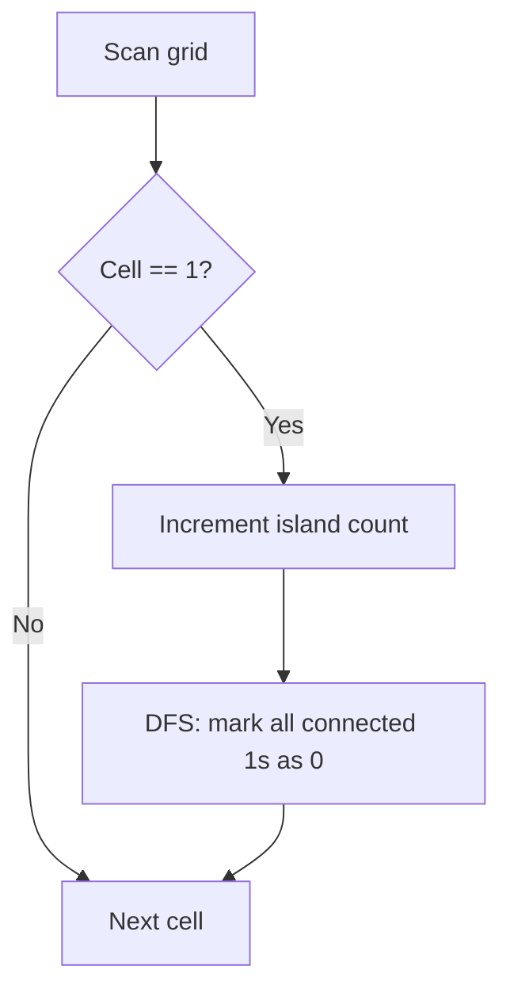
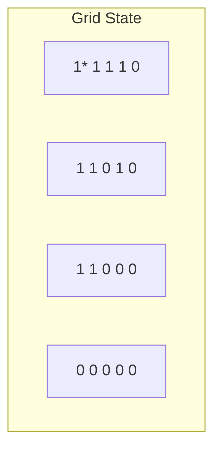
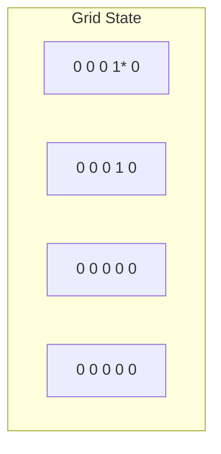
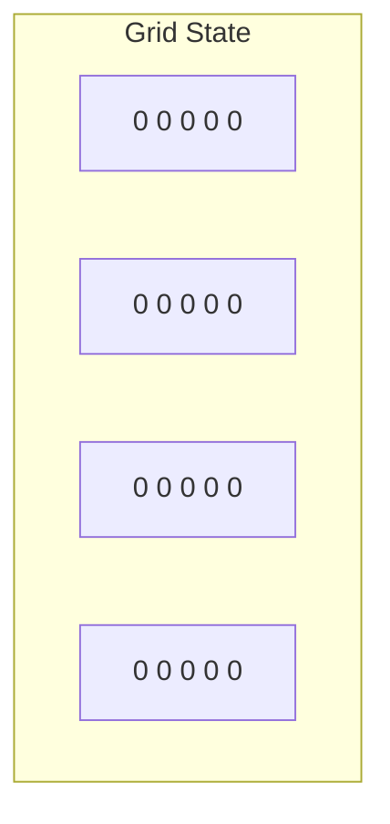

# Problem 200: Number of Islands

**Difficulty:** Medium  
**Tags:** Array, Depth-First Search, Breadth-First Search, Union-Find, Matrix  
**Pattern:** DFS / Graph  
**Link:** [leetcode.com/problems/number-of-islands](https://leetcode.com/problems/number-of-islands/)

## Description

Given an `m x n` 2D binary grid `grid` which represents a map of `'1'`s (land) and `'0'`s (water), return *the number of islands*.

An **island** is surrounded by water and is formed by connecting adjacent lands horizontally or vertically. You may assume all four edges of the grid are all surrounded by water.

 

Example 1:

```

**Input:** grid = [
  ["1","1","1","1","0"],
  ["1","1","0","1","0"],
  ["1","1","0","0","0"],
  ["0","0","0","0","0"]
]
**Output:** 1

```

Example 2:

```

**Input:** grid = [
  ["1","1","0","0","0"],
  ["1","1","0","0","0"],
  ["0","0","1","0","0"],
  ["0","0","0","1","1"]
]
**Output:** 3

```

 

**Constraints:**

	- `m == grid.length`
	- `n == grid[i].length`
	- `1 <= m, n <= 300`
	- `grid[i][j]` is `'0'` or `'1'`.

## Approach: DFS / Graph

For each unvisited '1', increment count and DFS to mark all connected land as visited.

## Pseudocode

```
1. For each cell:
   If '1': count++, DFS to mark connected '1's as '0'
2. Return count
```

## Algorithm Flow



## Visual State Transitions

**DFS Island Counting on grid:**

**Step 1:** Find first '1' at (0,0), start DFS



Island count: 1, DFS marks all connected 1s

**Step 2:** After DFS from (0,0), find next '1' at (0,3)



Island count: 1 (all first island marked as 0)

**Step 3:** DFS from (0,3), marks connected. No more 1s.



Final count: 2 islands

## Complexity Analysis

- **Time:** O(m*n)
- **Space:** O(m*n)

## Solution (Python3)

```python
class Solution:
    def numIslands(self, grid: list[list[str]]) -> int:
        if not grid:
            return 0
        m, n = len(grid), len(grid[0])
        count = 0

        def dfs(i, j):
            if i < 0 or i >= m or j < 0 or j >= n or grid[i][j] != '1':
                return
            grid[i][j] = '0'
            dfs(i+1, j); dfs(i-1, j); dfs(i, j+1); dfs(i, j-1)

        for i in range(m):
            for j in range(n):
                if grid[i][j] == '1':
                    count += 1
                    dfs(i, j)
        return count
```

## Solution (C++)

```cpp
#include <functional>
#include <numeric>
#include <string>
#include <vector>
using namespace std;

class Solution {
public:
    int numIslands(vector<vector<string>>& grid) {
        // Union Find (DSU) - O(n * alpha(n))
        int n = grid.size();
        vector<int> parent(n + 1), rnk(n + 1, 0);
        iota(parent.begin(), parent.end(), 0);
        function<int(int)> find = [&](int x) -> int {
            return parent[x] == x ? x : parent[x] = find(parent[x]);
        };
        auto unite = [&](int x, int y) -> bool {
            int px = find(x), py = find(y);
            if (px == py) return false;
            if (rnk[px] < rnk[py]) swap(px, py);
            parent[py] = px;
            if (rnk[px] == rnk[py]) rnk[px]++;
            return true;
        };
        int components = n;
        return components;
    }
};
```
