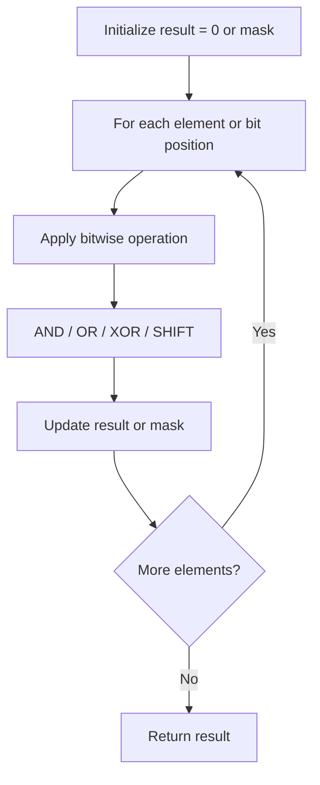

# Problem 201: Bitwise AND of Numbers Range

**Difficulty:** Medium  
**Tags:** Bit Manipulation  
**Pattern:** Bit Manipulation  
**Link:** [leetcode.com/problems/bitwise-and-of-numbers-range](https://leetcode.com/problems/bitwise-and-of-numbers-range/)

## Description

Given two integers `left` and `right` that represent the range `[left, right]`, return *the bitwise AND of all numbers in this range, inclusive*.

 

Example 1:

```

**Input:** left = 5, right = 7
**Output:** 4

```

Example 2:

```

**Input:** left = 0, right = 0
**Output:** 0

```

Example 3:

```

**Input:** left = 1, right = 2147483647
**Output:** 0

```

 

**Constraints:**

	- `0 <= left <= right <= 2^31 - 1`

## Approach: Bit Manipulation

Operate on individual bits using bitwise operators (AND, OR, XOR, shift). Common tricks: x & (x-1) removes lowest set bit, x ^ x = 0, XOR all elements to find unique.

## Pseudocode

```
1. Apply bitwise operations:
   - XOR all elements to cancel paired bits
   - Use bitmask to track state
   - Shift and mask to extract/set individual bits
2. Return result
```

## Algorithm Flow



## Complexity Analysis

- **Time:** O(n) or O(log n)
- **Space:** O(1)

## Solution (Python3)

```python
class Solution:
    def rangeBitwiseAnd(self, left: int, right: int) -> int:
        # Bit manipulation - O(n) time, O(1) space
        result = 0
        for val in left:
            result ^= val
        return result
```

## Solution (C++)

```cpp
#include <string>
#include <vector>
using namespace std;

class Solution {
public:
    int rangeBitwiseAnd(int left, int right) {
        // Bit manipulation - O(n) time, O(1) space
        int result = 0;
        for (int val : left) {
            result ^= val;
        }
        return result;
    }
};
```
