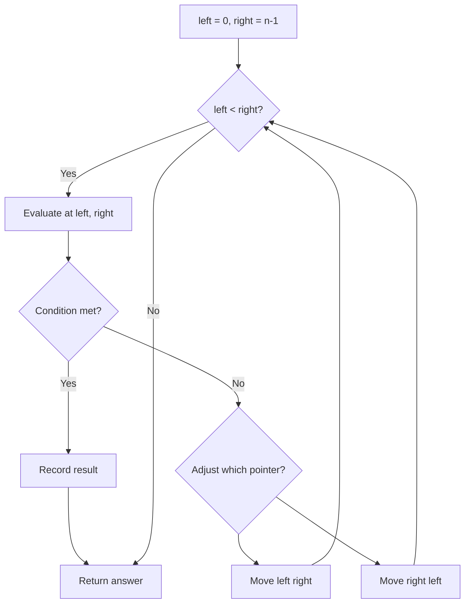
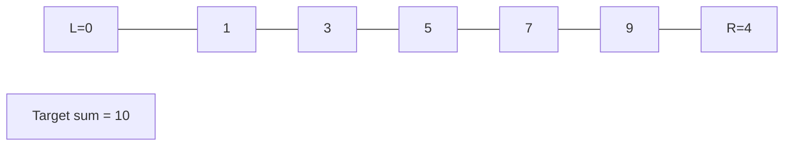
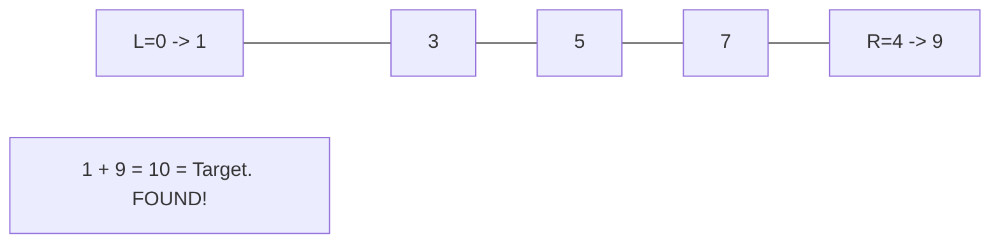

# Problem 202: Happy Number

**Difficulty:** Easy  
**Tags:** Hash Table, Math, Two Pointers  
**Pattern:** Two Pointers  
**Link:** [leetcode.com/problems/happy-number](https://leetcode.com/problems/happy-number/)

## Description

Write an algorithm to determine if a number `n` is happy.

A **happy number** is a number defined by the following process:

	- Starting with any positive integer, replace the number by the sum of the squares of its digits.
	- Repeat the process until the number equals 1 (where it will stay), or it **loops endlessly in a cycle** which does not include 1.
	- Those numbers for which this process **ends in 1** are happy.

Return `true` *if* `n` *is a happy number, and* `false` *if not*.

 

Example 1:

```

**Input:** n = 19
**Output:** true
**Explanation:**
12 + 92 = 82
82 + 22 = 68
62 + 82 = 100
12 + 02 + 02 = 1

```

Example 2:

```

**Input:** n = 2
**Output:** false

```

 

**Constraints:**

	- `1 <= n <= 2^31 - 1`

## Approach: Two Pointers

Use two pointers moving through the data structure. Depending on the problem, pointers may move toward each other (converging), in the same direction (fast/slow), or independently.

## Pseudocode

```
1. Initialize left = 0, right = n-1 (or two independent pointers)
2. While pointers haven't crossed:
   a. Evaluate condition at pointer positions
   b. Move left pointer right or right pointer left
3. Return result
```

## Algorithm Flow



## Visual State Transitions

**Two Pointer Convergence:**

**Frame 1: Initialize pointers**


**Frame 2: Sum = 1+9 = 10, found!**



## Complexity Analysis

- **Time:** O(n)
- **Space:** O(1)

## Solution (Python3)

```python
class Solution:
    def isHappy(self, n: int) -> bool:
        # Two pointer approach - O(n) time, O(1) space
        left, right = 0, len(n) - 1
        while left < right:
            curr = n[left] + n[right]
            if curr == n:
                return [left, right]
            elif curr < n:
                left += 1
            else:
                right -= 1
        return False
```

## Solution (C++)

```cpp
#include <string>
#include <vector>
using namespace std;

class Solution {
public:
    bool isHappy(int n) {
        // Two pointer approach - O(n) time, O(1) space
        int left = 0, right = n.size() - 1;
        while (left < right) {
            int curr = n[left] + n[right];
            if (curr == n) {
                return {left, right};
            } else if (curr < n) {
                left++;
            } else {
                right--;
            }
        }
        return false;
    }
};
```
