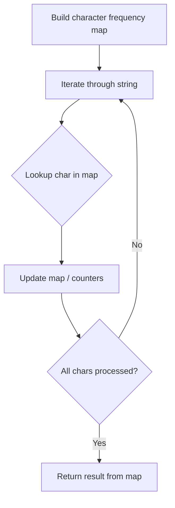

# Problem 205: Isomorphic Strings

**Difficulty:** Easy  
**Tags:** Hash Table, String  
**Pattern:** Hash Map String Processing  
**Link:** [leetcode.com/problems/isomorphic-strings](https://leetcode.com/problems/isomorphic-strings/)

## Description

Given two strings `s` and `t`, *determine if they are isomorphic*.

Two strings `s` and `t` are isomorphic if the characters in `s` can be replaced to get `t`.

All occurrences of a character must be replaced with another character while preserving the order of characters. No two characters may map to the same character, but a character may map to itself.

 

Example 1:

**Input:** s = "egg", t = "add"

**Output:** true

**Explanation:**

The strings `s` and `t` can be made identical by:

	- Mapping `'e'` to `'a'`.
	- Mapping `'g'` to `'d'`.

Example 2:

**Input:** s = "f11", t = "b23"

**Output:** false

**Explanation:**

The strings `s` and `t` can not be made identical as `'1'` needs to be mapped to both `'2'` and `'3'`.

Example 3:

**Input:** s = "paper", t = "title"

**Output:** true

 

**Constraints:**

	- `1 <= s.length <= 5 * 10^4`
	- `t.length == s.length`
	- `s` and `t` consist of any valid ascii character.

## Approach: Hash Map String Processing

Use a hash map to count character frequencies or map characters/strings for O(1) lookups. Process the string in one or two passes.

## Pseudocode

```
1. Build frequency map / char-to-index map
2. Iterate through string:
   a. Look up character in map
   b. Update counts or mappings
3. Return result based on map state
```

## Algorithm Flow



## Complexity Analysis

- **Time:** O(n)
- **Space:** O(n)

## Solution (Python3)

```python
class Solution:
    def isIsomorphic(self, s: str, t: str) -> bool:
        # Hash map for string/character frequency - O(n) time
        freq = {}
        for ch in s:
            freq[ch] = freq.get(ch, 0) + 1
        # Process frequency map
        for ch, cnt in freq.items():
            if cnt == 1:
                return s.index(ch)
        return False
```

## Solution (C++)

```cpp
#include <string>
#include <unordered_map>
#include <vector>
using namespace std;

class Solution {
public:
    bool isIsomorphic(string& s, string& t) {
        // Hash map for string/character frequency - O(n) time
        unordered_map<char, int> freq;
        for (char ch : s) {
            freq[ch]++;
        }
        // Process frequency map
        for (int i = 0; i < s.size(); i++) {
            if (freq[s[i]] == 1) return i;
        }
        return false;
    }
};
```
