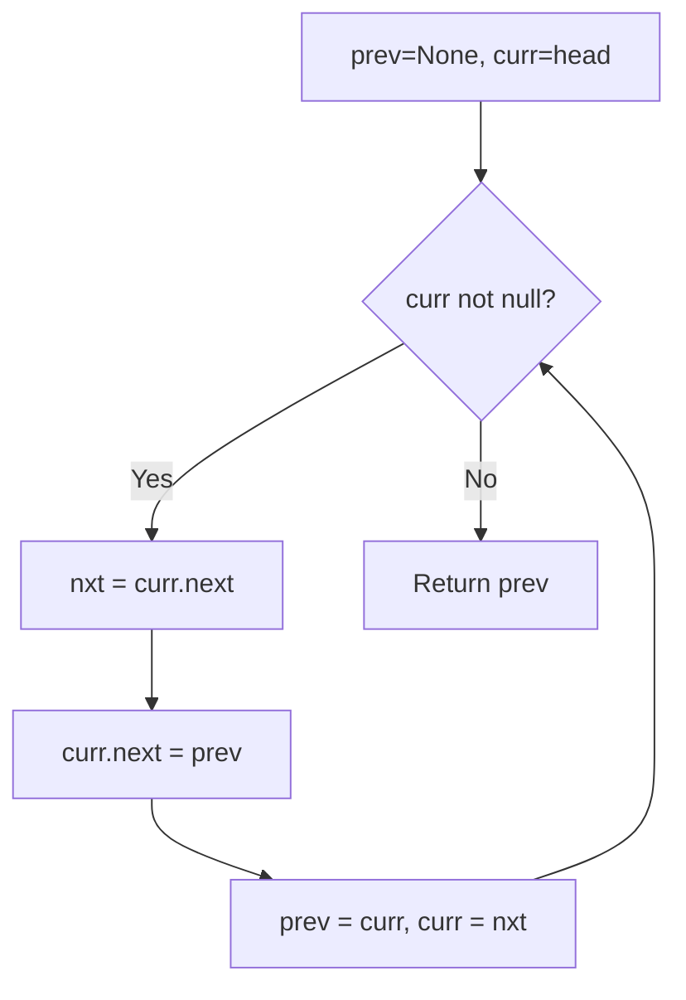
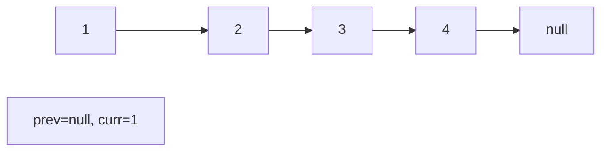
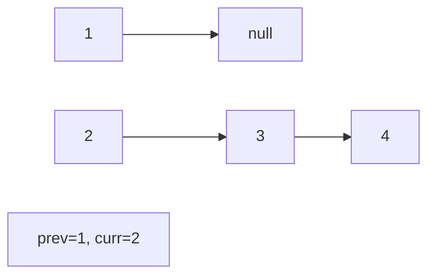
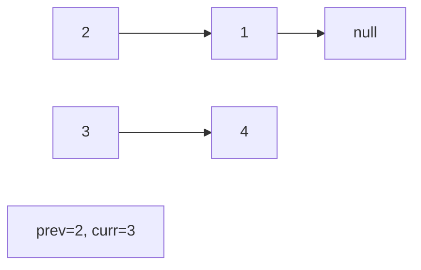
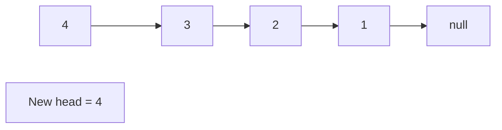

# Problem 206: Reverse Linked List

**Difficulty:** Easy  
**Tags:** Linked List, Recursion  
**Pattern:** Linked List Reversal  
**Link:** [leetcode.com/problems/reverse-linked-list](https://leetcode.com/problems/reverse-linked-list/)

## Description

Given the `head` of a singly linked list, reverse the list, and return *the reversed list*.

 

Example 1:

```

**Input:** head = [1,2,3,4,5]
**Output:** [5,4,3,2,1]

```

Example 2:

```

**Input:** head = [1,2]
**Output:** [2,1]

```

Example 3:

```

**Input:** head = []
**Output:** []

```

 

**Constraints:**

	- The number of nodes in the list is the range `[0, 5000]`.
	- `-5000 <= Node.val <= 5000`

 

**Follow up:** A linked list can be reversed either iteratively or recursively. Could you implement both?

## Approach: Linked List Reversal

Iterative reversal: maintain prev and curr pointers, reverse links one at a time.

## Pseudocode

```
1. prev=None, curr=head
2. While curr: save next, reverse link, advance
3. Return prev
```

## Algorithm Flow



## Visual State Transitions

**Linked List Operation (Reverse):**

**Frame 1: Initial list**


**Frame 2: Reverse first link**


**Frame 3: Reverse second link**


**Frame 4: Fully reversed**



## Complexity Analysis

- **Time:** O(n)
- **Space:** O(1)

## Solution (Python3)

```python
class Solution:
    def reverseList(self, head):
        prev = None
        curr = head
        while curr:
            nxt = curr.next
            curr.next = prev
            prev = curr
            curr = nxt
        return prev
```

## Solution (C++)

```cpp
#include <string>
#include <vector>
using namespace std;

class Solution {
public:
    ListNode* reverseList(ListNode* head) {
        // Linked list traversal/manipulation
        ListNode dummy(0);
        dummy.next = head;
        ListNode* prev = &dummy;
        ListNode* curr = head;
        while (curr) {
            ListNode* nxt = curr->next;
            // Process current node
            prev = curr;
            curr = nxt;
        }
        return dummy.next;
    }
};
```
