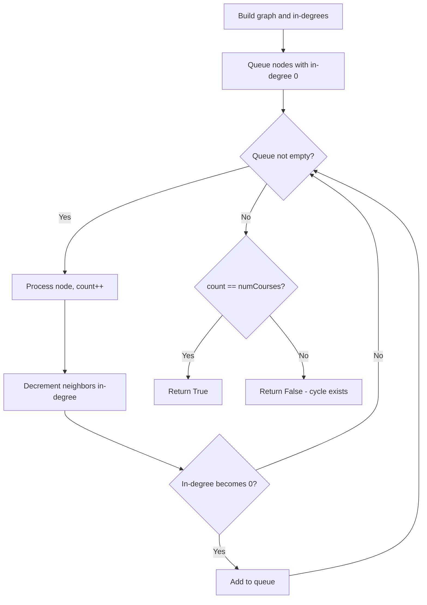
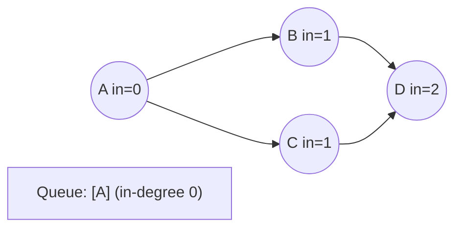
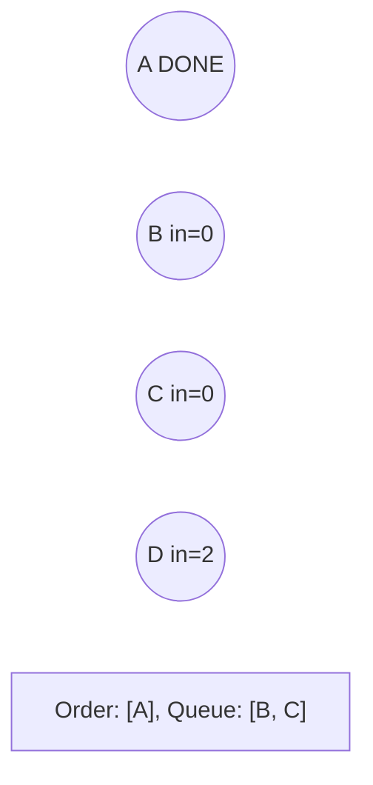
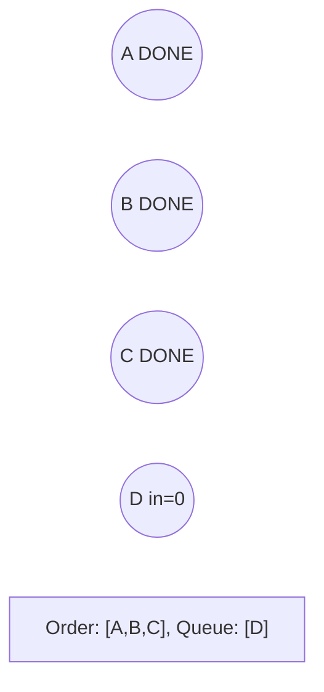
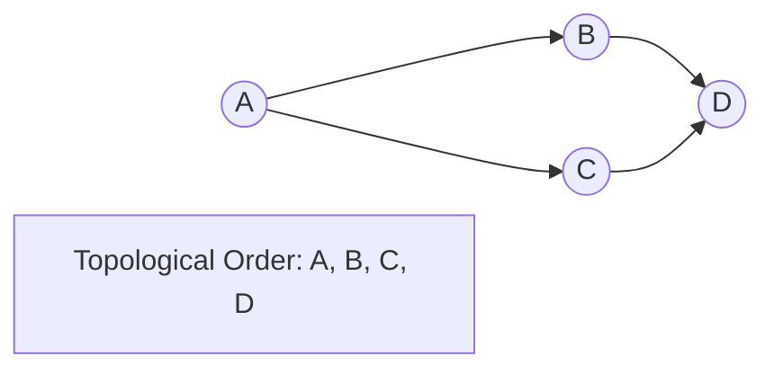

# Problem 207: Course Schedule

**Difficulty:** Medium  
**Tags:** Depth-First Search, Breadth-First Search, Graph Theory, Topological Sort  
**Pattern:** Topological Sort (BFS)  
**Link:** [leetcode.com/problems/course-schedule](https://leetcode.com/problems/course-schedule/)

## Description

There are a total of `numCourses` courses you have to take, labeled from `0` to `numCourses - 1`. You are given an array `prerequisites` where `prerequisites[i] = [ai, bi]` indicates that you **must** take course `bi` first if you want to take course `ai`.

	- For example, the pair `[0, 1]`, indicates that to take course `0` you have to first take course `1`.

Return `true` if you can finish all courses. Otherwise, return `false`.

 

Example 1:

```

**Input:** numCourses = 2, prerequisites = [[1,0]]
**Output:** true
**Explanation:** There are a total of 2 courses to take. 
To take course 1 you should have finished course 0. So it is possible.

```

Example 2:

```

**Input:** numCourses = 2, prerequisites = [[1,0],[0,1]]
**Output:** false
**Explanation:** There are a total of 2 courses to take. 
To take course 1 you should have finished course 0, and to take course 0 you should also have finished course 1. So it is impossible.

```

 

**Constraints:**

	- `1 <= numCourses <= 2000`
	- `0 <= prerequisites.length <= 5000`
	- `prerequisites[i].length == 2`
	- `0 <= ai, bi < numCourses`
	- All the pairs prerequisites[i] are **unique**.

## Approach: Topological Sort (BFS)

**Kahn's Algorithm:** BFS with in-degree tracking. If all nodes are processed, no cycle exists.

## Pseudocode

```
1. Build adjacency list and in-degree array
2. Queue all nodes with in-degree 0
3. BFS: process node, decrement neighbors' in-degree
4. If count == numCourses: no cycle
```

## Algorithm Flow



## Visual State Transitions

**Topological Sort (Kahn's Algorithm):**

**Frame 1: Compute in-degrees**


**Frame 2: Process A, reduce neighbors**


**Frame 3: Process B and C**


**Frame 4: Complete**



## Complexity Analysis

- **Time:** O(V+E)
- **Space:** O(V+E)

## Solution (Python3)

```python
from collections import deque

class Solution:
    def canFinish(self, numCourses: int, prerequisites: list[list[int]]) -> bool:
        graph = [[] for _ in range(numCourses)]
        in_degree = [0] * numCourses
        for a, b in prerequisites:
            graph[b].append(a)
            in_degree[a] += 1
        queue = deque(i for i in range(numCourses) if in_degree[i] == 0)
        count = 0
        while queue:
            node = queue.popleft()
            count += 1
            for neighbor in graph[node]:
                in_degree[neighbor] -= 1
                if in_degree[neighbor] == 0:
                    queue.append(neighbor)
        return count == numCourses
```

## Solution (C++)

```cpp
#include <queue>
#include <string>
#include <vector>
using namespace std;

class Solution {
public:
    bool canFinish(int numCourses, vector<vector<int>>& prerequisites) {
        // Topological sort (Kahn's) - O(V+E)
        int n = numCourses;
        vector<vector<int>> graph(n);
        vector<int> indegree(n, 0);
        for (auto& edge : prerequisites) {
            graph[edge[1]].push_back(edge[0]);
            indegree[edge[0]]++;
        }
        queue<int> q;
        for (int i = 0; i < n; i++)
            if (indegree[i] == 0) q.push(i);
        vector<int> order;
        while (!q.empty()) {
            int node = q.front(); q.pop();
            order.push_back(node);
            for (int neighbor : graph[node]) {
                if (--indegree[neighbor] == 0) q.push(neighbor);
            }
        }
        return order.size() == n;
    }
};
```
