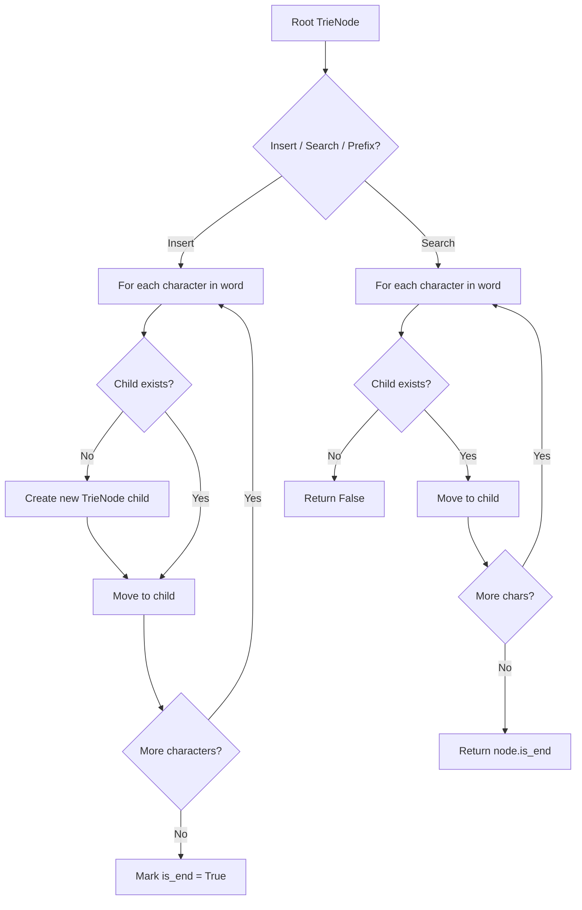
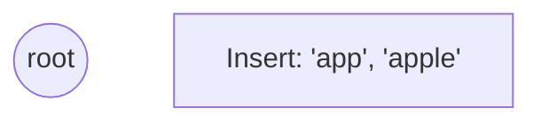
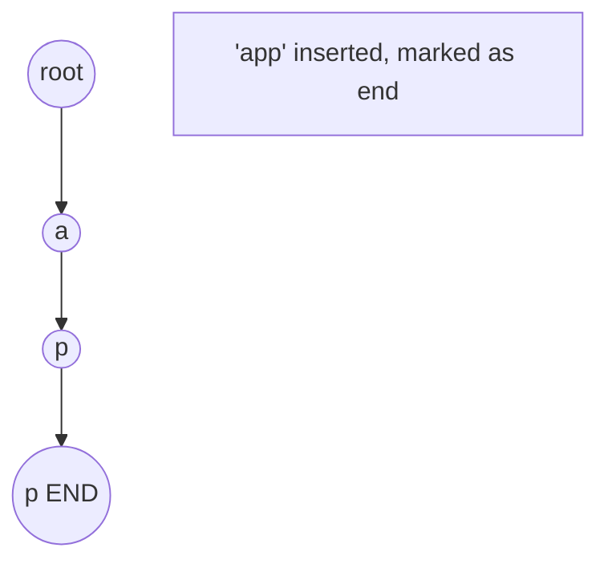
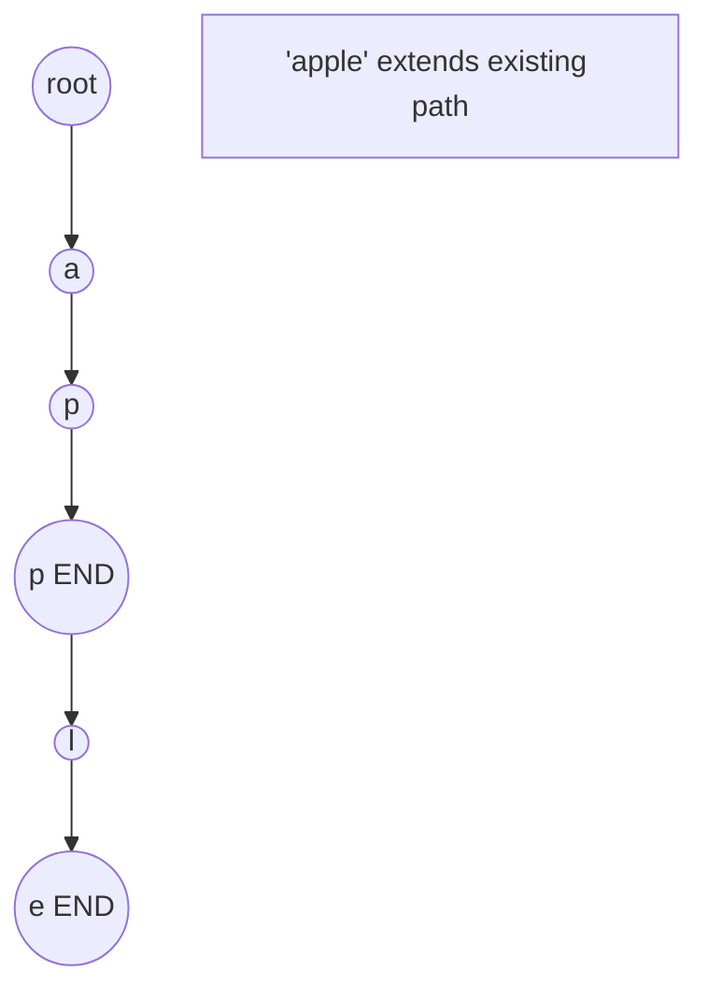
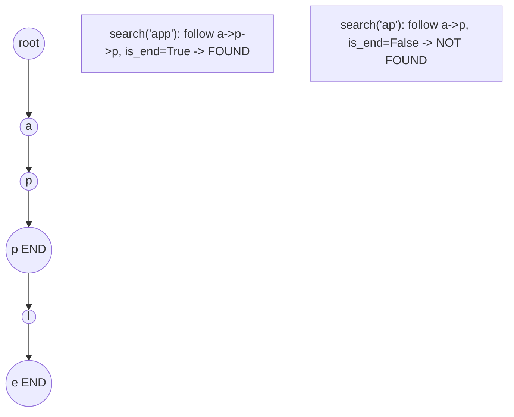

# Problem 208: Implement Trie (Prefix Tree)

**Difficulty:** Medium  
**Tags:** Hash Table, String, Design, Trie  
**Pattern:** Trie / Prefix Tree  
**Link:** [leetcode.com/problems/implement-trie-prefix-tree](https://leetcode.com/problems/implement-trie-prefix-tree/)

## Description

A **trie** (pronounced as "try") or **prefix tree** is a tree data structure used to efficiently store and retrieve keys in a dataset of strings. There are various applications of this data structure, such as autocomplete and spellchecker.

Implement the Trie class:

	- `Trie()` Initializes the trie object.
	- `void insert(String word)` Inserts the string `word` into the trie.
	- `boolean search(String word)` Returns `true` if the string `word` is in the trie (i.e., was inserted before), and `false` otherwise.
	- `boolean startsWith(String prefix)` Returns `true` if there is a previously inserted string `word` that has the prefix `prefix`, and `false` otherwise.

 

Example 1:

```

**Input**
["Trie", "insert", "search", "search", "startsWith", "insert", "search"]
[[], ["apple"], ["apple"], ["app"], ["app"], ["app"], ["app"]]
**Output**
[null, null, true, false, true, null, true]

**Explanation**
Trie trie = new Trie();
trie.insert("apple");
trie.search("apple");   // return True
trie.search("app");     // return False
trie.startsWith("app"); // return True
trie.insert("app");
trie.search("app");     // return True

```

 

**Constraints:**

	- `1 <= word.length, prefix.length <= 2000`
	- `word` and `prefix` consist only of lowercase English letters.
	- At most `3 * 10^4` calls **in total** will be made to `insert`, `search`, and `startsWith`.

## Approach: Trie / Prefix Tree

Build a trie (prefix tree) where each node represents a character. Insert words character by character, and search by following child pointers. Supports efficient prefix matching.

## Pseudocode

```
1. TrieNode: children = {}, is_end = False
2. Insert(word):
   - For each char: create child if absent, move to child
   - Mark last node as end
3. Search(word):
   - For each char: if child absent return False, move to child
   - Return node.is_end
4. StartsWith(prefix): same as search but return True at end
```

## Algorithm Flow



## Visual State Transitions

**Trie Insert and Search:**

**Frame 1: Empty trie**


**Frame 2: Insert 'app'**


**Frame 3: Insert 'apple'**


**Frame 4: Search 'app' = True, 'ap' = False**



## Complexity Analysis

- **Time:** O(L) per operation
- **Space:** O(N * L)

## Solution (Python3)

```python
class Trie:
    def __init__(self):
        # Initialize data structure
        pass

    def insert(self, word: str) -> None:
        return None

    def search(self, word: str) -> bool:
        return False

    def startsWith(self, prefix: str) -> bool:
        return False

```

## Solution (C++)

```cpp
#include <string>
#include <vector>
using namespace std;

class Trie {
public:
    Trie() {
        // Initialize
    }

    void insert(string& word) {
        return ;
    }

    bool search(string& word) {
        return false;
    }

    bool startsWith(string& prefix) {
        return false;
    }

};
```
