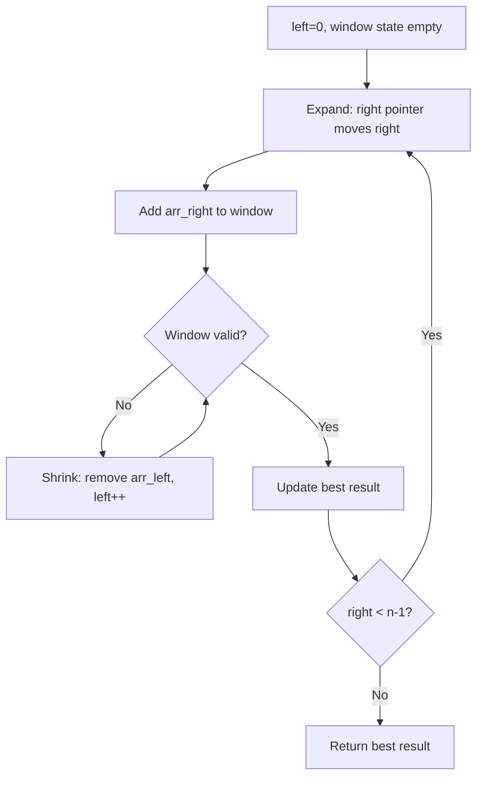
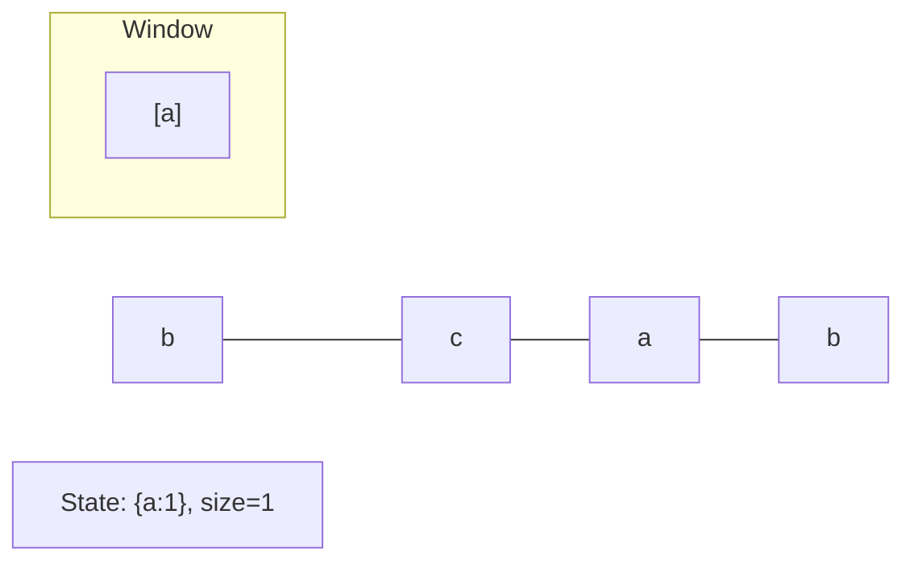
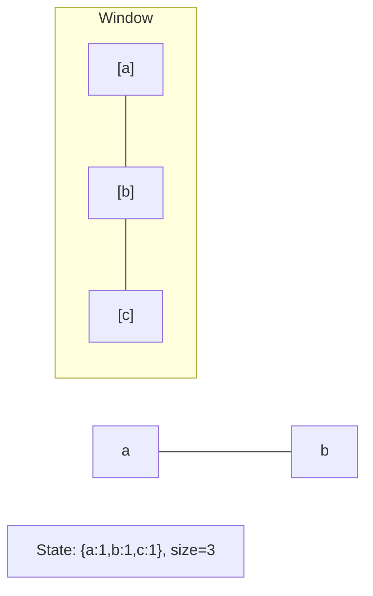
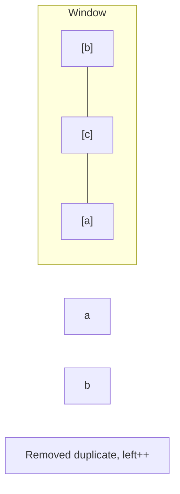
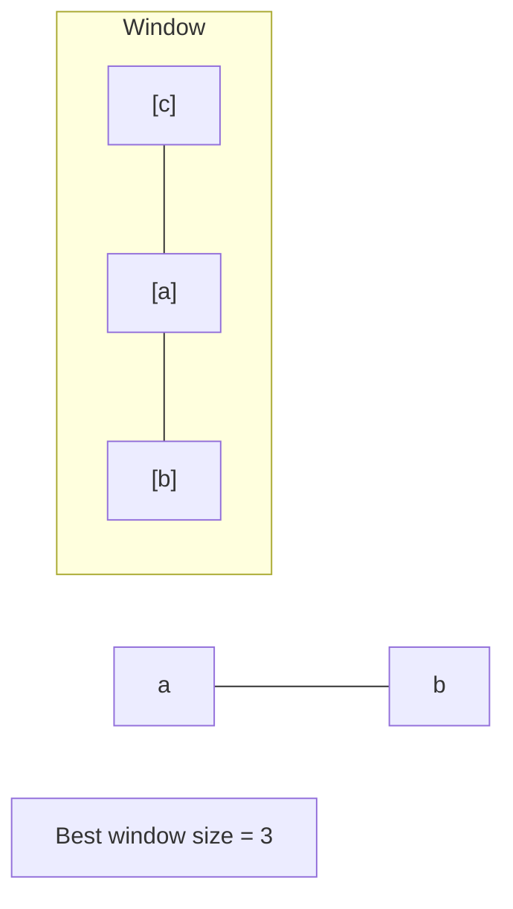

# Problem 209: Minimum Size Subarray Sum

**Difficulty:** Medium  
**Tags:** Array, Binary Search, Sliding Window, Prefix Sum  
**Pattern:** Sliding Window  
**Link:** [leetcode.com/problems/minimum-size-subarray-sum](https://leetcode.com/problems/minimum-size-subarray-sum/)

## Description

Given an array of positive integers `nums` and a positive integer `target`, return *the **minimal length** of a **subarray** whose sum is greater than or equal to* `target`. If there is no such subarray, return `0` instead.

 

Example 1:

```

**Input:** target = 7, nums = [2,3,1,2,4,3]
**Output:** 2
**Explanation:** The subarray [4,3] has the minimal length under the problem constraint.

```

Example 2:

```

**Input:** target = 4, nums = [1,4,4]
**Output:** 1

```

Example 3:

```

**Input:** target = 11, nums = [1,1,1,1,1,1,1,1]
**Output:** 0

```

 

**Constraints:**

	- `1 <= target <= 10^9`
	- `1 <= nums.length <= 10^5`
	- `1 <= nums[i] <= 10^4`

 

**Follow up:** If you have figured out the `O(n)` solution, try coding another solution of which the time complexity is `O(n log(n))`.

## Approach: Sliding Window

Maintain a window over the data using two pointers. Expand the right boundary to include new elements, and shrink the left boundary when the window constraint is violated. Track the optimal window.

## Pseudocode

```
1. Initialize left = 0, result = initial_value
2. For right in range(n):
   a. Add element at right to window state
   b. While window is invalid:
      - Remove element at left from window state
      - left++
   c. Update result = best of (result, window size/value)
3. Return result
```

## Algorithm Flow



## Visual State Transitions

**Sliding Window Step-by-Step:**

**Frame 1: Initial window (left=0, right=0)**


**Frame 2: Expand right (right=2)**


**Frame 3: Violation - shrink left**


**Frame 4: Continue expanding**



## Complexity Analysis

- **Time:** O(n)
- **Space:** O(k)

## Solution (Python3)

```python
class Solution:
    def minSubArrayLen(self, target: int, nums: List[int]) -> int:
        # Sliding window approach - O(n) time, O(k) space
        from collections import defaultdict
        window = defaultdict(int)
        left = 0
        result = 0
        for right in range(len(target)):
            window[target[right]] += 1
            while len(window) > (nums if isinstance(nums, int) else len(target)):
                window[target[left]] -= 1
                if window[target[left]] == 0:
                    del window[target[left]]
                left += 1
            result = max(result, right - left + 1)
        return result
```

## Solution (C++)

```cpp
#include <algorithm>
#include <string>
#include <unordered_map>
#include <vector>
using namespace std;

class Solution {
public:
    int minSubArrayLen(int target, vector<int>& nums) {
        // Sliding window approach - O(n) time, O(k) space
        unordered_map<char, int> window;
        int left = 0, result = 0;
        for (int right = 0; right < target.size(); right++) {
            window[target[right]]++;
            while ((int)window.size() > nums) {
                window[target[left]]--;
                if (window[target[left]] == 0)
                    window.erase(target[left]);
                left++;
            }
            result = max(result, right - left + 1);
        }
        return result;
    }
};
```
